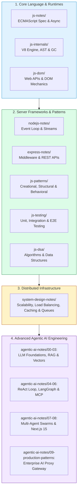
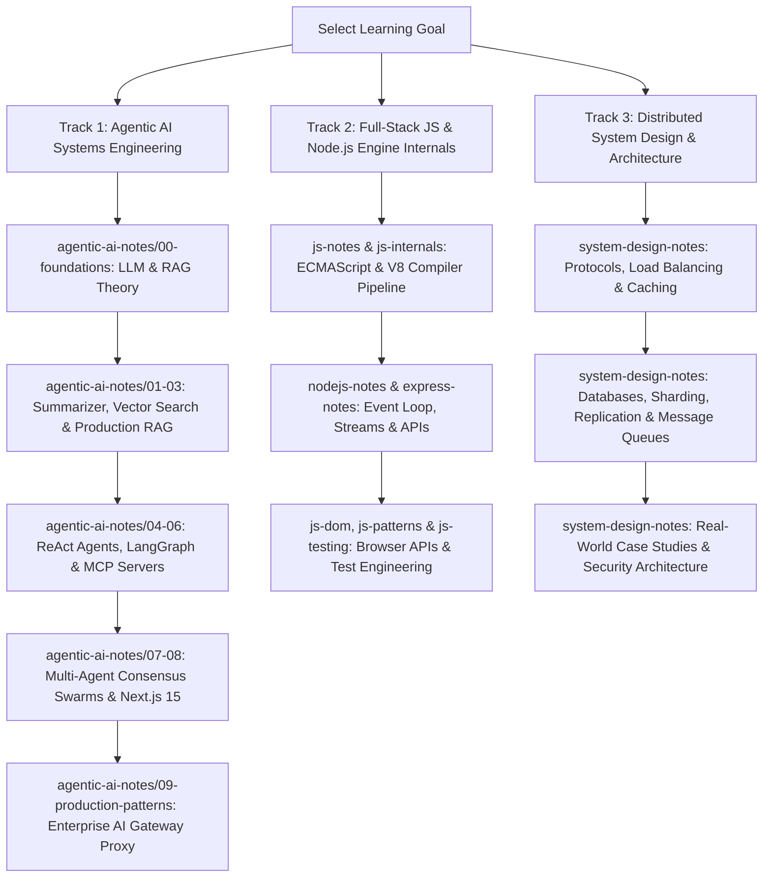
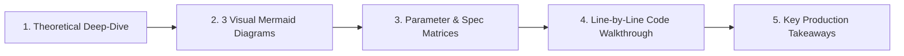

# Engineering Playbook 🚀

Welcome to the **Engineering Playbook**, an exhaustive, production-grade guide, interactive curriculum, and technical reference repository for modern software engineering, distributed systems, system design, JavaScript/Node.js internals, and advanced Agentic AI systems.

> 💡 **Pure Learning & Reference Repository**: This playbook is built exclusively for learning and architectural reference. **Zero local setup, installation, or environment configuration is required.** Every module is fully self-contained with comprehensive Markdown explanations, visual Mermaid diagrams, mathematical equations, parameter matrices, and annotated code walkthroughs. You can read and learn directly on GitHub, in your browser, or in any Markdown viewer.

---

## 🗺️ High-Level Playbook Architecture

The diagram below illustrates how the different engineering layers in this playbook interconnect—from fundamental language runtimes and server frameworks to high-scale distributed systems and enterprise Agentic AI infrastructure:

---

## 📖 How to Navigate & Study This Playbook

Whether you are studying for system design interviews, building enterprise multi-agent AI applications, or mastering JavaScript engine internals, this playbook is structured to help you locate exactly what you need:

1. **Find What You Want to Learn**: Scroll down to the [Exhaustive Directory & Module Catalog](#-exhaustive-directory--module-catalog) below to view detailed module-by-module tables.
2. **Follow a Structured Track**: Use the [Curriculum Learning Tracks](#-curriculum-learning-tracks) to progress through topic-specific curricula step by step.
3. **Study Standardized Modules**: Every topic `.md` file follows a 5-part layout (Theory Deep-Dive $\rightarrow$ 3 Visual Mermaid Diagrams $\rightarrow$ Parameter Matrices $\rightarrow$ Line-by-Line Code Walkthrough $\rightarrow$ Key Production Takeaways).

---

## 📂 Exhaustive Directory & Module Catalog

Below is the complete, detailed directory catalog detailing every folder in this repository, what is included inside it, and what you will learn from studying it:

---

### 1. `agentic-ai-notes/` — Autonomous Agentic AI Systems Engineering
*Focus: Building enterprise LLM agents, RAG engines, LangGraph workflows, MCP servers, multi-agent consensus swarms, and production proxy gateways.*

#### Sub-Folder Breakdown:

| Directory Path | Subject Area | Key Concepts & Included Technologies |
| :--- | :--- | :--- |
| **`00-foundations/`** | LLM & RAG Theory | Transformer architecture, prompt engineering strategies, embedding models, vector databases, chunking algorithms, ReAct loops, function calling, memory systems, guardrails, evaluation frameworks, and Model Context Protocol (MCP). |
| **`01-chai-summarizer/`** | LangChain Summarizer | LangChain document summarization pipelines, prompt composition, Chain-of-Thought (CoT), map-reduce chains, sentiment analysis, token counting heuristics, cost tracking, and API servers. |
| **`02-dukaan-search/`** | Semantic Search Engine | Semantic product search engines, vector similarity algorithms (Cosine, Dot Product), embedding benchmarks, chunking strategies (Fixed-size, Recursive, Semantic), and vector store implementations (In-Memory, ChromaDB, MongoDB Atlas Vector Search). |
| **`03-vidya-rag/`** | Production RAG System | Production PDF RAG system with document loaders, chunkers, hybrid search (BM25 + Dense Vectors), cross-encoder rerankers, citation engines, faithfulness & relevance evaluators, and hallucination safety guardrails. |
| **`04-jugaad-agent/`** | Custom ReAct Agent Engine | Custom ReAct autonomous agent framework built from scratch with execution loops, context managers, token budget controllers, dynamic tool registries, short-term/long-term vector memory, and safety filters. |
| **`05-karigar-flow/`** | LangGraph Workflows | Stateful workflow graphs using LangGraph JS, state schemas (`Annotation.Root`), graph node handlers, conditional edge routers, resume parser/job tools, and LangSmith observability tracing. |
| **`06-seva-mcp/`** | Model Context Protocol | Model Context Protocol (MCP) server & client architectures, JSON-RPC 2.0 transport, resource providers, tool definitions, prompts, ticket/knowledgebase integrations, PII filters, and Mastra agent workflows. |
| **`07-neta-multiagent/`** | Multi-Agent Swarms | Multi-agent consensus swarms using LangGraph supervisor orchestrators, shared memory buses, specialist agents (Researcher, Writer, Critic, Editor), shared tools, and LLM-as-a-Judge quality evaluators. |
| **`08-samvaad-ai/`** | Full-Stack Next.js 15 AI | Full-stack Next.js 15 App Router AI application using Vercel AI SDK, real-time SSE streaming (`streamText`), tool calls, vector stores, RAG generation engines, topic guardrails, and MongoDB persistence. |
| **`09-production-patterns/`** | Production AI Proxy Gateway | Enterprise AI Proxy Gateway architecture including semantic query vector caching, $O(1)$ exact prompt hash caches, 3-state circuit breakers (CLOSED, OPEN, HALF_OPEN), multi-provider fallback chains, exponential backoff with full jitter, daily USD budget enforcers, dynamic cost model routers, distributed request tracing, and Prometheus metrics telemetry. |

---

### 2. `system-design-notes/` — Distributed Systems & High-Scalability Architecture
*Focus: Master high-scale distributed systems design, microservices, and system design interview patterns.*

| Module ID | Module Title | Technical Scope & Production Context |
| :--- | :--- | :--- |
| **`01-04`** | Networking & Protocols | Client-server protocols, REST API design, HTTP/1.1 vs HTTP/2 vs HTTP/3, WebSockets, gRPC, Protobuf, and JSON serialization. |
| **`05-08`** | Scalability & Traffic | Load balancing algorithms (Round Robin, Least Connections, Hashing), distributed caching (Redis, eviction policies), CDN edge networks, and horizontal vs vertical scaling strategies. |
| **`09-13`** | Database Architecture | SQL vs NoSQL, ACID vs BASE, database replication (Master-Slave, Multi-Master), database sharding & consistent hashing, and distributed transactions & isolation levels. |
| **`14-17`** | Messaging & Event Streams | Message queues (RabbitMQ), pub/sub messaging & event-driven architecture (Apache Kafka), Event Sourcing & CQRS, and real-time stream processing (Flink, Spark). |
| **`18-21`** | Resilience & Consensus | Rate limiting algorithms (Token Bucket, Leaky Bucket), Circuit Breakers & Bulkheads, fault tolerance patterns, and distributed consensus (Raft, Paxos). |
| **`22-25`** | Microservices Architecture | Monolith to microservices migration strategies, API Gateways, service discovery, serverless computing, and event-driven microservice patterns. |
| **`26-31`** | System Design Case Studies | Real-world system design walkthroughs: URL Shortener, Real-time Chat System, News Feed, Distributed Payment System, Notification Engine, and Search Autocomplete. |
| **`32-34`** | Operations & Security | Observability (Prometheus, Grafana, Distributed Tracing), Containerization (Docker, Kubernetes), and security fundamentals (OAuth 2.0, JWT, TLS/SSL). |

---

### 3. `nodejs-notes/` — Node.js Runtime Architecture & Core Modules
*Focus: Deep understanding of Node.js internals, event-driven I/O, streams, and cluster scaling.*

| Module Range | Technical Topic | Core Concepts & Included Utilities |
| :--- | :--- | :--- |
| **`01-04`** | Runtime & Event Loop | Node.js architecture & libuv, global objects, `process` object mechanics, timer execution phases (`setTimeout`, `setImmediate`, `process.nextTick`). |
| **`05-08`** | Binary Data & File System | Buffers & binary buffer manipulation, `path` module utilities, File System (`fs`) sync vs async APIs, advanced file descriptors, and file streaming. |
| **`09-11`** | Events & Stream Pipelines | EventEmitter pattern, memory leak warnings, Readable, Writable, Transform streams, `stream.pipeline()`, and backpressure management. |
| **`12-16`** | Networking & Cryptography | HTTP server & client implementation from scratch, URL & querystring parsing, `os` system diagnostics, and `crypto` hashing/encryption. |
| **`17-20`** | Multiprocessing & Concurrency | Child processes (`exec`, `spawn`, `fork`), Worker Threads for CPU-bound tasks, Cluster module for multi-core scaling, and REPL/Readline interfaces. |
| **`21-28`** | Core Utilities & Debugging | `util` module helpers, `zlib` compression, `net` (TCP socket programming), `dns` lookup, environment config, error handling, npm package resolution, and debugging/profiling. |
| **`29-32`** | Hands-On Capstone Projects | Complete Node.js project implementations: CLI Task Manager, Static File Web Server, Multi-file Log Analyzer, and Real-time TCP Chat Server. |

---

### 4. `express-notes/` — Express.js Server & API Gateway Architecture
*Focus: Building scalable REST APIs, middleware pipelines, authentication servers, and API gateways.*

| Module Range | Subject Area | Key Concepts Covered |
| :--- | :--- | :--- |
| **`01-05`** | Express Core & Middleware | Express fundamentals, routing mechanics, route parameters & query strings, middleware pipeline execution order, built-in middleware (`express.json`, `express.urlencoded`). |
| **`06-10`** | Request/Response Mechanics | Request (`req`) & Response (`res`) abstraction objects, Router module encapsulation, global error-handling middleware, serving static files, template engine integration. |
| **`11-15`** | REST APIs & Security | RESTful API design standards, request validation (Zod, Joi), cookies & session management, JWT authentication & refresh token rotations, file upload handling (Multer). |
| **`16-23`** | Production Hardening | CORS implementation from scratch, security headers (Helmet), rate limiting middleware, logging with Morgan & Winston, application settings, Express 5 features, performance optimization techniques. |
| **`24-27`** | Capstone Architecture Projects | Production Express projects: REST API Server, Authentication Server, Middleware Pipeline Engine, and API Gateway Proxy. |

---

### 5. `js-internals/` — JavaScript Engine Internals & V8 Execution
*Focus: How JavaScript code is parsed, compiled, executed, and garbage collected inside modern browser & Node.js engines.*

| Module Range | V8 Subsystem | Core Technical Concepts |
| :--- | :--- | :--- |
| **`01-03`** | Parser & Compiler | V8 engine pipeline overview, Parsing & Abstract Syntax Trees (AST), Compilation pipeline (Ignition Bytecode interpreter + TurboFan JIT compiler). |
| **`04-06`** | Execution Context & Memory | Execution Context creation & execution phases, Call Stack mechanics & stack overflow, Memory Model (Stack vs Heap memory allocation). |
| **`07-09`** | Hidden Classes & Memory GC | Hidden Classes & Shapes (Inline Caches), Generational Garbage Collection (Scavenger Young Generation + Mark-Sweep/Compact Old Generation), Memory Leak diagnosis & memory profiling. |
| **`10-14`** | Async & Data Internals | Event Loop microtasks vs macrotasks queues, JIT optimization & deoptimization triggers, Numbers & SMI (Small Integer) representation, String immutability & interning, Closure memory scope allocation. |
| **`15-18`** | Advanced Concurrency | Async/Await promise unwrapping, SharedArrayBuffer & Atomics multithreading, WebAssembly (Wasm) interop, and performance profiling tools. |

---

### 6. `js-patterns/` — Software Design Patterns in JavaScript & TypeScript
*Focus: Master object-oriented and functional design patterns for clean, scalable, and maintainable software architecture.*

| Category | Pattern Modules | Included Design Patterns & Architectural Paradigms |
| :--- | :--- | :--- |
| **Creational** | `01-07` | Module pattern, Singleton, Factory, Abstract Factory, Builder, Prototype, Object Pool. |
| **Structural** | `08-14` | Adapter, Decorator, Proxy, Facade, Composite, Bridge, Flyweight. |
| **Behavioral** | `15-23` | Observer, Pub/Sub, Strategy, Command, Iterator, State, Chain of Responsibility, Mediator, Memento, Template, Visitor. |
| **Functional** | `24-26` | Composition, Currying, Memoization, Lazy Evaluation, Monad, Functor. |
| **Async & Resilient**| `27-30` | Promise patterns, Retry with Exponential Backoff, Circuit Breaker, Throttle/Debounce, Saga, Async Iterators & Streams. |
| **Enterprise** | `31-40` | Dependency Injection, MVC/MVP/MVVM, Repository & Service Layer, CQRS & Event Sourcing, Middleware & Plugin architectures, Registry & Lazy Loading, Mixins/Traits/Symbols, and 3 project architectures (Event System, Data Layer, UI Framework). |

---

### 7. `js-testing/` — Automated Testing & Quality Assurance
*Focus: Comprehensive testing methodologies, test-driven development (TDD), mocking, and CI/CD pipelines.*

| Module Range | QA Focus Area | Key Concepts & Frameworks |
| :--- | :--- | :--- |
| **`01-05`** | Fundamentals & Mocking | Testing pyramid & fundamentals, test anatomy (Arrange-Act-Assert / Given-When-Then), matchers & assertion libraries, mocking basics (spies, stubs, mocks), advanced mocking (module mocks, timer mocks). |
| **`06-10`** | Async, DOM & Coverage | Testing asynchronous code (promises, async/await, callbacks), DOM & UI testing, testing external API calls (MSW, fetch mocks), snapshot testing, code coverage metrics (lines, statements, branches, functions). |
| **`11-15`** | Workflows & E2E | Test-Driven Development (TDD) workflow, integration testing strategies, End-to-End (E2E) testing (Playwright, Cypress), testing design patterns, and Continuous Integration (CI) pipeline setup with best practices. |

---

### 8. `js-dsa/` — Data Structures & Algorithms in JavaScript
*Focus: Algorithmic problem solving, data structure implementations, dynamic programming, and Big-O efficiency analysis.*

| Topic Category | Module Range | Algorithm & Data Structure Implementations |
| :--- | :--- | :--- |
| **Foundations** | `01-04` | Big-O space & time complexity analysis, Arrays deep dive, Strings & pattern matching algorithms, Hash Tables & collision resolution. |
| **Linear DS** | `05-07` | Stacks, Queues (Priority Queue, Deque), Linked Lists (Singly, Doubly, Circular). |
| **Sorting & Search**| `08-11` | Recursion & call stack dynamics, Sorting basics (Bubble, Selection, Insertion), Advanced Sorting (Merge Sort, Quick Sort, Radix Sort), Searching (Linear, Binary Search variants). |
| **Non-Linear DS** | `12-17` | Trees basics, Binary Search Trees (BST), Heaps & Min/Max Heap implementations, Tries (Prefix Trees), Graphs basics (Adjacency Matrix & List), Graph Algorithms (BFS, DFS, Dijkstra, Topological Sort). |
| **Patterns & DP** | `18-25` | Sliding Window pattern, Two Pointers pattern, Backtracking, Dynamic Programming (Memoization & Tabulation), Greedy algorithms, Bit manipulation tricks, LRU Cache implementation, and real-world DSA application scenarios. |

---

### 9. `js-dom/` — Web APIs, DOM Mechanics & Browser Engineering
*Focus: Modern browser mechanics, event propagation, web storage, background workers, and performance optimization.*

| Subsystem Area | Module Range | Browser APIs & DOM Mechanics Covered |
| :--- | :--- | :--- |
| **DOM Manipulation**| `01-05` | DOM introduction & node trees, selecting elements, traversing the DOM, creating & modifying elements, attributes & class manipulation. |
| **Events & Observers**| `06-14` | Event fundamentals, event propagation (Capturing, Target, Bubbling), event delegation, form handling & validation, keyboard/mouse/touch events, scroll/resize & dimensional math, Intersection Observer API, Mutation Observer API, Animation & `requestAnimationFrame`. |
| **Storage & Workers**| `15-21` | HTML5 Drag & Drop API, Web Storage (LocalStorage, SessionStorage), IndexedDB database, Fetch API & HTTP requests, Web Workers (multithreading in browser), Service Workers & PWA caching, WebSockets realtime communication. |
| **Graphics & Perf** | `22-25` | History API & client-side routing, HTML5 Canvas basics, Browser APIs (Geolocation, Notifications, Clipboard), and web performance & critical rendering path optimization. |

---

### 10. `js-notes/` — Modern ECMAScript Core & JavaScript Language Fundamentals
*Focus: Complete mastery of the JavaScript language specification, syntax, async primitives, and object model.*

| Module Range | Language Feature | Core ECMAScript Topics Covered |
| :--- | :--- | :--- |
| **`01-09`** | Language Basics | Console & comments, variables (`var`, `let`, `const`), data types (primitive vs reference), numbers & `Math` object, string methods, template literals, type coercion rules, booleans & truthy/falsy values, `null`, `undefined` & `NaN`. |
| **`10-17`** | Data Structures & Control | Arrays & mutation, array methods (`map`, `filter`, `reduce`, etc.), objects & object methods, destructuring assignment, spread & rest operators, conditionals, loops & iteration. |
| **`18-24`** | Functions & OOP | Function declarations vs expressions vs arrow functions, scope & hoisting, closures, higher-order functions, `this` keyword binding rules, `call`, `apply` & `bind`, `new` keyword & constructor functions. |
| **`25-31`** | Object Model & Collections | Prototype chain, ES6 Classes, class inheritance, getters/setters & static members, Symbols, Iterators & Generators, `Set` & `Map` data structures. |
| **`32-37`** | Async & Modules | Error handling (`try/catch/finally`), Promises & Promise chaining, `async/await` mechanics, Event Loop execution model, ES Modules (`import`/`export`), Regular Expressions. |
| **`38-43`** | Meta-programming & Advanced | `Proxy` & `Reflect`, optional chaining & nullish coalescing, tagged templates, `WeakRef` & `FinalizationRegistry`, memory management & performance, bitwise/binary operations. |

---

## 🗺️ Curriculum Learning Tracks

Select a structured track to guide your study through the playbook:

---

## 💡 Standardized Module Format

Every single topic `.md` file across all 10 major directories is formatted according to a strict 5-part structure to ensure consistency and thoroughness:

1. **Theoretical Deep-Dive & Mechanics**: Detailed, zero-hand-waving architectural explanations of technical concepts, design trade-offs, and runtime behavior.
2. **Visual Mermaid Diagrams**: Exactly 3 visual diagrams per module (`flowchart TD`, `sequenceDiagram`, `stateDiagram-v2`) illustrating dataflows, state transitions, and component topologies.
3. **Comparison & Specification Matrices**: Tables detailing parameters, algorithm performance, data structures, and pricing matrices.
4. **Code Walkthrough & Annotated Implementations**: Complete line-by-line code implementations with extensive comments explaining control flow, parameters, and error handling.
5. **Key Production Takeaways**: Bulleted summaries highlighting battle-tested best practices and failure modes to avoid in production.

---

## 🔒 Quality Standards & Code Integrity

- **Clean Nomenclature**: All content adheres strictly to clean engineering nomenclature.
- **Source Code Integrity**: Source code files (`.js`, `.ts`) remain functional and unmutated. All documentation updates augment understanding without modifying execution logic.
- **Zero Hand-Waving**: Complete, verifiable mathematical equations (e.g. Cosine Similarity, Exponential Backoff with Full Jitter, BPE token heuristics) and explicit execution topologies.