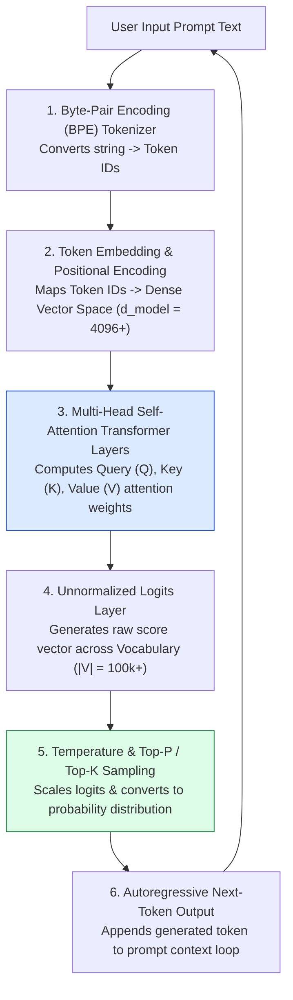
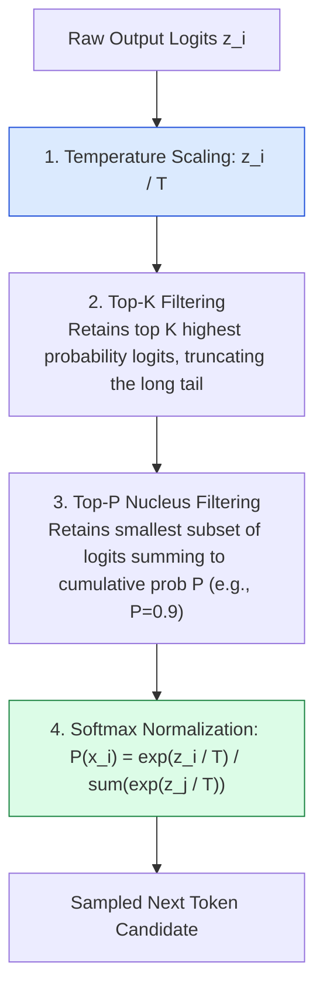
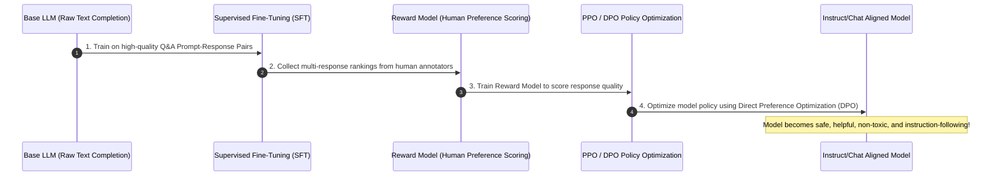

# Module 01: How Large Language Models (LLMs) Work

## Overview

**Large Language Models (LLMs)** like GPT-4, Claude 3.5, and Gemini 1.5 are auto-regressive Transformer neural networks trained on multi-terabyte textual corpora. At their foundational computational core, LLMs are statistical **next-token predictors**. Given an input sequence of tokens (a prompt), an LLM calculates a probability distribution across its vocabulary to predict and generate subsequent tokens iteratively.

Understanding **Transformer Self-Attention Mechanics**, **BPE Tokenization**, **Logits & Softmax Sampling Strategies (Temperature, Top-P, Top-K)**, and **RLHF Alignment** is fundamental to building reliable agentic AI systems.

---

## 1. Transformer Architecture & Token Generation Pipeline



---

## 2. Mathematical Sampling Strategies & Parameter Tuning

LLM output behavior is governed by sampling hyperparameters applied to raw output logits $z_i$ prior to the Softmax transformation:



### Sampling Strategy Hyperparameter Matrix

| Parameter | Mathematical Range | Low Value ($0.0 - 0.2$) | High Value ($0.7 - 1.0$) | Primary Production Use Case |
| :--- | :--- | :--- | :--- | :--- |
| **`Temperature (T)`** | $0.0 \le T \le 2.0$ | **Deterministic & Focused**: Greedy selection ($T \to 0$). Reduces hallucination risk. | **Creative & Diverse**: Flattens probability distribution, increasing variation. | Use $T=0.0$ for JSON extraction, math, and code generation. Use $T=0.7$ for creative drafting. |
| **`Top-P (Nucleus)`** | $0.0 \le P \le 1.0$ | Cuts off low-probability token tail aggressively. | Includes a broader pool of candidate tokens up to cumulative probability threshold. | Alternative to Temperature tuning; typically set $P=0.9$ while keeping Temperature fixed. |
| **`Top-K`** | $1 \le K \le |V|$ | Limits choices strictly to top $K$ most likely tokens (e.g. $K=40$). | Allows selection from thousands of candidate tokens. | Prevents model from picking extremely improbable tokens in low-resource settings. |

---

## 3. RLHF & Alignment Pipeline (Pre-training to Instruct/Chat Models)



---

## 4. Practical Implementation Showcase: Simulated Softmax & Temperature Sampler

```javascript
// Production-grade conceptual Softmax Temperature & Top-P Sampler Engine
class TokenSamplerEngine {
  constructor(vocabulary) {
    this.vocab = vocabulary;
  }

  /**
   * Applies Temperature scaling, Top-P filtering, and Softmax sampling over logits
   */
  sampleNextToken(rawLogits, temperature = 0.7, topP = 0.9) {
    if (temperature === 0.0) {
      // Greedy Decoding: Pick token with highest logit score
      let maxIdx = 0;
      for (let i = 1; i < rawLogits.length; i++) {
        if (rawLogits[i] > rawLogits[maxIdx]) maxIdx = i;
      }
      return { token: this.vocab[maxIdx], probability: 1.0 };
    }

    // 1. Temperature Scaling
    const scaledLogits = rawLogits.map((logit) => logit / temperature);

    // 2. Compute Softmax Probabilities
    const maxLogit = Math.max(...scaledLogits);
    const expValues = scaledLogits.map((l) => Math.exp(l - maxLogit)); // Subtract max for numerical stability
    const sumExp = expValues.reduce((a, b) => a + b, 0);
    let probabilities = expValues.map((v) => v / sumExp);

    // Pair probabilities with vocabulary indices and sort descending
    let tokenPairs = probabilities
      .map((prob, index) => ({ token: this.vocab[index], prob, index }))
      .sort((a, b) => b.prob - a.prob);

    // 3. Apply Top-P (Nucleus) Truncation Filter
    let cumulativeProb = 0;
    let cutoffIndex = tokenPairs.length;
    for (let i = 0; i < tokenPairs.length; i++) {
      cumulativeProb += tokenPairs[i].prob;
      if (cumulativeProb >= topP) {
        cutoffIndex = i + 1;
        break;
      }
    }
    tokenPairs = tokenPairs.slice(0, cutoffIndex);

    // Re-normalize probabilities after Top-P truncation
    const truncatedSum = tokenPairs.reduce((sum, item) => sum + item.prob, 0);
    tokenPairs.forEach((item) => (item.prob /= truncatedSum));

    // 4. Weighted Random Sampling
    const randomThreshold = Math.random();
    let acc = 0;
    for (const item of tokenPairs) {
      acc += item.prob;
      if (randomThreshold <= acc) {
        return { token: item.token, probability: item.prob };
      }
    }

    return tokenPairs[0];
  }
}

// Example Usage
const vocabulary = ["The", "agent", "executed", "the", "tool", "successfully", "error"];
const mockLogits = [1.2, 8.5, 4.2, 0.5, 6.1, 3.8, -2.4];
const sampler = new TokenSamplerEngine(vocabulary);

console.log("Greedy Choice (T=0.0):", sampler.sampleNextToken(mockLogits, 0.0));
console.log("Balanced Choice (T=0.7, P=0.9):", sampler.sampleNextToken(mockLogits, 0.7, 0.9));
```

---

## Key Production Takeaways

1. **LLMs Are Autoregressive Predictors**: LLMs generate text token-by-token. Every output token becomes part of the input context for subsequent tokens, causing inference latency to scale linearly ($O(N)$) with output sequence length.
2. **Use Temperature $0.0$ for Deterministic Agent Workflows**: When generating JSON schemas, parsing tool arguments, or evaluating code, always set `temperature: 0` to eliminate non-deterministic variance.
3. **Context Window Limits Guard Information Retrieval**: An LLM cannot process infinite text. Models enforce maximum context window limits (e.g. 128k tokens), requiring chunking and RAG for large documents.
4. **RLHF Alignment Controls Safety**: Pre-trained base models complete text rawly; RLHF/DPO instruction-tuned models convert raw base models into structured, safe conversational agents.

