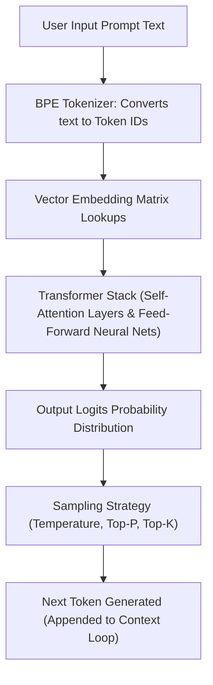

# File 01: How Large Language Models (LLMs) Work

## Overview
**Large Language Models (LLMs)** like GPT-4, Claude, and Gemini are autoregressive neural networks trained on vast text corpora. At their core, LLMs operate by predicting the most probable **next token** based on pre-trained statistical parameters, Transformer self-attention mechanisms, and RLHF (Reinforcement Learning from Human Feedback) alignment.

---

## 1. Transformer Architecture & Next-Token Generation Pipeline



---

## 2. Simulated Autoregressive Next-Token Sampling

```javascript
// Simulated Autoregressive Next-Token Predictor Concept
class ToyLLM {
    constructor(vocabulary) {
        this.vocab = vocabulary;
    }

    // Softmax Temperature Sampling Strategy
    sampleNextToken(logits, temperature = 0.7) {
        // Apply Temperature scaling
        const scaledLogits = logits.map(l => l / temperature);
        const expValues = scaledLogits.map(Math.exp);
        const sumExp = expValues.reduce((a, b) => a + b, 0);
        const probabilities = expValues.map(v => v / sumExp);

        // Weighted Random Sampling
        const rand = Math.random();
        let cumulative = 0;
        for (let i = 0; i < probabilities.length; i++) {
            cumulative += probabilities[i];
            if (rand <= cumulative) return this.vocab[i];
        }
        return this.vocab[this.vocab.length - 1];
    }
}

const vocab = ["The", "agent", "executed", "the", "tool", "successfully"];
const llm = new ToyLLM(vocab);
const mockLogits = [2.1, 8.5, 4.2, 1.0, 6.3, 3.8];

console.log("Predicted Next Token:", llm.sampleNextToken(mockLogits, 0.7));
```

---

## Key Takeaways
1. LLMs are **next-token predictors**—they do NOT possess real-time world memory unless connected to external search or database tools.
2. **Temperature** controls randomness: lower values ($0.0 - 0.2$) produce deterministic outputs; higher values ($0.7 - 1.0$) produce creative outputs.
3. **RLHF (Reinforcement Learning from Human Feedback)** aligns raw completion models into helpful conversational assistants.
