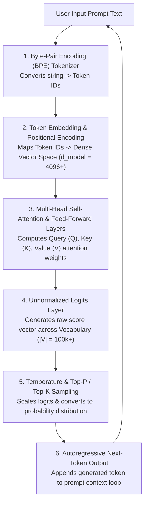

# Module 01: How Large Language Models (LLMs) Work — Transformer Architecture, Tokenization, & Sampling Mechanics

## Theoretical Overview & Computational Core

**Large Language Models (LLMs)** like GPT-4o, Claude 3.5, and Gemini 1.5 are auto-regressive Transformer neural networks trained on multi-terabyte textual corpora. At their foundational computational core, LLMs are statistical **next-token predictors**. Given an input sequence of tokens (a prompt), an LLM calculates a probability distribution across its vocabulary to predict and generate subsequent tokens iteratively.



### Real-World Analogy: Pandit Ji at the Marriage Bureau
Think of Pandit ji at a traditional matrimonial bureau:
- **Context Window**: Pandit ji inspects the groom's family background, horoscopes, and preferences (input prompt tokens).
- **Training Data**: He scans his mental database built over decades of reviewing thousands of past successful marriages (pre-training weights).
- **Next-Token Prediction**: Based on the current profile, he predicts the single best matching candidate family (next token).
- **Temperature Dial**: If you ask for a strictly traditional match ($T=0.0$), he gives the most predictable, safe option. If you increase his creativity dial ($T=1.0$), he suggests unconventional, highly creative, but potentially riskier matches.

---

## 1. Transformer Architecture Step-by-Step Pipeline

| Step | Stage Name | Purpose & Mechanics |
| :--- | :--- | :--- |
| **1** | **Tokenization** | Converts raw input text into integer token IDs using Byte-Pair Encoding (BPE). |
| **2** | **Embedding** | Maps discrete token IDs into continuous dense vectors (768 to 12,288 dimensions). |
| **3** | **Positional Encoding** | Injects positional sine/cosine vectors so the model understands token order. |
| **4** | **Self-Attention** | Allows every token to attend to every other token in the context window. |
| **5** | **Feed-Forward Network** | Applies non-linear transformations independently to each token position. |
| **6** | **Layer Stacking** | Repeats Self-Attention + Feed-Forward blocks $N$ times (GPT-4: $\sim 120$ layers). |
| **7** | **Output Projection** | Maps final hidden layer states back to raw logit scores over the vocabulary. |
| **8** | **Sampling** | Selects the next token using Temperature, Top-K, or Top-P probability filtering. |

---

## 2. Self-Attention Mechanics & BPE Tokenization

Self-attention allows the model to dynamically connect related words (e.g. associating "it" with "cat" even 500 tokens prior).

```javascript
// Self-Attention Weight Calculation Simulation
function simpleAttention(tokens, queryIndex) {
  const similarities = {
    "the": { "cat": 0.3, "sat": 0.1, "on": 0.1, "the": 0.05, "mat": 0.3 },
    "cat": { "the": 0.2, "sat": 0.5, "on": 0.1, "the": 0.05, "mat": 0.3 },
    "sat": { "the": 0.1, "cat": 0.5, "on": 0.3, "the": 0.05, "mat": 0.2 },
    "on":  { "the": 0.2, "cat": 0.1, "sat": 0.3, "the": 0.2, "mat": 0.4 },
    "mat": { "the": 0.3, "cat": 0.4, "sat": 0.2, "on": 0.3, "the": 0.2 },
  };

  const queryToken = tokens[queryIndex];
  const scores = tokens.map((t, i) => ({
    token: t,
    position: i,
    attention: (similarities[queryToken] && similarities[queryToken][t]) || 0.1,
  }));

  // Softmax normalization
  const expScores = scores.map(s => ({ ...s, exp: Math.exp(s.attention) }));
  const sumExp = expScores.reduce((sum, s) => sum + s.exp, 0);
  return expScores.map(s => ({ ...s, weight: (s.exp / sumExp).toFixed(3) }));
}

// BPE Tokenization Simulation: Iteratively merges frequent character pairs
function simpleBPE(text, numMerges = 5) {
  let tokens = text.split("");
  const mergeLog = [];

  for (let m = 0; m < numMerges; m++) {
    const pairCounts = {};
    for (let i = 0; i < tokens.length - 1; i++) {
      const pair = tokens[i] + "|" + tokens[i + 1];
      pairCounts[pair] = (pairCounts[pair] || 0) + 1;
    }

    let bestPair = null, bestCount = 0;
    for (const [pair, count] of Object.entries(pairCounts)) {
      if (count > bestCount) { bestPair = pair; bestCount = count; }
    }
    if (!bestPair || bestCount < 2) break;

    const [a, b] = bestPair.split("|");
    const merged = a + b;
    const newTokens = [];
    let i = 0;
    while (i < tokens.length) {
      if (i < tokens.length - 1 && tokens[i] === a && tokens[i + 1] === b) {
        newTokens.push(merged); i += 2;
      } else {
        newTokens.push(tokens[i]); i++;
      }
    }
    mergeLog.push({ merge: m + 1, pair: `"${a}" + "${b}" -> "${merged}"`, count: bestCount });
    tokens = newTokens;
  }
  return { tokens, mergeLog };
}
```

---

## 3. Next-Token Prediction & Markov Probability Distribution

At its core, text generation is an iterative loop sampling from a probability distribution over a vocabulary.

```javascript
// Next-Token Probability Distribution via Markov Model Simulation
function buildMarkovModel(corpus) {
  const model = {};
  const words = corpus.split(/\s+/);
  for (let i = 0; i < words.length - 1; i++) {
    if (!model[words[i]]) model[words[i]] = {};
    model[words[i]][words[i + 1]] = (model[words[i]][words[i + 1]] || 0) + 1;
  }

  // Convert raw frequency counts to normalized probabilities
  for (const word of Object.keys(model)) {
    const total = Object.values(model[word]).reduce((s, c) => s + c, 0);
    for (const next of Object.keys(model[word])) {
      model[word][next] = model[word][next] / total;
    }
  }
  return model;
}
```

---

## 4. Sampling Strategies: Temperature, Top-K, & Top-P (Nucleus)

Raw output scores (logits) pass through temperature scaling and probability filtering before selection:

$$\text{P}(x_i) = \frac{\exp(z_i / T)}{\sum_j \exp(z_j / T)}$$

```javascript
// Temperature Scaling Softmax
function softmaxWithTemperature(logits, temperature = 1.0) {
  const scaled = logits.map(l => l / Math.max(temperature, 0.01));
  const maxLogit = Math.max(...scaled);
  const exps = scaled.map(l => Math.exp(l - maxLogit)); // Numerical stability adjustment
  const sumExps = exps.reduce((s, e) => s + e, 0);
  return exps.map(e => e / sumExps);
}

// Top-K Filtering: Keeps only the K highest-probability logits
function topKFilter(probs, k) {
  const indexed = probs.map((p, i) => ({ p, i })).sort((a, b) => b.p - a.p);
  const result = new Array(probs.length).fill(0);
  const topK = indexed.slice(0, k);
  const sum = topK.reduce((s, x) => s + x.p, 0);
  topK.forEach(x => { result[x.i] = x.p / sum; });
  return result;
}

// Top-P (Nucleus) Filtering: Keeps tokens summing to cumulative probability P
function topPFilter(probs, p) {
  const indexed = probs.map((prob, i) => ({ prob, i })).sort((a, b) => b.prob - a.prob);
  let cumulative = 0;
  const selected = [];
  for (const item of indexed) {
    cumulative += item.prob;
    selected.push(item);
    if (cumulative >= p) break;
  }
  const result = new Array(probs.length).fill(0);
  const sum = selected.reduce((s, x) => s + x.prob, 0);
  selected.forEach(x => { result[x.i] = x.prob / sum; });
  return result;
}
```

---

## 5. Model Families Comparison Matrix

| Model Family | Provider / Maker | Context Window | Key Strengths & Architecture | License Model |
| :--- | :--- | :--- | :--- | :--- |
| **GPT-4o** | OpenAI | 128K tokens | Industry gold standard all-rounder, excellent function calling & vision. | Proprietary API |
| **GPT-4o-mini** | OpenAI | 128K tokens | High speed, extremely cheap token cost, ideal for lightweight agents. | Proprietary API |
| **Claude 3.5 Sonnet** | Anthropic | 200K tokens | State-of-the-art software engineering, instruction following, safety. | Proprietary API |
| **Gemini 1.5 Pro** | Google | 1M - 2M tokens | Unmatched context length, native multimodal processing. | Proprietary API |
| **Llama 3.1 (8B/70B/405B)** | Meta | 128K tokens | Premier open-weight models, fully fine-tunable, privacy-safe. | Open Weights |
| **Mixtral 8x22B** | Mistral | 65K tokens | Mixture-of-Experts (MoE) architecture, ultra-fast token generation. | Apache 2.0 |
| **Command R+** | Cohere | 128K tokens | Enterprise RAG optimization, native citation generation. | CC-BY-NC |

---

## 6. Complete Generation Loop Simulation

```javascript
function generateText(model, startWord, maxTokens = 8, temperature = 0.7) {
  const generated = [startWord];
  let current = startWord;

  for (let step = 0; step < maxTokens; step++) {
    const nextOptions = model[current];
    if (!nextOptions) break;

    const words = Object.keys(nextOptions);
    const probs = Object.values(nextOptions);
    const logitsLocal = probs.map(p => Math.log(p + 0.001));

    const scaledProbs = softmaxWithTemperature(logitsLocal, temperature);
    const idx = sampleFromDistribution(scaledProbs);
    current = words[idx];
    generated.push(current);
  }

  return generated.join(" ");
}
```

---

## Key Production Takeaways

1. **Self-Attention Enables Long Context**: Transformers process all tokens in parallel using Self-Attention, allowing models to correlate words across thousands of tokens.
2. **Subword BPE Units**: Tokenizers split words into subword fragments. Always account for token counts rather than raw character lengths when computing API costs and context boundaries.
3. **Emergent Next-Token Prediction**: Reasoning, coding, and conversation are emergent properties of a single core loop: predicting the next token.
4. **Sampling Parameter Strategy**: Use $T=0.0$ for deterministic agent outputs (JSON generation, math, tool calls) and $T=0.7 - 1.0$ for creative content drafting.
5. **Model Selection Tradeoffs**: Balance cost, speed, and capability—use mini/haiku models for high-frequency routing and flagship models for complex reasoning.


## Learn from the implementation

Use the matching source file as an executable example, not just something to copy. Before running it, state in your own words what data enters the module, what it returns, and which values it changes. Then trace one realistic request from the caller through each function.

Pay special attention to these questions:

- **Data flow:** Which object, array, string, or state value moves between functions? What shape must it have?
- **Control flow:** Which branch, loop, early return, or retry changes the outcome? What condition selects it?
- **Async boundaries:** Where does the code wait for an LLM, database, network, file system, or tool? What should happen if that operation rejects or returns no result?
- **Side effects:** Which lines log information, make an external request, store data, or mutate in-memory state? Keep those distinct from pure calculations.
- **Production limits:** Which assumptions are only safe for a tutorial—for example, in-memory storage, fixed thresholds, approximate token counts, mock data, or a hard-coded batch size?

A useful practice is to change one input at a time and predict the result before executing it. If you can explain why the output changed, when the module should be used, and one way it could fail, you understand the concept rather than only the syntax.
