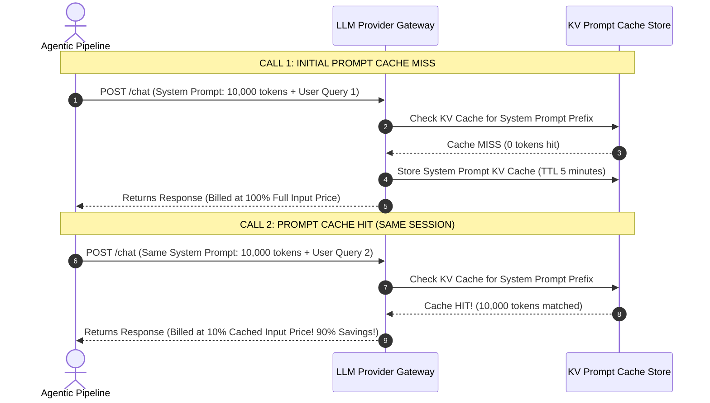
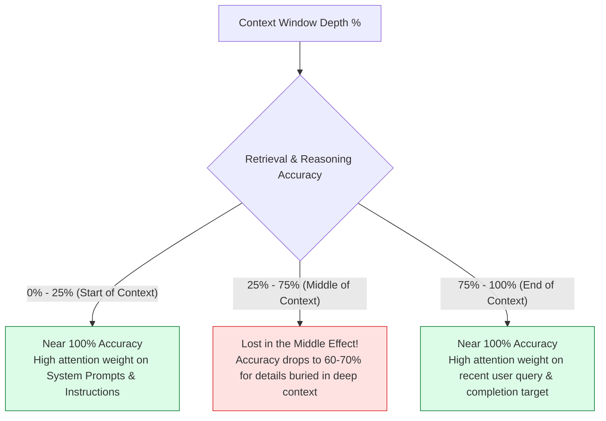

# Module 02: Tokens, Context Windows, Prompt Caching, and Cost Optimization

## Overview

Large Language Models process text as discrete numerical sequences called **Tokens** created via subword tokenization algorithms (e.g. **Byte-Pair Encoding (BPE)** or **tiktoken**). Every LLM operates within a fixed **Context Window Limit** (e.g. 128k to 2M tokens) representing the maximum total length of input prompt tokens plus output generated tokens.

Understanding **Tokenization Ratios**, **Context Window Saturation & Needle-in-a-Haystack Retrieval**, **Prompt Caching Economics**, and **Granular API Cost Calculation** is critical for building economically viable agentic architectures.

---

## 1. Tokenization Pipeline & Context Window Architecture

```mermaid
flowchart TD
    RawText[Raw Input Text String] --> BPEEngine["1. Byte-Pair Encoding (tiktoken / SentencePiece)<br/>Splits text into subword fragments & punctuation"]

    BPEEngine --> TokenIDs["2. Array of Integer Token IDs<br/>[15496, 11, 318, 257, 4921]"]

    subgraph Context Window Boundary (e.g., 128,000 Tokens)
        TokenIDs --> SystemPrompt["System & User Prompt Tokens (Input Tier)"]
        SystemPrompt --> ContextHistory["Conversation Memory History"]
        ContextHistory --> ToolOutput["Tool Execution Payload Returns"]
        ToolOutput --> MaxGenLimit["Max Output Completion Tokens (Output Tier: 4,096 - 16,384)"]
    end

    MaxGenLimit --> APICall["LLM Provider API Engine"]

    style BPEEngine fill:#dbeafe,stroke:#1d4ed8
    style MaxGenLimit fill:#dcfce7,stroke:#15803d
```

---

## 2. Prompt Caching Mechanics & Cost Dynamics

Modern LLM providers (Anthropic Claude, OpenAI, Google Gemini) offer **Prompt Caching**. When system prompts, schema definitions, or RAG contexts ($> 1,024$ tokens) are reused across agent loops, cached tokens receive a **$75\% - 90\%$ cost discount** and sub-100ms latency reduction:



### Commercial LLM Token Pricing & Context Window Matrix

| Model Identifier | Context Window Limit | Max Output Limit | Input Price / 1M Tokens | Cached Input / 1M Tokens | Output Price / 1M Tokens |
| :--- | :--- | :--- | :--- | :--- | :--- |
| **Claude 3.5 Sonnet** | 200,000 Tokens | 8,192 Tokens | **$3.00** | **$0.30** ($90\%$ off) | **$15.00** |
| **GPT-4o** | 128,000 Tokens | 16,384 Tokens | **$2.50** | **$1.25** ($50\%$ off) | **$10.00** |
| **GPT-4o-mini** | 128,000 Tokens | 16,384 Tokens | **$0.15** | **$0.075** ($50\%$ off) | **$0.60** |
| **Gemini 1.5 Pro** | 2,000,000 Tokens | 8,192 Tokens | **$1.25** ($< 128k$) | **$0.31** ($75\%$ off) | **$5.00** |

---

## 3. Context Degradation: Needle in a Haystack Performance



---

## 4. Practical Implementation Showcase: Production Cost & Token Counter Engine

```javascript
class ProductionTokenCostCalculator {
  constructor(modelPricingTable) {
    this.pricingTable = modelPricingTable;
  }

  /**
   * Fast rule-of-thumb character-based token estimator
   * English: ~4 characters per token
   * Code / JSON: ~2.5 characters per token
   */
  estimateTokens(text, contentType = "english") {
    if (!text) return 0;
    const charsPerToken = contentType === "code" || contentType === "json" ? 2.5 : 4.0;
    return Math.ceil(text.length / charsPerToken);
  }

  /**
   * Calculates granular API cost with prompt caching discounts
   */
  calculateCallCost({ model, inputTokens, outputTokens, cachedTokens = 0 }) {
    const pricing = this.pricingTable[model];
    if (!pricing) {
      throw new Error(`Pricing model '${model}' not found in registry.`);
    }

    const nonCachedInput = Math.max(0, inputTokens - cachedTokens);

    const baseInputCost = (nonCachedInput / 1_000_000) * pricing.inputPricePerM;
    const cachedInputCost = (cachedTokens / 1_000_000) * (pricing.cachedInputPricePerM || pricing.inputPricePerM);
    const outputCost = (outputTokens / 1_000_000) * pricing.outputPricePerM;

    const totalCostUSD = baseInputCost + cachedInputCost + outputCost;

    return {
      model,
      tokenBreakdown: {
        totalInputTokens: inputTokens,
        cachedInputTokens: cachedTokens,
        nonCachedInputTokens: nonCachedInput,
        outputTokens,
        totalTokens: inputTokens + outputTokens
      },
      costBreakdown: {
        baseInputCostUSD: Number(baseInputCost.toFixed(6)),
        cachedInputCostUSD: Number(cachedInputCost.toFixed(6)),
        outputCostUSD: Number(outputCost.toFixed(6)),
        totalCostUSD: Number(totalCostUSD.toFixed(6))
      }
    };
  }
}

// Enterprise Model Pricing Registry
const PRICING_REGISTRY = {
  "claude-3-5-sonnet": {
    inputPricePerM: 3.0,
    cachedInputPricePerM: 0.3,
    outputPricePerM: 15.0
  },
  "gpt-4o": {
    inputPricePerM: 2.5,
    cachedInputPricePerM: 1.25,
    outputPricePerM: 10.0
  }
};

const costCalculator = new ProductionTokenCostCalculator(PRICING_REGISTRY);

// Simulation: 50,000 Token RAG Prompt with 40,000 Cached Tokens
const simulation = costCalculator.calculateCallCost({
  model: "claude-3-5-sonnet",
  inputTokens: 50000,
  outputTokens: 1200,
  cachedTokens: 40000
});

console.log("Production Token & Cost Breakdown:", JSON.stringify(simulation, null, 2));
```

---

## Key Production Takeaways

1. **Output Tokens Cost $3\times - 5\times$ More Than Input Tokens**: Optimize prompts to request concise, structured JSON outputs rather than verbose multi-paragraph responses to minimize costs.
2. **Leverage Prompt Caching for Agent System Prompts**: Design fixed system prompt prefixes exceeding $1,024$ tokens so LLM providers can cache the prefix across multi-turn agent loops, lowering input costs by up to $90\%$.
3. **Beware the "Lost in the Middle" Effect**: Information placed in the center of long context windows ($50\%$ depth) suffers from reduced retrieval accuracy. Place critical instructions at the top (system prompt) or bottom (user query).
4. **Enforce Token Budget Caps**: Always set explicit `max_tokens` limits on API requests to protect against runaway generation loops or recursive agent cost spikes.

