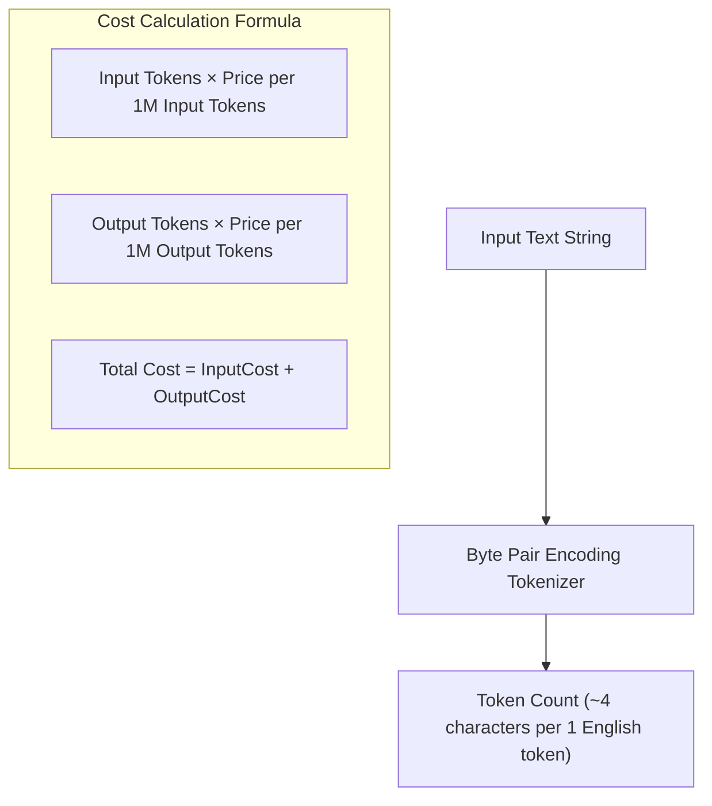

# File 02: Tokens, Context Windows, and Cost Estimation

## Overview
LLMs do not process raw text directly; text is broken into **Tokens** using algorithms like BPE (Byte Pair Encoding). The **Context Window** defines the maximum token capacity (Input Prompt + Output Generation) an LLM can process simultaneously.

---

## 1. Token Estimation & Cost Architecture



---

## 2. Token Estimation & API Cost Calculator Implementation

```javascript
class TokenCostCalculator {
    constructor(pricingPerMillion) {
        this.pricing = pricingPerMillion; // { inputPrice, outputPrice }
    }

    // Heuristic rule-of-thumb token estimation: ~4 chars per token for English
    estimateTokenCount(text) {
        return Math.ceil(text.length / 4);
    }

    calculateCost(promptText, completionText) {
        const inputTokens = this.estimateTokenCount(promptText);
        const outputTokens = this.estimateTokenCount(completionText);

        const inputCost = (inputTokens / 1_000_000) * this.pricing.inputPrice;
        const outputCost = (outputTokens / 1_000_000) * this.pricing.outputPrice;
        const totalCost = inputCost + outputCost;

        return {
            inputTokens,
            outputTokens,
            totalTokens: inputTokens + outputTokens,
            totalCostUSD: totalCost.toFixed(6)
        };
    }
}

// Pricing for Claude 3.5 Sonnet ($3 / 1M Input, $15 / 1M Output)
const calculator = new TokenCostCalculator({ inputPrice: 3.0, outputPrice: 15.0 });

const prompt = "Analyze the system architecture of our microservices platform and summarize key risks.";
const completion = "The primary risks include single point of failure in the API Gateway and lack of distributed tracing across services.";

console.log("Cost Estimation Breakdown:", calculator.calculateCost(prompt, completion));
```

---

## Key Takeaways
1. **Rule of Thumb**: $1 \text{ Token} \approx 4 \text{ Characters}$ or $0.75 \text{ Words}$ in English.
2. Output tokens are significantly more expensive than input tokens across provider APIs.
3. Exceeding model **Context Windows** triggers truncated context or API error exceptions.
