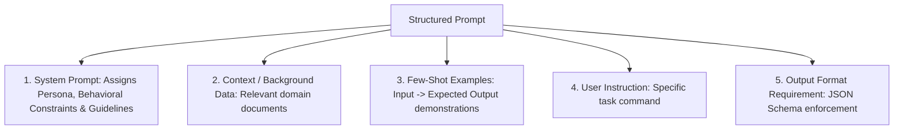

# File 03: Prompt Engineering Basics (System Prompts, Few-Shot, Role Prompting)

## Overview
**Prompt Engineering** is the practice of structuring input text to guide LLM generation towards accurate, high-quality responses. Fundamental techniques include establishing clear **System Roles**, providing **Few-Shot Examples**, and defining explicit **Output Formats** (JSON / Markdown).

---

## 1. Prompt Structuring Architecture



---

## 2. Structured Few-Shot Prompt Builder Implementation

```javascript
class PromptBuilder {
    constructor() {
        this.systemInstruction = "";
        this.examples = [];
    }

    setSystemRole(roleDescription) {
        this.systemInstruction = `SYSTEM ROLE: ${roleDescription}\n`;
        return this;
    }

    addFewShotExample(input, output) {
        this.examples.push({ input, output });
        return this;
    }

    buildUserPrompt(userInput) {
        let prompt = this.systemInstruction;
        
        if (this.examples.length > 0) {
            prompt += "\nEXAMPLES:\n";
            this.examples.forEach((ex, i) => {
                prompt += `Input ${i + 1}: ${ex.input}\nOutput ${i + 1}: ${ex.output}\n\n`;
            });
        }

        prompt += `CURRENT TASK:\nInput: ${userInput}\nOutput:`;
        return prompt;
    }
}

const builder = new PromptBuilder();
const prompt = builder
    .setSystemRole("You are an expert Code Reviewer. Analyze code snippets and classify security risks as HIGH, MEDIUM, or LOW.")
    .addFewShotExample("eval(req.query.code)", "HIGH - Arbitrary Code Execution Risk")
    .addFewShotExample("console.log(user.name)", "LOW - Debug Logging")
    .buildUserPrompt("db.query(`SELECT * FROM users WHERE id = ${req.body.id}`)");

console.log(prompt);
```

---

## Key Takeaways
1. **System Prompts** establish persona, rules, and boundaries for conversational agents.
2. **Few-Shot Prompting** (providing 2-5 input/output examples) dramatically improves accuracy for complex tasks compared to Zero-Shot prompts.
3. Explicitly demand output formats (e.g., `"Return ONLY valid JSON matching schema"`).
