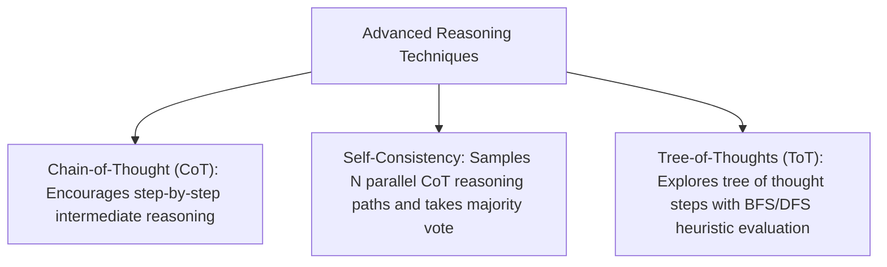

# File 04: Advanced Prompting Techniques (Chain-of-Thought, Tree-of-Thoughts, Self-Consistency)

## Overview
Advanced prompting techniques improve LLM reasoning performance on complex mathematical, logic, and multi-step planning tasks using **Chain-of-Thought (CoT)** ("Think step-by-step"), **Self-Consistency** (majority voting over $N$ reasoning paths), and **Tree-of-Thoughts (ToT)** search.

---

## 1. CoT vs Self-Consistency vs Tree-of-Thoughts



---

## 2. Self-Consistency Majority Voting Implementation

```javascript
class SelfConsistencyResolver {
    // Aggregates N independent reasoning outputs and returns the majority answer
    static resolveMajorityVote(responses) {
        const voteCounts = new Map();

        responses.forEach(resp => {
            // Extract final answer line
            const answerMatch = resp.match(/FINAL ANSWER:\s*(.+)$/m);
            const answer = answerMatch ? answerMatch[1].trim() : resp.trim();
            voteCounts.set(answer, (voteCounts.get(answer) || 0) + 1);
        });

        let majorityAnswer = null;
        let maxVotes = 0;

        for (const [answer, count] of voteCounts) {
            if (count > maxVotes) {
                maxVotes = count;
                majorityAnswer = answer;
            }
        }

        return { majorityAnswer, confidence: `${maxVotes}/${responses.length} votes` };
    }
}

const sampledLLMOutputs = [
    "Step 1: 10 + 5 = 15. Step 2: 15 * 2 = 30. FINAL ANSWER: 30",
    "Step 1: 10 + 5 = 15. Step 2: 15 * 2 = 30. FINAL ANSWER: 30",
    "Step 1: 10 * 2 = 20. Step 2: 20 + 5 = 25. FINAL ANSWER: 25"
];

console.log("Self-Consistency Result:", SelfConsistencyResolver.resolveMajorityVote(sampledLLMOutputs));
```

---

## Key Takeaways
1. **Chain-of-Thought (CoT)** forces the LLM to output step-by-step reasoning tokens before generating the final answer.
2. **Self-Consistency** mitigates individual reasoning errors by running multiple parallel generations and selecting the **majority vote**.
3. **Tree-of-Thoughts (ToT)** allows exploring, evaluating, and backtracking across multiple candidate solution branches.
