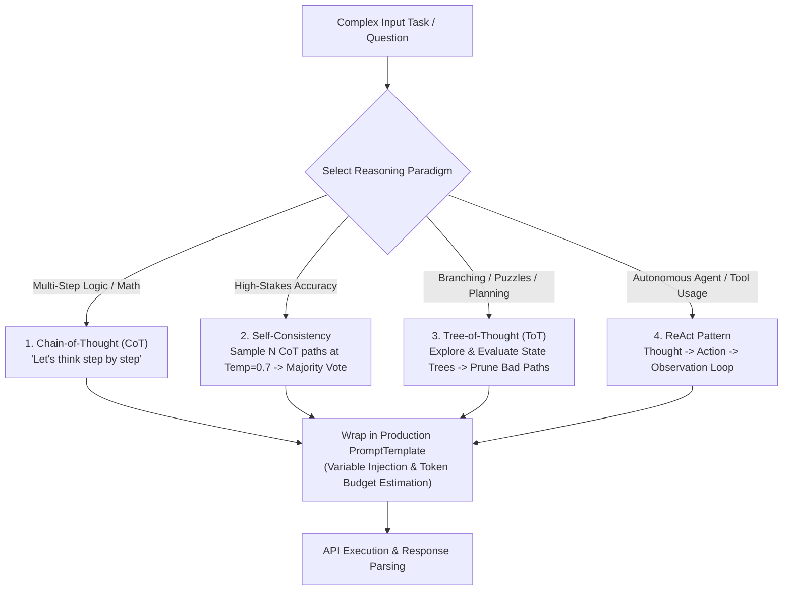
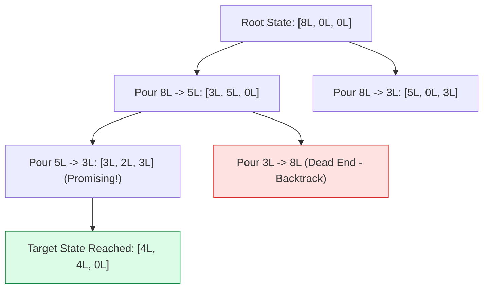

# Module 04: Advanced Prompt Engineering — Chain-of-Thought, Self-Consistency, Tree-of-Thought, & ReAct

## Theoretical Overview & Advanced Reasoning Paradigms

Basic zero-shot prompting hits a capability ceiling on multi-step reasoning, mathematical calculations, logic puzzles, and complex tool orchestration. Advanced prompt engineering techniques structure the LLM's computation by forcing intermediate reasoning steps before arriving at a final answer.

By leveraging **Chain-of-Thought (CoT)**, **Self-Consistency (Majority Voting)**, **Tree-of-Thought (ToT Branching)**, **ReAct (Reason + Act)**, and **Templated Variable Injection**, developers can boost model reasoning accuracy from $\sim 50\%$ to over $90\%+$ without fine-tuning weights.



### Real-World Analogy: IAS Toppers Rough Work Sheets
Think of an IAS exam topper solving complex policy questions:
- **Standard Prompt**: Writing down only the final answer without working. If the mental calculation makes a tiny arithmetic slip early on, the entire answer fails.
- **Chain-of-Thought (CoT)**: Showing explicit rough work step-by-step on the margin ("Step 1: Calculate total budget, Step 2: Subtract administrative overhead...").
- **Self-Consistency**: Asking 5 different IAS toppers to solve the same problem independently and accepting the consensus majority answer.
- **Tree-of-Thought (ToT)**: Evaluating multiple candidate policy solutions, drawing decision trees, and discarding non-viable options before writing the final recommendation.
- **ReAct**: Alternating between analyzing the situation (Thought), fetching data from ministry reports (Action), reading the figures (Observation), and deciding the next step.

---

## 1. Chain-of-Thought (CoT) Prompting (`Section 1`)

CoT forces the LLM to generate intermediate reasoning tokens prior to the final answer token. This unlocks significant reasoning improvements.

```javascript
// Standard Prompt vs Chain-of-Thought Prompt Comparison
const standardPrompt = `Q: A shop sells mangoes at ₹40 each. Rahul buys 5 mangoes and gets a 10% discount. He pays with a ₹500 note. How much change does he get?
A:`;

const cotPrompt = `Q: A shop sells mangoes at ₹40 each. Rahul buys 5 mangoes and gets a 10% discount. He pays with a ₹500 note. How much change does he get?

Let's solve this step by step:
Step 1: Calculate total before discount (5 * 40 = 200)
Step 2: Calculate discount amount (10% of 200 = 20)
Step 3: Calculate final price (200 - 20 = 180)
Step 4: Calculate change (500 - 180 = 320)

A: Rahul receives ₹320 change.`;

// Zero-Shot CoT: The "Magic Phrase"
const zeroShotCoT = `Q: If a train travels at 60 km/h and needs to cover 240 km, but stops for 30 minutes halfway, what's the total journey time?

Let's think step by step.

A:`;

// Programmatic Guided CoT Prompt Builder
function buildCoTPrompt(question, steps = null) {
  let prompt = `Question: ${question}\n\n`;
  if (steps) {
    prompt += "Think through this systematically:\n";
    steps.forEach((s, i) => { prompt += `Step ${i + 1}: ${s}\n`; });
    prompt += "\nAnswer:";
  } else {
    prompt += "Let's think step by step.\n\nAnswer:";
  }
  return prompt;
}
```

---

## 2. Self-Consistency: Sampling Multiple Paths & Majority Voting (`Section 2`)

Single reasoning paths can encounter unexpected logical drifts. **Self-Consistency** samples $N$ independent reasoning paths (with $T=0.7$) and selects the statistical majority answer.

```javascript
// Majority Voting Algorithm across N Reasoning Paths
function selfConsistencyVote(answers) {
  const counts = {};
  answers.forEach(a => {
    const normalized = a.toString().trim().toLowerCase();
    counts[normalized] = (counts[normalized] || 0) + 1;
  });

  const sorted = Object.entries(counts).sort((a, b) => b[1] - a[1]);
  const total = answers.length;

  return {
    winner: sorted[0][0],
    confidence: (sorted[0][1] / total * 100).toFixed(0) + "%",
    distribution: sorted.map(([ans, count]) => ({
      answer: ans,
      votes: count,
      pct: (count / total * 100).toFixed(0) + "%",
    })),
  };
}

// 5 Parallel Reasoning Paths for "17 * 24"
const simulatedPaths = [
  { reasoning: "17*20=340, 17*4=68, total=408", answer: 408 },
  { reasoning: "17*24=17*25-17=425-17=408", answer: 408 },
  { reasoning: "20*24=480, -3*24=-72, 480-72=408", answer: 408 },
  { reasoning: "17*24=17*2*12=34*12=408", answer: 408 },
  { reasoning: "17*24=17*12*2=204*2=408", answer: 408 },
];

const voteResult = selfConsistencyVote(simulatedPaths.map(p => p.answer));
// Output: winner = 408, confidence = "100%"
```

---

## 3. Tree-of-Thought (ToT) Framework (`Section 3`)

Tree-of-Thought allows the LLM to explore multiple solution branches, evaluate state quality, and backtrack when encountering non-promising paths.



```javascript
// Tree-of-Thought Water Jug Problem Solver (8L, 5L, 3L to get 4L)
function totWaterJug() {
  const target = 4;
  const capacities = [8, 5, 3];
  const initial = [8, 0, 0];
  const visited = new Set();
  const queue = [[initial, []]];

  while (queue.length > 0) {
    const [state, path] = queue.shift();
    const key = state.join(",");
    if (visited.has(key)) continue;
    visited.add(key);

    if (state[0] === target) return { solution: state, path: [...path, state] };

    // Explore tree branches (all valid pours)
    for (let from = 0; from < 3; from++) {
      for (let to = 0; to < 3; to++) {
        if (from === to || state[from] === 0) continue;
        const pour = Math.min(state[from], capacities[to] - state[to]);
        if (pour === 0) continue;
        const newState = [...state];
        newState[from] -= pour;
        newState[to] += pour;
        queue.push([newState, [...path, state]]);
      }
    }
  }
  return null;
}
```

---

## 4. ReAct Pattern: Reason + Act Loop (`Section 4`)

The **ReAct (Reason + Act)** pattern alternates between explicit reasoning steps (`Thought`), execution commands (`Action`), and returning external tool outputs (`Observation`).

```javascript
const reactPromptFormat = `You are an assistant that can use tools. Follow this exact format:

Thought: [reasoning about what to do next]
Action: [tool_name(parameters)]
Observation: [result returned by tool]
... (repeat Thought/Action/Observation)
Final Answer: [conclusion]

Available tools:
- search(query): Search web
- calculator(expression): Math evaluation

Question: What is the population density of Uttar Pradesh?

Thought: I need UP's population first.
Action: search("Uttar Pradesh population")
Observation: 240,000,000 people

Thought: Now I need UP's land area.
Action: search("Uttar Pradesh area sq km")
Observation: 243,286 sq km

Thought: Calculate density = population / area.
Action: calculator(240000000 / 243286)
Observation: 986.5

Final Answer: The population density of Uttar Pradesh is approximately 987 people per sq km.`;

// Programmatic ReAct Execution Loop Simulator
function simulateReActLoop(question, tools, maxSteps = 5) {
  const trace = [];
  let currentQuestion = question;

  for (let step = 0; step < maxSteps; step++) {
    const thought = `[Step ${step + 1}] Analyzing: ${currentQuestion}`;
    const action = tools[step % tools.length];
    const observation = `Result from ${action.name}: ${action.mockResult}`;

    trace.push({ step: step + 1, thought, action: action.name, observation });
    if (action.isFinal) break;
    currentQuestion = observation;
  }
  return trace;
}
```

---

## 5. Prompt Templates & Variable Injection (`Section 5`)

Hard-coding prompts does not scale in production. `PromptTemplate` handles variable injection, template composition, and token estimation:

```javascript
class PromptTemplate {
  constructor(template, requiredVars = []) {
    this.template = template;
    this.requiredVars = requiredVars;
  }

  format(variables) {
    const missing = this.requiredVars.filter(v => !(v in variables));
    if (missing.length > 0) {
      throw new Error(`Missing template variables: ${missing.join(", ")}`);
    }

    let result = this.template;
    for (const [key, value] of Object.entries(variables)) {
      const placeholder = `{{${key}}}`;
      while (result.includes(placeholder)) {
        result = result.replace(placeholder, String(value));
      }
    }
    return result;
  }

  estimateTokens(variables) {
    const formatted = this.format(variables);
    return Math.ceil(formatted.length / 4);
  }
}

// Enterprise Support Prompt Template
const supportTemplate = new PromptTemplate(
  `You are a {{role}} for {{company}}.
Customer name: {{customer_name}} (Language: {{language}})
Issue: {{issue}}

Respond in {{language}}. Keep response under {{max_words}} words.`,
  ["role", "company", "customer_name", "language", "issue"]
);
```

---

## Key Production Takeaways

1. **Zero-Shot CoT "Magic Phrase"**: Simply appending `"Let's think step by step"` to prompts increases accuracy by $20\% - 40\%$ on complex math and logic tasks.
2. **Self-Consistency for Mission-Critical Logic**: Run $N=5$ parallel CoT paths at $T=0.7$ and take a majority vote to eliminate accidental reasoning errors.
3. **Tree-of-Thought for Branching Problems**: Use ToT when problems require exploring multiple state paths (e.g. water jug puzzles, route planning, code generation).
4. **ReAct is the Agent Foundation**: All modern AI agents use the ReAct loop (`Thought -> Action -> Observation`) to decide which tools to call dynamically.
5. **Templated Variable Injection**: Wrap all production prompts in `PromptTemplate` classes to enforce required parameters, prevent missing inputs, and estimate token overhead.
