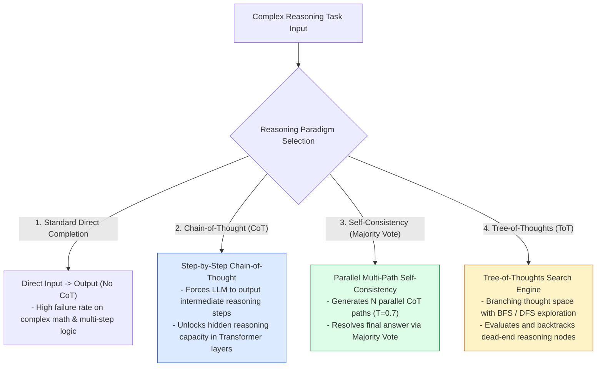
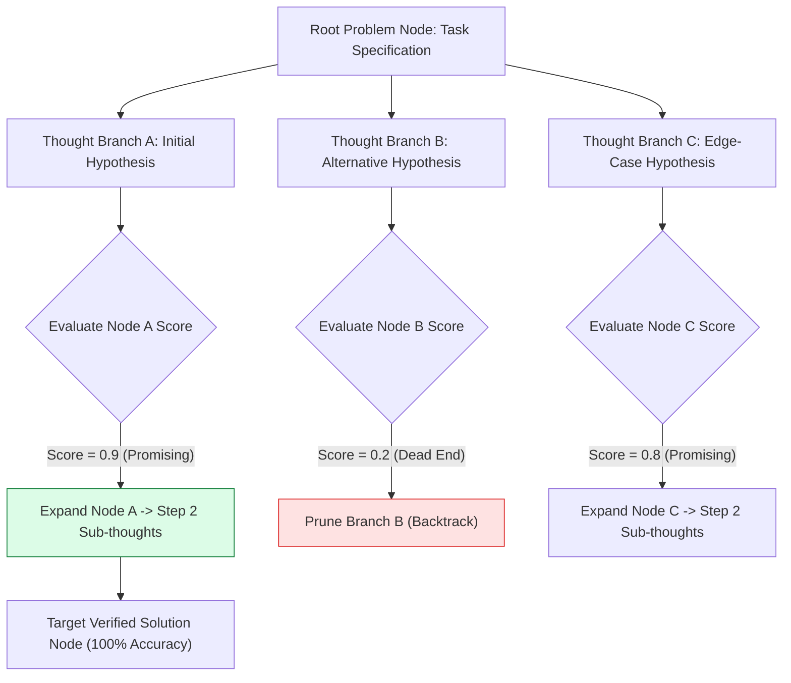
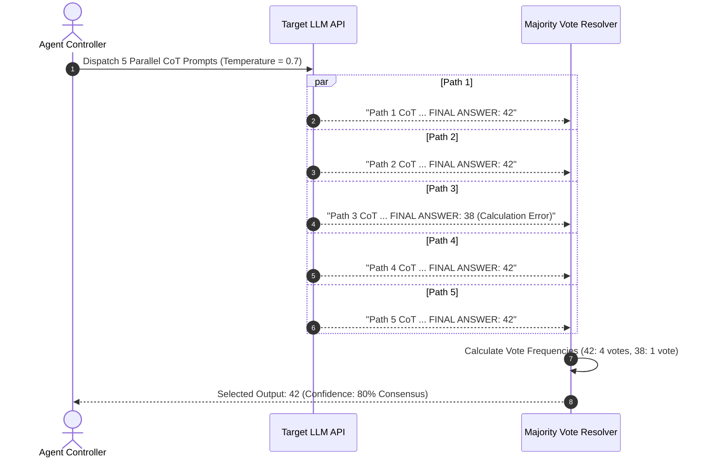

# Module 04: Advanced Reasoning Techniques — CoT, Self-Consistency, and Tree-of-Thoughts

## Overview

Complex mathematical deduction, logic puzzles, multi-step software design, and root-cause analysis often exceed the single-pass reasoning capabilities of standard zero-shot prompts. **Advanced Reasoning Paradigms**—such as **Chain-of-Thought (CoT)**, **Self-Consistency Majority Voting**, and **Tree-of-Thoughts (ToT)**—allocate additional output token budget to explicitly unpack intermediate reasoning steps before declaring a final answer.

Understanding **Zero-Shot vs. Few-Shot CoT**, **Self-Consistency Sampling Economics**, and **Tree-of-Thoughts State-Space Search (BFS/DFS)** is essential for high-accuracy agentic architectures.

---

## 1. Comparative Reasoning Paradigms Topology



---

## 2. Tree-of-Thoughts (ToT) State-Space Search Mechanics

Unlike linear Chain-of-Thought, **Tree-of-Thoughts** models problem solving as a search over a directed graph of "Thought Nodes", evaluating candidates via heuristic scoring:



### Advanced Reasoning Strategy Comparison Matrix

| Reasoning Strategy | Inference Token Cost | Execution Model | Accuracy Boost on Hard Tasks | Primary Best Use Case |
| :--- | :--- | :--- | :--- | :--- |
| **Standard Direct** | $1\times$ | Single Completion Call | Baseline ($30\% - 50\%$) | Simple classification, summaries, basic Q&A. |
| **Chain-of-Thought (CoT)** | $2\times - 3\times$ | Single Sequence ("Think step by step") | Moderate ($70\% - 85\%$) | Multi-step calculations, code debugging, logical deduction. |
| **Self-Consistency** | $5\times - 10\times$ | Parallel $N$ Samples + Majority Voting | High ($90\% - 95\%$) | Math benchmark competitions, legal contract analysis. |
| **Tree-of-Thoughts (ToT)** | $10\times - 30\times$ | Multi-Turn BFS/DFS Search with Evaluator | Maximum ($95\%+$) | Complex strategic planning, game theory, architecture design. |

---

## 3. Self-Consistency Execution & Voting Pipeline



---

## 4. Practical Implementation Showcase: Self-Consistency Majority Voting Engine

```javascript
class SelfConsistencyEngine {
  constructor(llmClient, options = {}) {
    this.client = llmClient;
    this.sampleCount = options.sampleCount || 5;
    this.temperature = options.temperature || 0.7;
  }

  /**
   * Parses reasoning output string and extracts answer tag payload
   */
  extractAnswerTag(completionText) {
    // Look for explicit tags like FINAL ANSWER: <val> or <answer><val></answer>
    const xmlMatch = completionText.match(/<answer>([\s\S]*?)<\/answer>/i);
    if (xmlMatch) return xmlMatch[1].trim();

    const lineMatch = completionText.match(/FINAL ANSWER:\s*(.+)$/im);
    if (lineMatch) return lineMatch[1].trim();

    // Fallback: Use last line of response
    const lines = completionText.trim().split("\n");
    return lines[lines.length - 1].trim();
  }

  /**
   * Executes parallel CoT samplings and calculates weighted majority consensus
   */
  async resolveTask(promptText) {
    const cotPrompt = `${promptText}\n\nLet's think step by step to solve this problem. Delineate your final answer clearly inside <answer>YOUR_ANSWER</answer> tags.`;

    // Simulate parallel asynchronous LLM API calls
    const parallelCalls = Array.from({ length: this.sampleCount }, () =>
      this.client.generateCompletion(cotPrompt, { temperature: this.temperature })
    );

    const responses = await Promise.all(parallelCalls);

    // Vote Frequency Aggregator
    const voteMap = new Map();

    responses.forEach((response, idx) => {
      const extractedAnswer = this.extractAnswerTag(response);
      if (!voteMap.has(extractedAnswer)) {
        voteMap.set(extractedAnswer, { count: 0, exemplarReasoning: response });
      }
      voteMap.get(extractedAnswer).count += 1;
    });

    // Find Majority Winner
    let winnerAnswer = null;
    let maxVotes = -1;
    let winningReasoning = "";

    for (const [answer, record] of voteMap.entries()) {
      if (record.count > maxVotes) {
        maxVotes = record.count;
        winnerAnswer = answer;
        winningReasoning = record.exemplarReasoning;
      }
    }

    const consensusScore = (maxVotes / this.sampleCount) * 100;

    return {
      finalAnswer: winnerAnswer,
      consensusConfidence: `${consensusScore.toFixed(1)}% (${maxVotes}/${this.sampleCount} votes)`,
      reasoningTrace: winningReasoning,
      voteDistribution: Object.fromEntries(
        Array.from(voteMap.entries()).map(([k, v]) => [k, v.count])
      )
    };
  }
}

// Mock LLM Client Simulator
const mockLLMClient = {
  generateCompletion: async (prompt, opts) => {
    const mockOutcomes = [
      "Step 1: Calculate total RAM (64GB). Step 2: Subtract OS overhead (4GB). Step 3: Divide remaining 60GB by 2GB per worker = 30 workers. <answer>30 workers</answer>",
      "Step 1: Total RAM is 64GB. OS uses 4GB leaving 60GB. 60GB / 2GB = 30. <answer>30 workers</answer>",
      "Step 1: 64GB RAM / 2GB = 32 workers. (Forgot OS overhead). <answer>32 workers</answer>",
      "Step 1: Overhead 4GB subtracted from 64GB = 60GB. Each worker 2GB -> 30 workers. <answer>30 workers</answer>",
      "Step 1: 64GB - 4GB = 60GB. 60 / 2 = 30. <answer>30 workers</answer>"
    ];
    return mockOutcomes[Math.floor(Math.random() * mockOutcomes.length)];
  }
};

// Execution Test
const engine = new SelfConsistencyEngine(mockLLMClient, { sampleCount: 5, temperature: 0.7 });
engine.resolveTask("How many 2GB worker processes can run on a 64GB RAM server if OS reserves 4GB?")
  .then((res) => console.log("Self-Consistency Consensus Report:\n", JSON.stringify(res, null, 2)));
```

---

## Key Production Takeaways

1. **Use "Think Step-by-Step" Trigger Phrases**: Simply adding `"Let's think step by step"` (Zero-Shot CoT) forces the LLM to output reasoning tokens before generating conclusions, drastically boosting accuracy on logic tasks.
2. **Apply Self-Consistency to High-Stakes Operations**: For critical financial, medical, or legal tasks, run $5 - 10$ parallel CoT generations with temperature $0.7$ and select the majority vote to eliminate individual hallucination errors.
3. **Use Tree-of-Thoughts for Combinatorial Planning**: When solving complex search space problems (e.g. scheduling, refactoring multi-file codebases), use ToT to systematically evaluate and backtrack candidate branches.
4. **Standardize Answer Extractors via Delimiters**: Enforce XML tags (e.g., `<answer>42</answer>`) in CoT prompts to allow automated Regex scripts to parse and count answers reliably.

