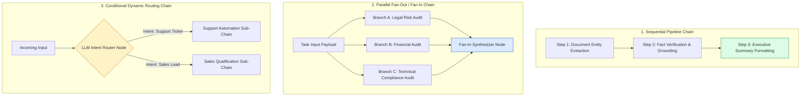
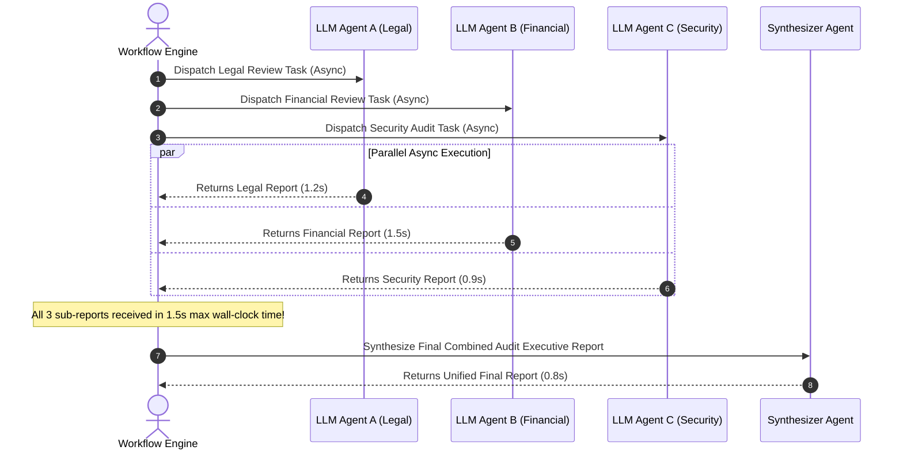
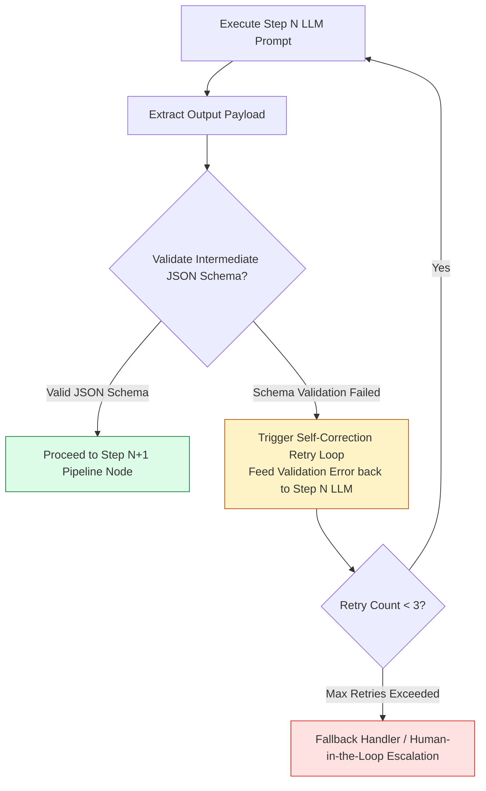

# Module 05: Prompt Chaining, Workflow Composition, and Pipeline Orchestration

## Overview

Attempting to solve complex multi-stage tasks (such as document auditing, codebase migration, or financial report synthesis) in a single massive prompt often results in degraded quality, missed constraints, and context window bloat. **Prompt Chaining** decomposes monolithic tasks into a directed sequence of focused, modular LLM execution steps, passing transformed context payloads from Step $N$ into Step $N+1$.

Understanding **Sequential Chains**, **Parallel Fan-Out / Fan-In Aggregation**, **Conditional Dynamic Routing**, and **Intermediate Step Validation Guards** is essential for scalable AI engineering.

---

## 1. Prompt Chaining Topology & Workflow Taxonomies



---

## 2. Parallel Fan-Out / Fan-In Latency & Cost Optimization

Parallel fan-out execution reduces total end-to-end pipeline latency from $O(N_1 + N_2 + N_3)$ down to $O(\max(N_1, N_2, N_3)) + \text{Synthesis}$:



### Chaining Architectural Patterns Comparison

| Pattern Type | Latency Characteristics | Cost Model | Primary Use Case |
| :--- | :--- | :--- | :--- |
| **Sequential Chain** | Linear additive latency ($T_1 + T_2 + T_3$) | Token count grows step-by-step | Multi-stage text transformations, translation then code generation. |
| **Parallel Fan-Out / Fan-In** | Low wall-clock latency ($\max(T_i) + T_{\text{synth}}$) | Higher input token cost due to parallel prompts | Multi-perspective document analysis (legal, technical, financial). |
| **Conditional Routing** | Optimal ($T_{\text{route}} + T_{\text{selected}}$) | Cost-efficient; fires only target branch | Intent classification and domain-specific query dispatching. |

---

## 3. Intermediate Step Validation Guard Pipeline



---

## 4. Practical Implementation Showcase: Enterprise Workflow Orchestrator

```javascript
class WorkflowChainEngine {
  constructor(llmClient) {
    this.client = llmClient;
  }

  /**
   * Executes a sequential pipeline step with error validation
   */
  async executeSequential(initialContext, steps) {
    let currentPayload = initialContext;
    const executionHistory = [];

    for (let idx = 0; idx < steps.length; idx++) {
      const step = steps[idx];
      console.log(`[WORKFLOW STEP ${idx + 1}/${steps.length}] Executing '${step.name}'...`);

      const prompt = step.promptBuilder(currentPayload);
      const startTime = Date.now();

      const rawResponse = await this.client.generateCompletion(prompt);
      const durationMs = Date.now() - startTime;

      let validatedOutput = rawResponse;
      if (step.validator) {
        validatedOutput = step.validator(rawResponse);
      }

      executionHistory.push({
        stepName: step.name,
        durationMs,
        inputContext: currentPayload,
        output: validatedOutput
      });

      currentPayload = validatedOutput;
    }

    return { finalOutput: currentPayload, history: executionHistory };
  }

  /**
   * Executes parallel fan-out requests and synthesizes results via fan-in step
   */
  async executeParallelFanOut(initialContext, parallelBranches, synthesisStep) {
    console.log(`[WORKFLOW PARALLEL] Launching ${parallelBranches.length} fan-out branches...`);

    const branchPromises = parallelBranches.map(async (branch) => {
      const prompt = branch.promptBuilder(initialContext);
      const res = await this.client.generateCompletion(prompt);
      return { branchName: branch.name, result: res };
    });

    const branchResults = await Promise.all(branchPromises);
    console.log(`[WORKFLOW PARALLEL] All ${branchResults.length} branches completed. Synthesizing...`);

    const synthesisPrompt = synthesisStep.promptBuilder(branchResults);
    const finalReport = await this.client.generateCompletion(synthesisPrompt);

    return { branchResults, finalReport };
  }
}

// Simulated LLM API Client
const mockLLMClient = {
  generateCompletion: async (prompt) => {
    if (prompt.includes("LEGAL")) return "LEGAL ANALYSIS: Compliance Verified. Zero liability found.";
    if (prompt.includes("FINANCIAL")) return "FINANCIAL ANALYSIS: Q4 Revenue $1.2M (+15% YoY).";
    if (prompt.includes("SYNTHESIZE")) return "EXECUTIVE BRIEF: Legal and Financial audits passed cleanly.";
    return `Processed: ${prompt.substring(0, 40)}...`;
  }
};

// Execution Test
const orchestrator = new WorkflowChainEngine(mockLLMClient);

const parallelBranches = [
  { name: "Legal Audit", promptBuilder: (ctx) => `LEGAL REVIEW FOR: ${ctx}` },
  { name: "Financial Audit", promptBuilder: (ctx) => `FINANCIAL REVIEW FOR: ${ctx}` }
];

const synthesisStep = {
  name: "Executive Synthesizer",
  promptBuilder: (branchOutputs) =>
    `SYNTHESIZE THE FOLLOWING BRANCH REPORTS:\n${JSON.stringify(branchOutputs, null, 2)}`
};

orchestrator
  .executeParallelFanOut("Enterprise Acquisition Pitch Deck V2", parallelBranches, synthesisStep)
  .then((res) => console.log("\nWorkflow Orchestration Result:\n", JSON.stringify(res, null, 2)));
```

---

## Key Production Takeaways

1. **Decompose Complex Prompts into Focused Steps**: Single prompts attempting to do 5 things simultaneously fail frequently. Splitting tasks into a 3-step prompt chain increases reliability by up to $80\%$.
2. **Use Parallel Fan-Out to Reduce Latency**: When multi-perspective analysis is required (e.g. security, performance, and legal checks), run tasks in parallel using `Promise.all()` to prevent additive latency spikes.
3. **Validate Intermediate Outputs Between Steps**: Insert JSON schema validators between chain steps to catch malformed intermediate data early before calling downstream prompts.
4. **Isolate Scope to Prevent Context Contamination**: Instead of passing the entire raw conversation transcript down every step, extract and pass only the relevant step payload ($N-1$) to keep token usage low.

