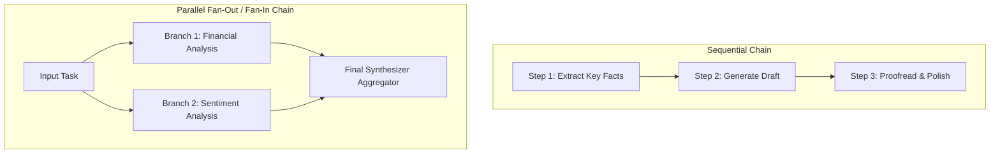

# File 05: Prompt Chaining and Workflows

## Overview
**Prompt Chaining** decomposes complex monolithic tasks into a sequence of smaller, focused LLM steps, passing the output of step $N$ as the input context for step $N+1$. Chaining supports **Sequential Chains**, **Parallel Chains (Fan-Out/Fan-In)**, and **Conditional Branching**.

---

## 1. Prompt Chaining Workflows Taxonomy



---

## 2. Sequential Prompt Chain Implementation

```javascript
class ChainStep {
    constructor(name, promptGeneratorFn) {
        this.name = name;
        this.generatePrompt = promptGeneratorFn;
    }
}

class SequentialPromptChain {
    constructor(steps, mockLlmFn) {
        this.steps = steps;
        this.llm = mockLlmFn;
    }

    async execute(initialInput) {
        let currentContext = initialInput;
        console.log(`[CHAIN START] Initial Input: "${initialInput}"\n`);

        for (let i = 0; i < this.steps.length; i++) {
            const step = this.steps[i];
            const prompt = step.generatePrompt(currentContext);
            console.log(`--- Step ${i + 1}: ${step.name} ---`);
            
            // Execute LLM call for current step
            currentContext = await this.llm(prompt);
            console.log(`Output: "${currentContext}"\n`);
        }

        return currentContext;
    }
}

// Mock LLM function
const mockLLM = async (prompt) => `[LLM Response for prompt: ${prompt.substring(0, 30)}...]`;

const chain = new SequentialPromptChain([
    new ChainStep("Extract Entity", input => `Extract main company name from: "${input}"`),
    new ChainStep("Fetch Financials", entity => `Summarize recent quarterly revenue for entity: "${entity}"`),
    new ChainStep("Format Executive Summary", summary => `Format into executive bullet points: "${summary}"`)
], mockLLM);

chain.execute("Tesla announced record Q4 vehicle deliveries yesterday.");
```

---

## Key Takeaways
1. **Decomposing tasks** into multi-step prompt chains yields dramatically higher accuracy than attempting complex tasks in a single prompt.
2. Supports **Parallel Chains** to speed up multi-perspective analysis (e.g. legal, financial, and technical checks in parallel).
3. Supports **Conditional Branching** to route inputs to specialized prompt sub-chains.
