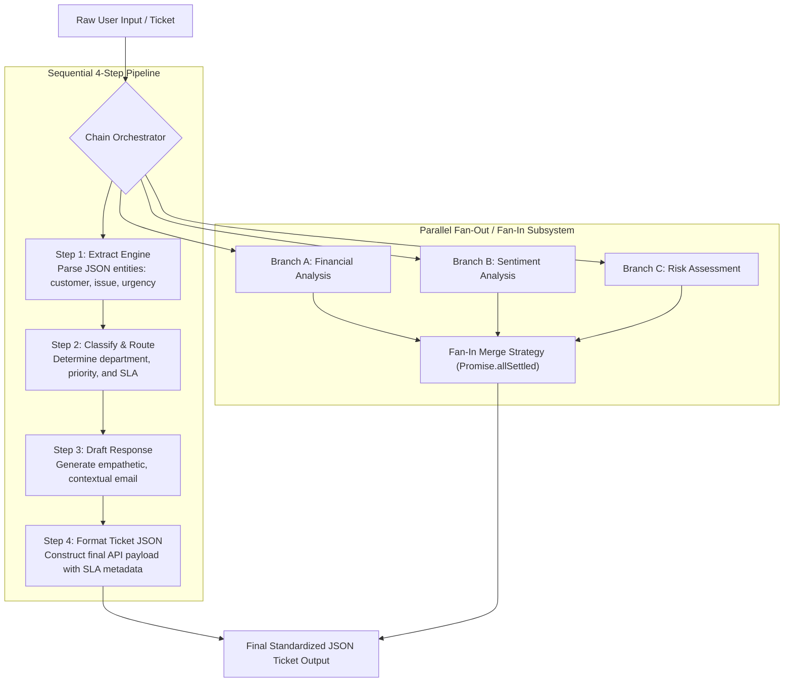

# Module 05: Prompt Chaining & Pipeline Orchestration Architecture

## Theoretical Overview & Pipeline Orchestration

Single-prompt LLM interactions fail on complex multi-stage tasks. **Prompt Chaining** decomposes a complex objective into modular, sequential, parallel, or conditional sub-prompts. Each step in a chain executes a focused task, validates its output, and passes structured data downstream.

By organizing workflows into **Sequential Chains**, **Parallel Fan-Out/Fan-In Chains**, **Conditional Branching Routers**, and **Map-Reduce Pipelines**, developers create reliable, debuggable, and scalable agentic systems.



### Real-World Analogy: Mumbai Dabba Supply Chain
Think of the famous Mumbai Dabbawala supply chain:
- **Step 1 (Nashik Farmers / Source)**: Harvest fresh vegetables from Nashik fields (extracting raw input data).
- **Step 2 (Crawford Market Sorting)**: Sort produce into specific delivery crates at the central market (classifying and routing by department).
- **Step 3 (Dabbawala Assembly)**: Assemble individual tiffin boxes into master wooden crates mapped to train lines (drafting and composing structured content).
- **Step 4 (Final Desk Delivery)**: Deliver the exact tiffin to the corporate desk at Churchgate station (formatting final validated output payload). If any single link breaks, the entire lunch delivery fails.

---

## 1. Prompt Chaining Core Patterns Matrix (`Section 1`)

| Chaining Pattern | Execution Flow | Primary Technical Benefit | Example Production Use Case |
| :--- | :--- | :--- | :--- |
| **Sequential** | $A \to B \to C \to D$ | Decouples complex logic into modular, easily testable steps. | Customer Support Ticket Processing (Extract $\to$ Classify $\to$ Draft $\to$ Format). |
| **Parallel (Fan-Out / Fan-In)** | $A \to [B_1, B_2, B_3] \to C$ | Reduces latency from $\sum t_i$ to $\max(t_i)$ via `Promise.allSettled()`. | Multi-perspective document review (Financial + Sentiment + Risk). |
| **Conditional (Branching)** | $A \to \text{if}(X) \text{ then } B \text{ else } C$ | Routes payloads to specialized sub-chains based on classifier output. | Customer inquiry triage (Billing vs Technical vs Delivery). |
| **Loop (Self-Correction)** | $A \to B \to \text{Check} \to B \text{ (Repeat)}$ | Iteratively repairs malformed JSON or code output. | Code generation with automated linter feedback loops. |
| **Map-Reduce** | $[C_1, C_2] \to \text{Map} \to \text{Reduce}$ | Bypasses context window limits by processing chunks in parallel. | Summarizing 500-page financial reports or legal contracts. |

---

## 2. Chain Step & Sequential Orchestrator Engine (`Sections 2 & 3`)

```javascript
// Single Reusable Chain Step with Retries & Parser Guards
class ChainStep {
  constructor(name, promptFn, parseFn = null, retries = 2) {
    this.name = name;
    this.promptFn = promptFn;
    this.parseFn = parseFn || (x => x);
    this.retries = retries;
  }

  async execute(input, callLLM) {
    const prompt = this.promptFn(input);
    let lastError = null;

    for (let attempt = 1; attempt <= this.retries; attempt++) {
      try {
        const raw = await callLLM(prompt);
        const parsed = this.parseFn(raw);
        return { success: true, data: parsed, raw, attempts: attempt };
      } catch (err) {
        lastError = err;
      }
    }
    return { success: false, error: lastError.message, attempts: this.retries };
  }
}

// Sequential Pipeline Engine
class SequentialChain {
  constructor(steps) { this.steps = steps; }

  async run(initialInput, callLLM) {
    let currentInput = initialInput;
    const results = [];

    for (const step of this.steps) {
      const result = await step.execute(currentInput, callLLM);
      results.push({ step: step.name, ...result });

      if (!result.success) {
        return { success: false, failedAt: step.name, results };
      }
      currentInput = result.data; // Output becomes input to next step
    }
    return { success: true, finalOutput: currentInput, results };
  }
}

// 4-Step Sequential Support Ticket Chain
const feedbackChain = new SequentialChain([
  // Step 1: Extract Entities
  new ChainStep("Extract", (input) => `Extract JSON: customer_name, product, issue, sentiment, urgency.\nFeedback: "${input}"\nJSON:`,
    (raw) => JSON.parse(raw.replace(/```json?\n?/g, "").replace(/```/g, "").trim())),
  
  // Step 2: Classify & Priority Routing
  new ChainStep("Classify", (data) => `Classify department and priority based on data: ${JSON.stringify(data)}. Return JSON: { department, priority, reasoning }`,
    (raw) => JSON.parse(raw.replace(/```json?\n?/g, "").replace(/```/g, "").trim())),
  
  // Step 3: Draft Email Response
  new ChainStep("Draft", (classified) => `Draft support email response given context: ${JSON.stringify(classified)}. Keep under 100 words.`,
    (raw) => raw.trim()),
  
  // Step 4: Format Structured Ticket Payload
  new ChainStep("Format", (draft) => `Format as structured JSON ticket: { ticket_id: "auto-generated", status: "open", response_draft: "${draft}", sla_hours: 24 }`,
    (raw) => JSON.parse(raw.replace(/```json?\n?/g, "").replace(/```/g, "").trim()))
]);
```

---

## 3. Parallel Fan-Out & Conditional Branching (`Sections 4 & 5`)

```javascript
// Parallel Fan-Out / Fan-In Chain Execution
class ParallelChain {
  constructor(steps, mergeFn) {
    this.steps = steps;
    this.mergeFn = mergeFn;
  }

  async run(input, callLLM) {
    const promises = this.steps.map(step => step.execute(input, callLLM));
    const results = await Promise.allSettled(promises);

    const outputs = results.map((r, i) => ({
      step: this.steps[i].name,
      ...(r.status === "fulfilled" ? r.value : { success: false, error: r.reason }),
    }));

    const successOutputs = outputs.filter(o => o.success).map(o => o.data);
    return { outputs, merged: this.mergeFn(successOutputs) };
  }
}

// Conditional Routing Engine
class ConditionalChain {
  constructor(classifierStep, branches, defaultBranch) {
    this.classifierStep = classifierStep;
    this.branches = branches;
    this.defaultBranch = defaultBranch;
  }

  async run(input, callLLM) {
    const classification = await this.classifierStep.execute(input, callLLM);
    if (!classification.success) return { success: false, error: "Classification failed" };

    const category = classification.data.toLowerCase().trim();
    const branch = this.branches[category] || this.defaultBranch;
    return branch.run(input, callLLM);
  }
}
```

---

## 4. Fault Tolerance, Exponential Backoff, & JSON Repair (`Section 6`)

Production pipelines require automated recovery strategies to fix transient API timeouts and common LLM output syntax errors.

```javascript
// Exponential Backoff Retry Helper
async function retryWithBackoff(fn, maxRetries = 3, baseDelay = 1000) {
  for (let i = 0; i < maxRetries; i++) {
    try {
      return await fn();
    } catch (err) {
      if (i === maxRetries - 1) throw err;
      const delay = baseDelay * Math.pow(2, i);
      await new Promise(r => setTimeout(r, delay));
    }
  }
}

// Self-Healing JSON Repair Engine
function repairJSON(text) {
  let cleaned = text
    .replace(/```json?\n?/g, "")
    .replace(/```/g, "")
    .trim();

  // Fix trailing commas in arrays/objects (common LLM error)
  cleaned = cleaned.replace(/,(\s*[}\]])/g, "$1");
  // Fix single quotes to valid double quotes
  cleaned = cleaned.replace(/'/g, '"');

  // Extract JSON block if surrounded by conversational filler
  const jsonMatch = cleaned.match(/\{[\s\S]*\}/);
  if (jsonMatch) cleaned = jsonMatch[0];

  return JSON.parse(cleaned);
}
```

---

## 5. Map-Reduce Processing for Massive Documents (`Section 8`)

```javascript
// Map-Reduce Pipeline for Summarizing Massive Texts Beyond Context Limits
async function mapReduceChain(chunks, mapPromptFn, reducePromptFn, callLLM) {
  // 1. Map Phase: Process each document chunk independently in parallel
  const mapResults = await Promise.all(
    chunks.map(async (chunk) => {
      const prompt = mapPromptFn(chunk);
      return await callLLM(prompt);
    })
  );

  // 2. Reduce Phase: Combine intermediate map outputs into final executive summary
  const combinedSummaries = mapResults.join("\n\n---\n\n");
  const reducePrompt = reducePromptFn(combinedSummaries);
  return await callLLM(reducePrompt);
}
```

---

## Key Production Takeaways

1. **Break Complex Tasks into 3-5 Steps**: Single-prompt monoliths fail randomly. Modular sequential chains isolate errors and produce reliable outputs.
2. **Execute Independent Steps in Parallel**: Use `ParallelChain` with `Promise.allSettled()` for independent analysis tasks to reduce user-perceived latency.
3. **Route Workflows Dynamically**: Implement `ConditionalChain` classifiers at the head of pipelines to route inquiries to specialized downstream prompt handlers.
4. **Implement Automated JSON Repair**: Always pass LLM JSON outputs through a repair sanitizer (`repairJSON`) to fix trailing commas and markdown code blocks.
5. **Use Map-Reduce for Large Documents**: When document volume exceeds context window limits, split text into chunks, map summaries in parallel, and reduce them into a final executive brief.
