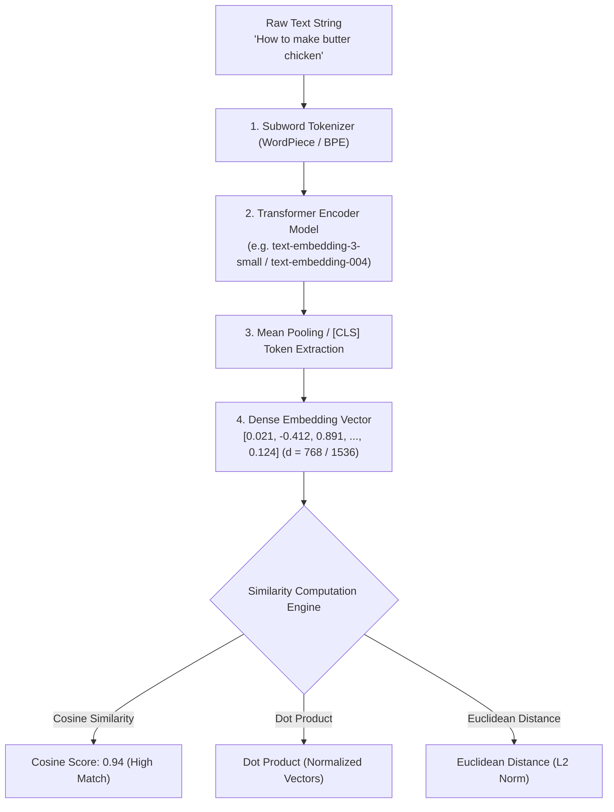

# Module 06: Embeddings Deep Dive — Vector Mechanics, Similarity Metrics, & Encoder Models

## Theoretical Overview & Dense Vector Space

An **Embedding** is a dense vector representation (an array of floating-point numbers, e.g. 768 to 3,072 dimensions) that encodes the semantic meaning of text into continuous vector space. Words, phrases, or full documents with similar conceptual meanings map to vectors positioned close together in high-dimensional space.

Embeddings bridge human language and machine linear algebra, powering **Retrieval-Augmented Generation (RAG)**, **Semantic Search**, **Vector Databases**, and **Document Clustering**.



### Real-World Analogy: Mumbai Local Railway Map
Think of the Mumbai local train system map:
- **Spatial Proximity (Vector Distance)**: Churchgate and Marine Lines are geographically adjacent on the map (high cosine similarity $\approx 0.98$) because both serve the South Mumbai business district.
- **Distant Nodes**: Borivali and Churchgate are far apart (dissimilar vectors) despite both being on the Western Line.
- **The Map IS the Embedding Space**: Just as physical coordinates on a railway map capture geographical proximity, high-dimensional vector embeddings capture conceptual proximity.

---

## 1. Encoder vs. Decoder Model Architecture (`Section 2`)

| Model Architecture | Representative Models | Primary Output | Typical Production Use Cases |
| :--- | :--- | :--- | :--- |
| **Encoder-Only** | BERT, E5, BGE, OpenAI `text-embedding-3`, Gemini `text-embedding-004` | Fixed-size dense float vector ($d = 384 - 3072$) | **Text Embeddings, Semantic Search, Classification, RAG Retrieval** |
| **Decoder-Only** | GPT-4o, Claude 3.5 Sonnet, Llama 3.1, Mistral | Token-by-token generated text sequence | **Conversational Chat, Code Generation, Reasoning, Summarization** |
| **Encoder-Decoder** | T5, BART | Generated output conditioned on encoder input | **Sequence-to-Sequence Translation, Paraphrasing** |

---

## 2. Commercial & Open-Source Embedding Models (`Section 3`)

| Model Identifier | Provider / Maker | Dimensions | Max Context | Price per 1M Tokens | Quality Rank |
| :--- | :--- | :--- | :--- | :--- | :--- |
| **`text-embedding-3-small`** | OpenAI | 1,536 dims | 8,191 tokens | **$0.02** | Good (Standard RAG) |
| **`text-embedding-3-large`** | OpenAI | 3,072 dims | 8,191 tokens | **$0.13** | Premier Quality |
| **`text-embedding-004`** | Google | 768 dims | 2,048 tokens | **Free Tier** / Generous | Excellent |
| **`embed-english-v3.0`** | Cohere | 1,024 dims | 512 tokens | **$0.10** | RAG Optimized |
| **`nomic-embed-text-v1.5`** | Nomic AI | 768 dims | 8,192 tokens | Open Weights / Free | Very Good |
| **`all-MiniLM-L6-v2`** | SBERT | 384 dims | 512 tokens | Free (Local CPU) | Fast & Lightweight |
| **`BGE-large-en-v1.5`** | BAAI | 1,024 dims | 512 tokens | Free (Local GPU) | Top Open Benchmark |

---

## 3. Dimensionality Tradeoffs & Storage Economics (`Section 4`)

Higher vector dimensionality increases expressiveness but scales RAM/disk storage and search latency linearly.

```javascript
// Storage Calculator for 1 Million Vectors
function calculateStorage(numVectors, dimensions, bytesPerFloat = 4) {
  const bytesPerVector = dimensions * bytesPerFloat;
  const totalBytes = numVectors * bytesPerVector;
  return {
    perVectorBytes: bytesPerVector,
    rawTotalGB: (totalBytes / 1e9).toFixed(2) + " GB",
    withHNSWIndexMB: `~${(totalBytes * 1.3 / 1e6).toFixed(0)} MB (30% Index Overhead)`
  };
}

// 1 Million Documents Storage Matrix:
// 384 dims  -> 1.5 GB raw storage
// 768 dims  -> 3.0 GB raw storage  (Sweet Spot for Production)
// 1536 dims -> 6.0 GB raw storage
// 3072 dims -> 12.0 GB raw storage
```

---

## 4. Vector Similarity Metrics Implementation from Scratch (`Section 5`)

```javascript
// 1. Cosine Similarity: Measures angle between vectors (-1 to +1)
function cosineSimilarity(a, b) {
  if (a.length !== b.length) throw new Error("Vector dimension mismatch");
  let dot = 0, magA = 0, magB = 0;
  for (let i = 0; i < a.length; i++) {
    dot += a[i] * b[i];
    magA += a[i] * a[i];
    magB += b[i] * b[i];
  }
  const denom = Math.sqrt(magA) * Math.sqrt(magB);
  return denom === 0 ? 0 : dot / denom;
}

// 2. Dot Product: Raw sum of element-wise products
function dotProduct(a, b) {
  if (a.length !== b.length) throw new Error("Vector dimension mismatch");
  let sum = 0;
  for (let i = 0; i < a.length; i++) sum += a[i] * b[i];
  return sum;
}

// 3. Euclidean Distance (L2 Distance): Geometric distance in space
function euclideanDistance(a, b) {
  if (a.length !== b.length) throw new Error("Vector dimension mismatch");
  let sum = 0;
  for (let i = 0; i < a.length; i++) sum += (a[i] - b[i]) ** 2;
  return Math.sqrt(sum);
}

// 4. L2 Normalization: Scales vector magnitude to exactly 1.0
function normalize(vec) {
  const mag = Math.sqrt(vec.reduce((s, v) => s + v * v, 0));
  return mag === 0 ? vec : vec.map(v => v / mag);
}

// NOTE: When vectors are L2-normalized, Dot Product EQUALS Cosine Similarity!
```

---

## 5. Semantic Search Engine Simulation (`Section 6`)

```javascript
// Semantic Search via Cosine Similarity Scoring
function semanticSearch(queryEmbedding, documentEmbeddings, topK = 3) {
  const scores = documentEmbeddings.map((doc, index) => ({
    id: index,
    text: doc.text,
    score: cosineSimilarity(queryEmbedding, doc.embedding),
  }));

  scores.sort((a, b) => b.score - a.score);
  return scores.slice(0, topK);
}
```

---

## Key Production Takeaways

1. **Cosine Similarity is the Text Standard**: Cosine similarity measures vector orientation rather than magnitude, making it ideal for variable-length text documents.
2. **768 Dimensions is the Production Sweet Spot**: Models with 768 dimensions (such as `text-embedding-004` or `nomic-embed-text`) provide an optimal balance of retrieval quality and low memory footprint.
3. **Normalized Dot Product Optimization**: Normalize vector embeddings upon insertion so vector databases can compute dot product instead of full cosine similarity, boosting search speed by $2\times - 3\times$.
4. **Calculate Storage Before Choosing Models**: 1 million 1536-dimensional vectors consume $\sim 6\text{ GB}$ of raw memory before index overhead. Always plan index memory requirements.
5. **Always Use the Same Embedding Model for Indexing & Querying**: Never mix embedding models (e.g. embedding documents with OpenAI and querying with Gemini)—the vector spaces are completely incompatible.
