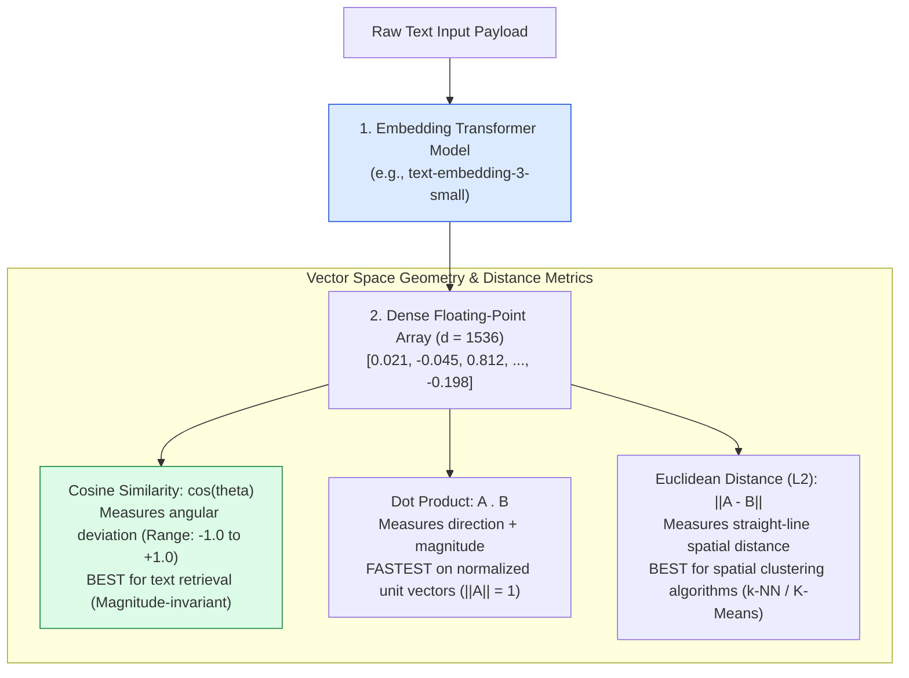
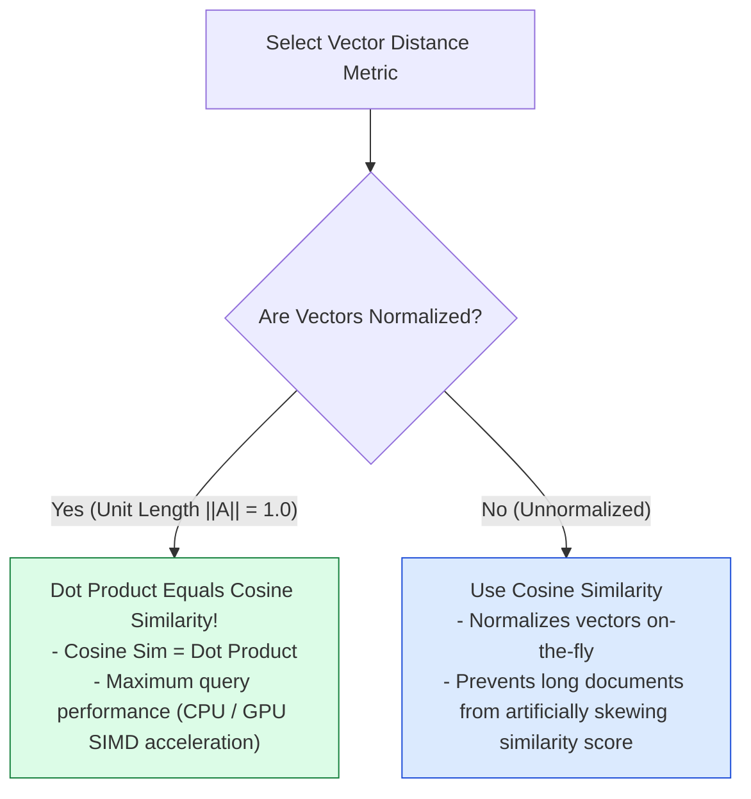
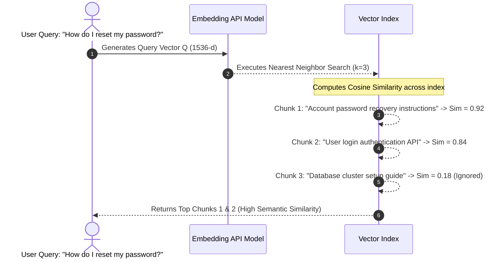

# Module 06: Vector Embeddings, High-Dimensional Spaces, and Distance Metrics

## Overview

**Vector Embeddings** transform unstructured natural language text, images, or code into dense $N$-dimensional floating-point vector arrays (e.g. 768, 1,536, or 3,072 dimensions). In an embedding space, semantically similar concepts (e.g. *"bank account"* and *"checking balance"*) are positioned mathematically adjacent to one another, enabling semantic search and similarity retrieval using geometric distance metrics like **Cosine Similarity**, **Dot Product**, and **Euclidean Distance ($L2$)**.

Understanding **Vector Dimensionality**, **Distance Metric Mathematics**, **Vector Normalization**, and **Embedding Model Trade-offs** is fundamental to modern RAG systems.

---

## 1. High-Dimensional Vector Embedding Space Topology



---

## 2. Geometric Distance Metrics Comparison



### Distance Metric Mathematical Reference Matrix

| Metric Name | Mathematical Formula | Range | Scale Invariant? | Recommended Vector Index Configuration |
| :--- | :--- | :--- | :--- | :--- |
| **Cosine Similarity** | $\cos(\theta) = \frac{\mathbf{A} \cdot \mathbf{B}}{\|\mathbf{A}\| \|\mathbf{B}\|}$ | $[-1.0, +1.0]$ | **YES** | **Default choice for text RAG & semantic search.** |
| **Dot Product (Inner)** | $\mathbf{A} \cdot \mathbf{B} = \sum_{i=1}^d A_i B_i$ | $(-\infty, +\infty)$ | **NO** | Ideal when embeddings are pre-normalized to $\|\mathbf{A}\|=1$. |
| **Euclidean ($L2$)** | $d(\mathbf{A}, \mathbf{B}) = \sqrt{\sum_{i=1}^d (A_i - B_i)^2}$ | $[0, +\infty)$ | **NO** | Preferred for image embeddings and clustering algorithms. |
| **Manhattan ($L1$)** | $d(\mathbf{A}, \mathbf{B}) = \sum_{i=1}^d \|A_i - B_i\|$ | $[0, +\infty)$ | **NO** | Used in high-dimensional sparse feature spaces. |

---

## 3. High-Dimensional Cluster Proximity Visualization



---

## 4. Practical Implementation Showcase: High-Performance Vector Utility Library

```javascript
class VectorMathEngine {
  /**
   * Calculates Dot Product of two equal-length vectors
   */
  static dotProduct(vecA, vecB) {
    let dot = 0;
    for (let i = 0; i < vecA.length; i++) {
      dot += vecA[i] * vecB[i];
    }
    return dot;
  }

  /**
   * Calculates Euclidean Norm (Magnitude) ||A||
   */
  static magnitude(vec) {
    let sumSq = 0;
    for (let i = 0; i < vec.length; i++) {
      sumSq += vec[i] * vec[i];
    }
    return Math.sqrt(sumSq);
  }

  /**
   * Normalizes vector to Unit Length (||A|| = 1.0)
   */
  static normalize(vec) {
    const mag = VectorMathEngine.magnitude(vec);
    if (mag === 0) return vec;
    return vec.map((val) => val / mag);
  }

  /**
   * Calculates Cosine Similarity between two arbitrary vectors
   */
  static cosineSimilarity(vecA, vecB) {
    const dot = VectorMathEngine.dotProduct(vecA, vecB);
    const magA = VectorMathEngine.magnitude(vecA);
    const magB = VectorMathEngine.magnitude(vecB);
    if (magA === 0 || magB === 0) return 0;
    return dot / (magA * magB);
  }

  /**
   * Calculates Euclidean Distance (L2) between two vectors
   */
  static euclideanDistance(vecA, vecB) {
    let sumDiffSq = 0;
    for (let i = 0; i < vecA.length; i++) {
      const diff = vecA[i] - vecB[i];
      sumDiffSq += diff * diff;
    }
    return Math.sqrt(sumDiffSq);
  }
}

// Example Usage
const vecQuery = [0.45, 0.88, 0.12, 0.91];
const vecDocRelevant = [0.44, 0.85, 0.15, 0.89];
const vecDocIrrelevant = [-0.12, 0.05, 0.94, -0.30];

console.log(
  "Cosine Similarity (Query vs Relevant Doc):",
  VectorMathEngine.cosineSimilarity(vecQuery, vecDocRelevant).toFixed(4)
); // ~0.9982

console.log(
  "Cosine Similarity (Query vs Irrelevant Doc):",
  VectorMathEngine.cosineSimilarity(vecQuery, vecDocIrrelevant).toFixed(4)
); // ~-0.0820

// Fast Dot Product on Normalized Vectors
const normQuery = VectorMathEngine.normalize(vecQuery);
const normDoc = VectorMathEngine.normalize(vecDocRelevant);

console.log(
  "Normalized Dot Product Similarity:",
  VectorMathEngine.dotProduct(normQuery, normDoc).toFixed(4)
); // ~0.9982 (Exact match to Cosine Sim!)
```

---

## Key Production Takeaways

1. **Use Cosine Similarity for Unstructured Text Search**: Cosine similarity evaluates the angle between vectors independent of text token length, preventing long document chunks from dominating vector space.
2. **Pre-normalize Vectors for Maximum Query Throughput**: Normalizing vectors to unit length ($\|\mathbf{A}\| = 1.0$) upon ingestion allows vector databases to use simple **Dot Product** operations during query execution, boosting throughput by up to $3\times$.
3. **Match Embedding Dimensions to Retrieval Needs**: Modern models like `text-embedding-3-large` support dimension truncation (e.g. reducing 3072d to 1024d via Matryoshka learning), reducing vector DB memory costs by $66\%$ with minimal accuracy loss.
4. **Never Mix Embedding Models**: Vectors generated by OpenAI `text-embedding-3-small` exist in a completely different vector space than Cohere or Voyage embeddings. Re-index all documents if you switch embedding providers.

