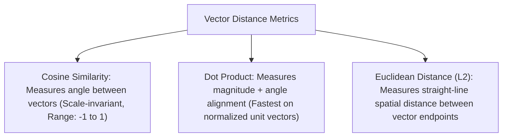

# File 06: Vector Embeddings and Distance Metrics

## Overview
**Vector Embeddings** transform high-dimensional unstructured text into dense numerical floating-point vectors ($N$-dimensional space, e.g. 1536 dimensions). Semantically similar concepts map closer together in vector space, measured using distance metrics like **Cosine Similarity**, **Dot Product**, or **Euclidean Distance (L2)**.

---

## 1. Vector Distance Metrics Comparison



### Distance Formulas Summary

- **Cosine Similarity**: $\cos(\theta) = \frac{\mathbf{A} \cdot \mathbf{B}}{\|\mathbf{A}\| \|\mathbf{B}\|}$
- **Euclidean Distance (L2)**: $d(\mathbf{A}, \mathbf{B}) = \sqrt{\sum_{i=1}^n (A_i - B_i)^2}$
- **Dot Product**: $\mathbf{A} \cdot \mathbf{B} = \sum_{i=1}^n A_i B_i$

---

## 2. Cosine Similarity & Vector Math Implementation

```javascript
class VectorUtils {
    // Calculates Cosine Similarity between two N-dimensional vectors
    static cosineSimilarity(vecA, vecB) {
        let dotProduct = 0;
        let normA = 0;
        let normB = 0;

        for (let i = 0; i < vecA.length; i++) {
            dotProduct += vecA[i] * vecB[i];
            normA += vecA[i] * vecA[i];
            normB += vecB[i] * vecB[i];
        }

        if (normA === 0 || normB === 0) return 0;
        return dotProduct / (Math.sqrt(normA) * Math.sqrt(normB));
    }
}

// Mock 4-Dimensional Embeddings
const vecKing = [0.4, 0.8, 0.1, 0.9];
const vecQueen = [0.39, 0.82, 0.12, 0.88];
const vecApple = [0.01, 0.05, 0.95, 0.02];

console.log("Similarity (King vs Queen):", VectorUtils.cosineSimilarity(vecKing, vecQueen).toFixed(4)); // ~0.998 (Highly Similar!)
console.log("Similarity (King vs Apple):", VectorUtils.cosineSimilarity(vecKing, vecApple).toFixed(4)); // ~0.150 (Dissimilar)
```

---

## Key Takeaways
1. **Embeddings** represent semantic meaning as dense floating-point vector arrays.
2. Use **Cosine Similarity** for text semantic search because it measures direction independent of vector length.
3. On **normalized unit vectors** ($\|\mathbf{A}\| = 1$), Cosine Similarity equals the Dot Product.
