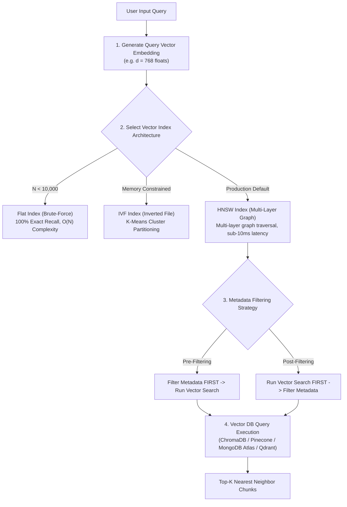
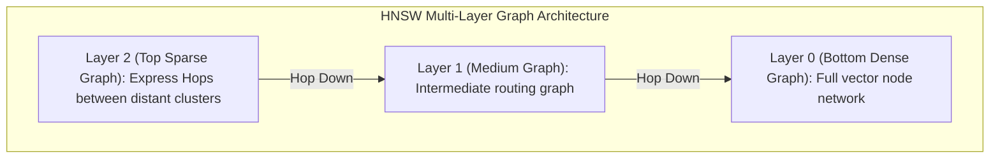

# Module 07: Vector Databases — Index Architectures, HNSW Graphs, & Database Selection

## Theoretical Overview & Similarity Search Engines

Traditional relational databases (PostgreSQL, MySQL) index scalar values via B-Trees to execute exact match operations (`WHERE id = 42`). In contrast, **Vector Databases** index high-dimensional embeddings ($d = 768 - 3072$) using specialized spatial graph and clustering data structures to execute **Approximate Nearest Neighbor (ANN)** similarity queries.

A brute-force linear scan over 1 million 768-dimensional vectors requires seconds. A specialized vector index using **HNSW (Hierarchical Navigable Small World)** executes nearest neighbor retrieval in milliseconds.



### Real-World Analogy: Big Bazaar Warehouse Racking
Think of inventory management across different retail formats:
- **Kirana Store (Flat Search)**: A small neighborhood store owner walks through every shelf manually to find a product ($O(N)$ linear search). Works fine when you have 50 items, but breaks at scale.
- **Big Bazaar Supermarket (IVF Clustering)**: Goods are categorized into distinct aisles (Dairy, Apparel, Electronics). You skip 90% of the store and search only the relevant aisle ($K$-Means cluster partitioning).
- **Amazon Mega-Warehouse (HNSW Multi-Layer Graph)**: An automated GPS-guided robotic system navigates a multi-layer spatial graph network, hopping between master hubs to locate any item in milliseconds.

---

## 1. Traditional SQL Databases vs. Vector Databases (`Section 1`)

| Architectural Feature | Traditional Relational Database (SQL) | Vector Database (ANN Engine) |
| :--- | :--- | :--- |
| **Primary Query Type** | Exact Match (`WHERE price = 100`) | Approximate Nearest Neighbor (`k-NN`) |
| **Index Data Structures** | B-Tree, B+Tree, Hash, GIN | **HNSW Graph, IVF Clusters, PQ Quantization** |
| **Distance Metrics** | Scalar inequality ($=, <, >$) | **Cosine Similarity, L2 Euclidean, Dot Product** |
| **Data Representation** | Scalars, Strings, Dates, JSON | High-dimensional dense float arrays ($d=768-3072$) |
| **Execution Performance** | $O(\log N)$ exact lookup | $O(\log N)$ graph traversal approximation |

---

## 2. Vector Indexing Architecture Taxonomy (`Section 2`)



| Index Architecture | How It Works | Primary Advantage | Main Disadvantage | Recommended Deployment |
| :--- | :--- | :--- | :--- | :--- |
| **Flat Index (Exact)** | Compares query to every vector without approximation. | $100\%$ exact recall accuracy. | $O(N)$ complexity; impossibly slow for millions of vectors. | $N < 10,000$ vectors or baseline benchmarking. |
| **IVF (Inverted File)** | Partitions vector space into $K$ centroids using $K$-Means clustering. | Fast search speed; tunable via `nprobe` parameter. | Requires an initial training step; cold-start overhead. | $100\text{k} - 10\text{M}$ vectors with memory limits. |
| **HNSW (Graph)** | Multi-layer graph where sparse top layers route to dense bottom layers. | **Fastest query latency & exceptional recall**. | High RAM consumption (stores graph edges). | **Production Default** for $10\text{k} - 100\text{M}+$ vectors. |
| **PQ (Quantization)** | Compresses float vectors into low-byte codebook centroids. | $4\times - 8\times$ memory compression savings. | Lossy compression; slight drop in retrieval recall. | Billions of vectors on constrained hardware. |

---

## 3. Simplified HNSW Graph Search Algorithm (`Section 3`)

```javascript
// Conceptual HNSW Graph Hop Traversal Simulation in 2D Space
function simpleGraphSearch(points, query, connections, maxHops = 10) {
  let current = 0; // Entry node
  let bestDist = euclidean2D(points[current], query);
  const visited = new Set([current]);
  const path = [current];

  for (let hop = 0; hop < maxHops; hop++) {
    const neighbors = connections[current] || [];
    let improved = false;

    for (const n of neighbors) {
      if (visited.has(n)) continue;
      visited.add(n);
      const dist = euclidean2D(points[n], query);

      // Greedy Hop: move to neighbor if distance to query decreases
      if (dist < bestDist) {
        bestDist = dist;
        current = n;
        path.push(current);
        improved = true;
        break;
      }
    }
    if (!improved) break; // Local minimum reached
  }

  return { nearest: current, distance: bestDist, hops: path.length, path };
}

function euclidean2D(a, b) {
  return Math.sqrt((a[0] - b[0]) ** 2 + (a[1] - b[1]) ** 2);
}
```

---

## 4. Vector Database Ecosystem Comparison (`Section 4`)

| Vector Database | Hosting Architecture | Primary Index Engine | Metadata Filtering | Ideal Production Use Case |
| :--- | :--- | :--- | :--- | :--- |
| **ChromaDB** | Embedded / In-Process | HNSW | Native | **Prototyping, local development, Python/JS apps** |
| **Pinecone** | Fully Managed Cloud | Proprietary Serverless | Pre-Filtering | **Zero-ops managed serverless architecture** |
| **Weaviate** | Self-Hosted / Managed | HNSW + BM25 Keyword | Native Hybrid | **Hybrid Keyword + Vector Semantic Search** |
| **Qdrant** | Self-Hosted / Cloud | HNSW (Rust Engine) | Payload Filter | **Ultra-high-performance Rust backend** |
| **MongoDB Atlas** | Managed Cloud Cluster | HNSW (Lucene Engine) | Integrated `$match` | **Existing MongoDB applications** |
| **pgvector** | PostgreSQL Extension | IVF flat / HNSW | SQL `WHERE` | **Existing PostgreSQL relational schemas** |

---

## 5. Operations Code Comparison: ChromaDB vs. MongoDB Atlas (`Sections 5, 6, & 7`)

```javascript
// --- ChromaDB Operations (Embedded In-Process) ---
const { ChromaClient } = require("chromadb");
const chroma = new ChromaClient();

const collection = await chroma.getOrCreateCollection({
  name: "demo_collection",
  metadata: { "hnsw:space": "cosine" },
});

// Upsert Documents
await collection.add({
  ids: ["doc_1", "doc_2"],
  documents: ["Masala tea recipe", "Filter coffee guide"],
  metadatas: [{ category: "beverage" }, { category: "beverage" }],
});

// Query
const chromaResults = await collection.query({
  queryTexts: ["Indian tea recipes"],
  nResults: 3,
  where: { category: "beverage" },
});

// --- MongoDB Atlas Vector Search (Aggregation Pipeline) ---
const mongoResults = await collection.aggregate([
  {
    $vectorSearch: {
      index: "vector_index",        // Configured in Atlas
      path: "embedding",
      queryVector: queryEmbedding,  // 768-dim float array
      numCandidates: 100,           // Search candidate pool breadth
      limit: 3,
      filter: { category: "beverage" }
    }
  },
  {
    $project: {
      title: 1,
      score: { $meta: "vectorSearchScore" }
    }
  }
]).toArray();
```

---

## 6. Vector DB Architectural Decision Helper (`Section 8`)

```javascript
function recommendVectorDB(requirements) {
  const { dataSize, existingDB, ops, selfHost, budget } = requirements;
  const recs = [];

  if (dataSize === "small" || ops === "prototyping") {
    recs.push("ChromaDB — Zero setup, runs locally, ideal for prototyping");
  }
  if (existingDB === "mongodb") {
    recs.push("MongoDB Atlas Vector Search — Unified data layer without new DB infra");
  }
  if (existingDB === "postgres") {
    recs.push("pgvector — Familiar SQL interface, extension on Postgres");
  }
  if (budget === "zero-ops" || ops === "managed") {
    recs.push("Pinecone — Fully managed serverless vector DB");
  }
  if (selfHost && dataSize === "large") {
    recs.push("Qdrant — High-performance Rust-based vector search engine");
    recs.push("Weaviate — Native hybrid vector + BM25 keyword search");
  }

  return recs;
}
```

---

## Key Production Takeaways

1. **HNSW is the Default Index Choice**: Hierarchical Navigable Small World (HNSW) graphs offer the best latency-to-recall tradeoff for production datasets ($10\text{k} - 100\text{M}$ vectors).
2. **Use ChromaDB for Local Prototypes, Cloud DBs for Scale**: Start prototyping with ChromaDB in under 5 minutes; transition to MongoDB Atlas, Pinecone, or Qdrant for production scale.
3. **Set `numCandidates` Generously in MongoDB Atlas**: Always set `numCandidates` to $10\times - 20\times$ your `limit` (e.g. `numCandidates: 100` for `limit: 5`) to maintain high search accuracy.
4. **Leverage Pre-Filtering for Metadata**: Ensure your vector database supports pre-filtering metadata to filter out invalid documents before performing high-dimensional vector search.
5. **Account for Index RAM Overhead**: HNSW indexes store graph edges in memory, creating a $\sim 30\%$ memory overhead on top of raw vector storage.


## Learn from the implementation

Use the matching source file as an executable example, not just something to copy. Before running it, state in your own words what data enters the module, what it returns, and which values it changes. Then trace one realistic request from the caller through each function.

Pay special attention to these questions:

- **Data flow:** Which object, array, string, or state value moves between functions? What shape must it have?
- **Control flow:** Which branch, loop, early return, or retry changes the outcome? What condition selects it?
- **Async boundaries:** Where does the code wait for an LLM, database, network, file system, or tool? What should happen if that operation rejects or returns no result?
- **Side effects:** Which lines log information, make an external request, store data, or mutate in-memory state? Keep those distinct from pure calculations.
- **Production limits:** Which assumptions are only safe for a tutorial—for example, in-memory storage, fixed thresholds, approximate token counts, mock data, or a hard-coded batch size?

A useful practice is to change one input at a time and predict the result before executing it. If you can explain why the output changed, when the module should be used, and one way it could fail, you understand the concept rather than only the syntax.
