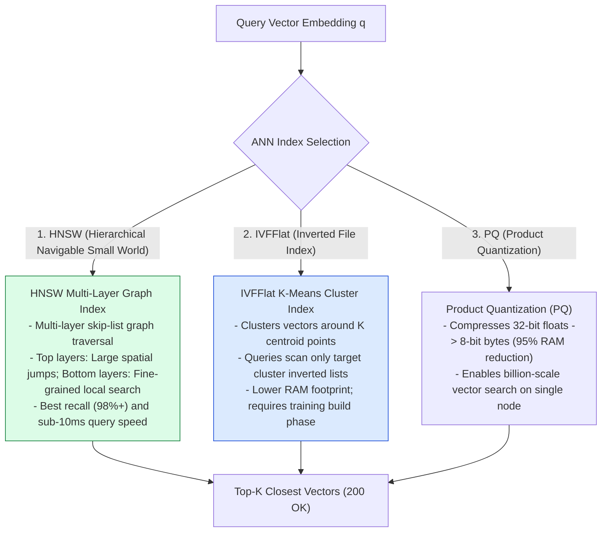
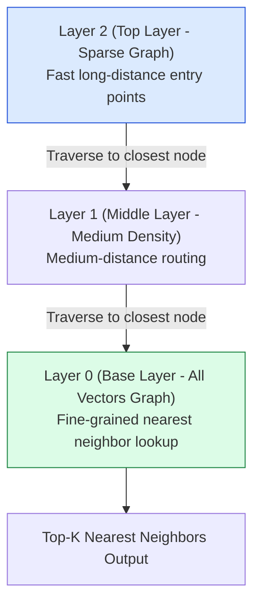
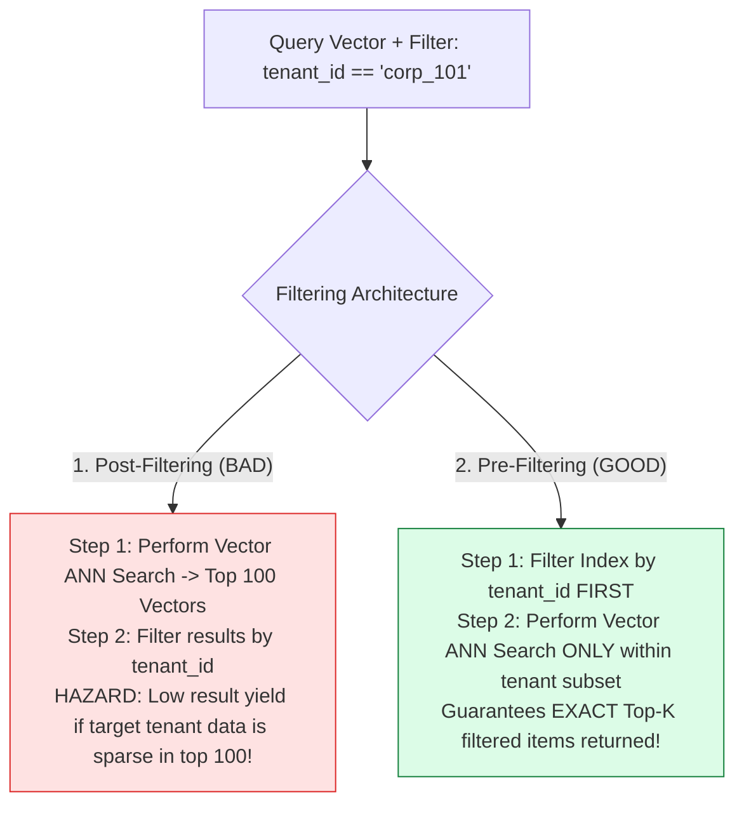

# Module 07: Vector Databases, ANN Indexing (HNSW, IVFFlat), and Metadata Filtering

## Overview

Traditional relational databases ($B$-Tree indexes) fail when querying $1,536$-dimensional vector embeddings due to the **Curse of Dimensionality**. **Vector Databases** (such as Qdrant, Pinecone, Milvus, ChromaDB, and PostgreSQL `pgvector`) utilize **Approximate Nearest Neighbor (ANN)** indexing algorithms to execute similarity queries across millions of vectors in sub-50 millisecond response times.

Understanding **ANN Indexing Algorithms (HNSW vs. IVFFlat vs. PQ)**, **Metadata Pre-Filtering vs. Post-Filtering**, and **Vector Database Selection Criteria** is essential for high-throughput enterprise RAG infrastructure.

---

## 1. Vector Database Search Topology & ANN Indexing



---

## 2. HNSW Hierarchical Graph Traversal Execution Flow



### ANN Indexing Algorithm Feature Matrix

| Indexing Algorithm | Query Latency | Recall Rate | Memory (RAM) Footprint | Build / Insertion Time | Primary Use Case |
| :--- | :--- | :--- | :--- | :--- | :--- |
| **HNSW** (Recommended) | **Sub-10ms** | **$98\% - 99\%$** | High ($1.5\times - 2.0\times$ raw vector size) | Fast incremental inserts | Production default for latency-critical RAG applications. |
| **IVFFlat** | $15\text{ms} - 30\text{ms}$ | $90\% - 95\%$ | Low (Equal to raw vector size) | Slow (Requires K-Means clustering step) | Large datasets with limited server memory constraints. |
| **HNSW + PQ** | $10\text{ms} - 20\text{ms}$ | $85\% - 92\%$ | **Extremely Low ($90\%$ RAM savings)** | Medium | Multi-billion vector enterprise datasets on low-memory nodes. |

---

## 3. Metadata Filtering Strategies: Pre-Filtering vs. Post-Filtering



---

## 4. Practical Implementation Showcase: Production In-Memory Vector Store

```javascript
class ProductionVectorStore {
  constructor() {
    this.vectors = new Map(); // ID -> { id, embedding, metadata }
  }

  /**
   * Inserts or updates a document vector entity
   */
  upsert(id, embedding, metadata = {}) {
    if (!Array.isArray(embedding) || embedding.length === 0) {
      throw new Error("Embedding vector must be a non-empty array of numbers.");
    }
    this.vectors.set(id, { id, embedding, metadata, createdAt: Date.now() });
  }

  /**
   * Computes Cosine Similarity between query vector and candidate vector
   */
  _computeCosineSimilarity(vecA, vecB) {
    let dot = 0, normA = 0, normB = 0;
    for (let i = 0; i < vecA.length; i++) {
      dot += vecA[i] * vecB[i];
      normA += vecA[i] * vecA[i];
      normB += vecB[i] * vecB[i];
    }
    return normA === 0 || normB === 0 ? 0 : dot / (Math.sqrt(normA) * Math.sqrt(normB));
  }

  /**
   * Performs Pre-filtered Vector Similarity Search
   */
  search(queryVector, topK = 3, filterPredicate = null) {
    let candidates = Array.from(this.vectors.values());

    // 1. PRE-FILTERING STEP: Filter candidates before scoring vector distances
    if (typeof filterPredicate === "function") {
      candidates = candidates.filter((item) => filterPredicate(item.metadata));
    }

    // 2. VECTOR SIMILARITY SCORING STEP
    const scoredResults = candidates.map((item) => ({
      id: item.id,
      score: Number(this._computeCosineSimilarity(queryVector, item.embedding).toFixed(4)),
      metadata: item.metadata
    }));

    // 3. TOP-K SORTING
    scoredResults.sort((a, b) => b.score - a.score);
    return scoredResults.slice(0, topK);
  }
}

// Example Usage
const vectorDB = new ProductionVectorStore();

vectorDB.upsert("doc_101", [0.91, 0.12, 0.05], { category: "security", tenantId: "tenant_a" });
vectorDB.upsert("doc_102", [0.88, 0.15, 0.02], { category: "security", tenantId: "tenant_b" });
vectorDB.upsert("doc_103", [0.02, 0.10, 0.95], { category: "billing", tenantId: "tenant_a" });

// Query with Tenant Pre-filter
const queryVector = [0.90, 0.14, 0.04];
const searchResults = vectorDB.search(queryVector, 2, (meta) => meta.tenantId === "tenant_a");

console.log("Pre-filtered Vector Search Results:\n", JSON.stringify(searchResults, null, 2));
```

---

## Key Production Takeaways

1. **HNSW is the Production Standard Index**: Choose HNSW graph indexing for sub-10ms query performance and $>98\%$ recall accuracy across most RAG vector databases (Qdrant, Pinecone, pgvector).
2. **Always Use Pre-Filtering for Multi-Tenant RAG**: Always configure vector databases to perform metadata pre-filtering (e.g., `tenant_id == 'org_123'`) before vector ANN search to prevent data leakage and guarantee return of $K$ results.
3. **Use Quantization (PQ / Scalar Quantization) for Large Scale**: Quantize 32-bit floating point vectors down to 8-bit integers (SQ8) to reduce vector database RAM utilization by $75\%$ while maintaining $>95\%$ retrieval accuracy.
4. **Leverage `pgvector` for Existing PostgreSQL Stacks**: If your architecture already relies on PostgreSQL, add the `pgvector` extension and build HNSW indexes (`CREATE INDEX ON items USING hnsw (embedding vector_cosine_ops)`) to avoid adding extra vector DB infrastructure.

