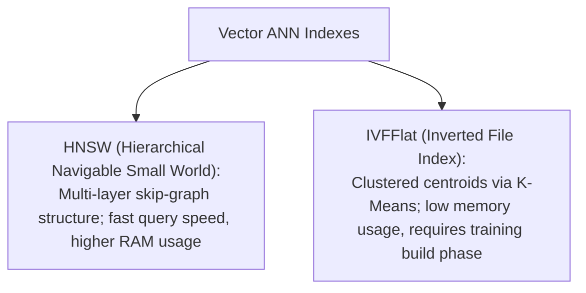

# File 07: Vector Databases and Indexing Algorithms (HNSW, IVFFlat)

## Overview
**Vector Databases** (Pinecone, Qdrant, ChromaDB, Milvus, pgvector) specialize in storing, indexing, and querying millions of high-dimensional vector embeddings in milliseconds using Approximate Nearest Neighbor (**ANN**) indexing algorithms like **HNSW** (Hierarchical Navigable Small World) and **IVFFlat** (Inverted File Index).

---

## 1. Vector Indexing Architecture (HNSW vs IVFFlat)



### HNSW vs IVFFlat Comparison

| Metric | HNSW (Recommended Default) | IVFFlat |
| :--- | :--- | :--- |
| **Search Speed** | Extremely Fast ($O(\log N)$) | Fast (Searches target clusters) |
| **Recall / Accuracy** | High (~95-99%) | Medium-High (~90-95%) |
| **Memory (RAM) Footprint** | High | Low |
| **Build / Training Time** | Fast incremental inserts | Requires pre-training K-Means centroids |

---

## 2. In-Memory Naive Vector Index Search Implementation

```javascript
class SimpleVectorDB {
    constructor() {
        this.records = []; // { id, vector, metadata }
    }

    insert(id, vector, metadata = {}) {
        this.records.push({ id, vector, metadata });
    }

    _cosineSimilarity(vecA, vecB) {
        let dot = 0, normA = 0, normB = 0;
        for (let i = 0; i < vecA.length; i++) {
            dot += vecA[i] * vecB[i];
            normA += vecA[i] * vecA[i];
            normB += vecB[i] * vecB[i];
        }
        return dot / (Math.sqrt(normA) * Math.sqrt(normB));
    }

    // Top-K Approximate Nearest Neighbor (ANN) Query
    query(queryVector, topK = 2, metadataFilter = null) {
        let results = this.records;
        
        // Optional Metadata Filtering
        if (metadataFilter) {
            results = results.filter(r => 
                Object.entries(metadataFilter).every(([k, v]) => r.metadata[k] === v)
            );
        }

        const scored = results.map(r => ({
            id: r.id,
            score: this._cosineSimilarity(queryVector, r.vector),
            metadata: r.metadata
        }));

        scored.sort((a, b) => b.score - a.score);
        return scored.slice(0, topK);
    }
}

const db = new SimpleVectorDB();
db.insert("doc1", [0.9, 0.1, 0.0], { category: "tech" });
db.insert("doc2", [0.85, 0.15, 0.05], { category: "tech" });
db.insert("doc3", [0.0, 0.1, 0.95], { category: "food" });

console.log("Vector Search Results:", db.query([0.88, 0.12, 0.01], 2, { category: "tech" }));
```

---

## Key Takeaways
1. Vector databases use **ANN (Approximate Nearest Neighbors)** algorithms to query high-dimensional embeddings in milliseconds.
2. **HNSW** is the gold-standard graph-based index balancing speed and recall.
3. Combine vector similarity scores with **Metadata Filtering** (Hybrid Search) to refine query results.
