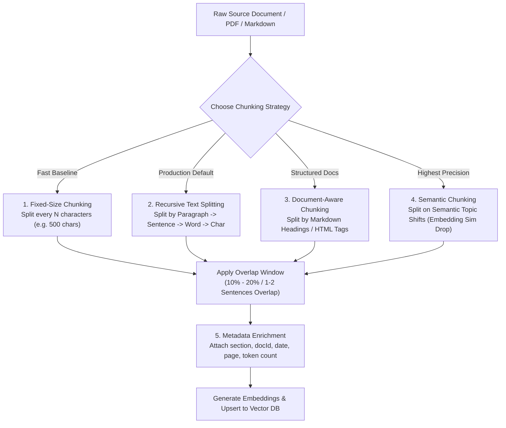

# Module 08: Chunking Strategies — Fixed, Recursive, Document-Aware, & Semantic Splitting

## Theoretical Overview & Chunking Engineering

In Retrieval-Augmented Generation (RAG) architectures, **Chunking** is the process of partitioning large unstructured text documents into smaller, semantically coherent fragments prior to vector embedding generation.

Retrieval accuracy in RAG systems depends more on the **Chunking Strategy** than on the choice of embedding model or vector database. If a chunk splits a sentence mid-thought or dilutes a key fact inside a 5,000-word block, vector search will either retrieve irrelevant noise or fail to find the answer entirely.



### Real-World Analogy: Tailor Cutting Sari Fabric
Think of a master tailor at a traditional Indian textile shop:
- **Random / Fixed Slicing**: If an apprentice blindly cuts a sari fabric every 50 cm without looking at the pattern, the intricate *zari* embroidery gets severed down the middle, making both pieces useless.
- **Master Tailor (Semantic Chunker)**: A master tailor inspects the fabric, identifying natural borders and pattern breaks before making precise cuts along the seams so each cut piece remains a complete, usable garment section.

---

## 1. Why Chunking Matters (`Section 1`)

| Chunking Issue | Underlying Technical Cause | Downstream RAG Failure Impact |
| :--- | :--- | :--- |
| **Chunks Too Small** ($< 100$ chars) | Document split into microscopic fragments. | Loses surrounding context; retrieval finds keywords without complete answers. |
| **Chunks Too Large** ($> 2,000$ chars) | Core answer buried inside huge text block. | Vector embedding gets diluted by noisy text; retrieval ranking drops. |
| **Arbitrary Mid-Sentence Cuts** | Fixed character slicing cuts mid-word. | Corrupts token embeddings and confuses the generator LLM. |
| **Zero Overlap Boundary** | Critical facts sit across chunk boundaries. | Queries asking about boundary topics fail to retrieve complete information. |
| **Missing Metadata** | Raw text stored without source context. | Impossible to filter by chapter, author, date, or security level. |

---

## 2. Fixed-Size vs. Recursive Text Splitting (`Sections 2 & 3`)

```javascript
// 1. Fixed-Size Chunking (Slices strictly by character count)
function fixedSizeChunk(text, chunkSize = 300, overlap = 50) {
  const chunks = [];
  let start = 0;
  while (start < text.length) {
    const end = Math.min(start + chunkSize, text.length);
    chunks.push({ text: text.slice(start, end), start, end });
    start += chunkSize - overlap;
  }
  return chunks;
}

// 2. Recursive Text Splitting (Production Default: Respects natural boundaries)
function recursiveTextSplit(text, maxChunkSize = 500, overlap = 100, separators = null) {
  if (!separators) {
    // Try biggest to smallest natural break separators
    separators = ["\n\n", "\n", ". ", ", ", " ", ""];
  }

  if (text.length <= maxChunkSize) return [text];

  const chunks = [];
  const separator = separators.find(s => text.includes(s)) || "";
  const nextSeparators = separators.slice(separators.indexOf(separator) + 1);
  const splits = separator ? text.split(separator) : [text];

  let currentChunk = "";
  for (const split of splits) {
    const candidate = currentChunk ? currentChunk + separator + split : split;
    if (candidate.length <= maxChunkSize) {
      currentChunk = candidate;
    } else {
      if (currentChunk) chunks.push(currentChunk);
      if (split.length > maxChunkSize) {
        // Recursively split oversized sub-fragment
        chunks.push(...recursiveTextSplit(split, maxChunkSize, overlap, nextSeparators));
        currentChunk = "";
      } else {
        currentChunk = split;
      }
    }
  }
  if (currentChunk) chunks.push(currentChunk);
  return chunks;
}
```

---

## 3. Document-Aware & Semantic Chunking (`Sections 4 & 5`)

```javascript
// 3. Document-Aware Markdown Chunker (Splits along Heading boundaries)
function markdownChunker(markdown, maxChunkSize = 800) {
  const sections = [];
  let currentSection = { header: "Introduction", level: 0, content: "" };

  for (const line of markdown.split("\n")) {
    const headerMatch = line.match(/^(#{1,6})\s+(.+)/);
    if (headerMatch) {
      if (currentSection.content.trim()) {
        sections.push({ ...currentSection, content: currentSection.content.trim() });
      }
      currentSection = { header: headerMatch[2], level: headerMatch[1].length, content: "" };
    } else {
      currentSection.content += line + "\n";
    }
  }
  if (currentSection.content.trim()) sections.push({ ...currentSection, content: currentSection.content.trim() });
  return sections;
}

// 4. Semantic Chunking (Splits when topic/meaning changes dynamically)
function semanticChunk(text, similarityThreshold = 0.5) {
  const sentences = text.match(/[^.!?\n]+[.!?\n]+/g) || [text];
  // In production: embed adjacent sentences & split when Cosine Sim < threshold
  return sentences;
}
```

---

## 4. Chunk Size Tradeoffs & Metadata Enrichment (`Sections 7 & 8`)

| Chunk Size | Token Estimate | Primary Advantage | Main Disadvantage | Best Production Use Case |
| :--- | :--- | :--- | :--- | :--- |
| **$100 - 200$ chars** | $\sim 30 - 50$ tokens | High precision retrieval | Lost context; fragmented thoughts | FAQ pairs, short glossaries |
| **$300 - 500$ chars** | $\sim 75 - 125$ tokens | **Production Sweet Spot** | Requires overlap window | **General-purpose RAG pipelines** |
| **$500 - 1000$ chars** | $\sim 125 - 250$ tokens | Rich contextual depth | Slight risk of embedding noise | Long-form Q&A, article retrieval |
| **$1000 - 2000$ chars** | $\sim 250 - 500$ tokens | Self-contained sections | Fewer chunks fit in LLM context | Document summaries |

```javascript
// Metadata Enrichment Pipeline
function enrichChunks(chunks, documentMeta) {
  return chunks.map((chunk, i) => ({
    id: `${documentMeta.docId}_chunk_${i}`,
    text: chunk,
    metadata: {
      source: documentMeta.source,
      author: documentMeta.author,
      date: documentMeta.date,
      chunkIndex: i,
      totalChunks: chunks.length,
      estimatedTokens: Math.ceil(chunk.length / 4),
      hasNumbers: /\d/.test(chunk),
    }
  }));
}
```

---

## 5. Chunking Strategy Decision Matrix by Document Type (`Section 9`)

| Source Document Format | Recommended Chunking Strategy | Optimal Size Range | Overlap Window |
| :--- | :--- | :--- | :--- |
| **Markdown / Docs** | Document-Aware (by Heading tags `#`, `##`) | $500 - 1000$ chars | 1 Sentence |
| **PDF Technical Reports** | Recursive Text Splitting | $500 - 800$ chars | $100$ chars |
| **Source Code** | Function & Class level AST Splitting | Variable | Module Imports Header |
| **Customer Support Chat** | Speaker Turn / Time Window | $300 - 500$ chars | 1 Conversation Turn |
| **Legal Contracts** | Clause & Section Numbering | $800 - 1500$ chars | Clause Title Prefix |
| **FAQ Knowledge Base** | Single Chunk per Q&A Pair | $100 - 300$ chars | None (Independent) |

---

## Key Production Takeaways

1. **Fix Chunking First**: Chunking strategy has a greater impact on RAG retrieval accuracy than selecting embedding models or vector databases.
2. **Use Recursive Text Splitting as Default**: Default to recursive text splitting (`["\n\n", "\n", ". ", " "]`) to preserve natural paragraph and sentence structures.
3. **Include a $10\% - 20\%$ Overlap Window**: Always maintain an overlap window between consecutive chunks to prevent information loss at chunk boundaries.
4. **Use Document-Aware Chunking for Structured Files**: Split Markdown, HTML, and API documentation at heading boundaries to maintain section context.
5. **Always Enrich Chunks with Metadata**: Attach metadata tags (`docId`, `section`, `date`, `tokenCount`) to enable metadata pre-filtering and exact source citations.


## Learn from the implementation

Use the matching source file as an executable example, not just something to copy. Before running it, state in your own words what data enters the module, what it returns, and which values it changes. Then trace one realistic request from the caller through each function.

Pay special attention to these questions:

- **Data flow:** Which object, array, string, or state value moves between functions? What shape must it have?
- **Control flow:** Which branch, loop, early return, or retry changes the outcome? What condition selects it?
- **Async boundaries:** Where does the code wait for an LLM, database, network, file system, or tool? What should happen if that operation rejects or returns no result?
- **Side effects:** Which lines log information, make an external request, store data, or mutate in-memory state? Keep those distinct from pure calculations.
- **Production limits:** Which assumptions are only safe for a tutorial—for example, in-memory storage, fixed thresholds, approximate token counts, mock data, or a hard-coded batch size?

A useful practice is to change one input at a time and predict the result before executing it. If you can explain why the output changed, when the module should be used, and one way it could fail, you understand the concept rather than only the syntax.
