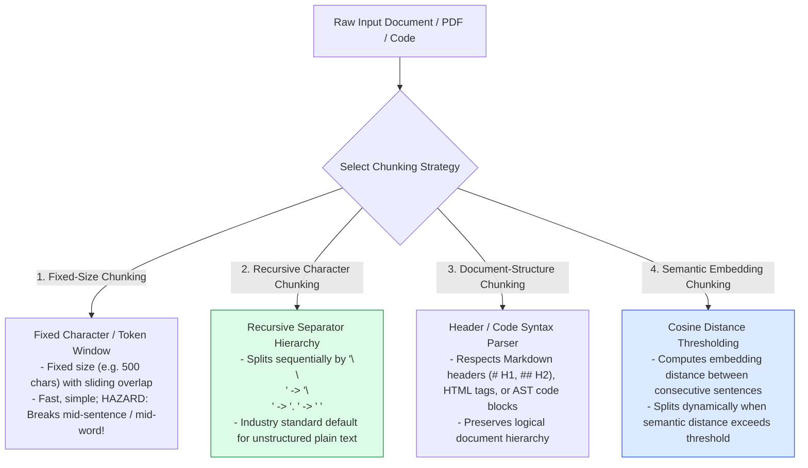
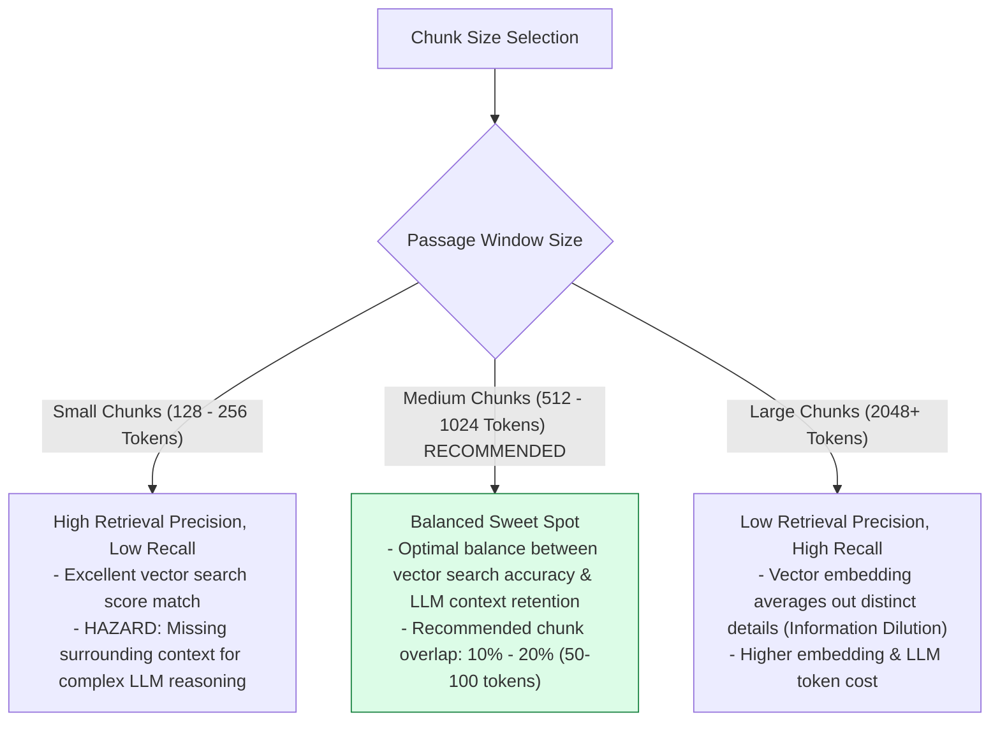
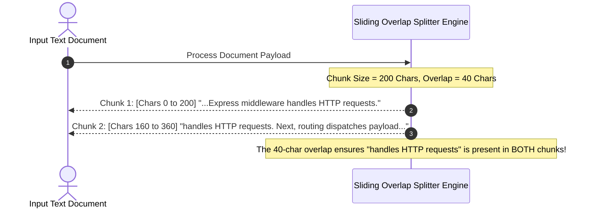

# Module 08: Text Chunking Strategies, Semantic Boundaries, and Overlap Economics

## Overview

In Retrieval-Augmented Generation (RAG) pipelines, raw documents cannot be embedded as single massive files due to embedding model token limits and retrieval dilution. **Text Chunking** is the process of partitioning large unstructured text documents into optimal, semantically coherent passages prior to embedding generation.

Understanding **Fixed-Size**, **Recursive Character**, **Document-Structure (Markdown/HTML)**, and **Semantic Embedding-Distance Chunking**, along with **Chunk Overlap Economics**, is critical for context precision.

---

## 1. Text Chunking Taxonomy & Strategy Pipeline



---

## 2. Chunk Size vs. Context Precision Trade-off Curve



### Chunking Strategy Comparison Matrix

| Chunking Strategy | Primary Mechanism | Processing Latency | Semantic Coherence | Best Use Case |
| :--- | :--- | :--- | :--- | :--- |
| **Fixed-Size** | Hard token character window | Instant ($O(N)$) | Low (Truncates sentences) | Quick prototypes, uniform fixed-size benchmarks. |
| **Recursive Character** | Hierarchical separators | Very Fast | High | **Default choice for plain text articles & docs.** |
| **Markdown / Code Parser** | AST / Header splitting | Fast | Very High | API documentation, READMEs, TypeScript/Python codebases. |
| **Semantic Embedding** | Sentence vector distance | Slow (Requires embedding calls) | **Maximum** | Unstructured books, academic papers, transcriptions. |

---

## 3. Sliding Chunk Overlap Preserving Context Across Boundaries



---

## 4. Practical Implementation Showcase: Recursive Character & Semantic Splitter

```javascript
class ProductionTextSplitter {
  constructor(chunkSize = 300, chunkOverlap = 50, separators = ["\n\n", "\n", ". ", " "]) {
    this.chunkSize = chunkSize;
    this.chunkOverlap = chunkOverlap;
    this.separators = separators;
  }

  /**
   * Recursively splits text at natural separator boundaries
   */
  splitText(text) {
    const finalChunks = [];
    this._splitRecursive(text, this.separators, finalChunks);
    return this._applyOverlap(finalChunks);
  }

  _splitRecursive(text, remainingSeparators, outputChunks) {
    if (text.length <= this.chunkSize || remainingSeparators.length === 0) {
      if (text.trim().length > 0) outputChunks.push(text.trim());
      return;
    }

    const separator = remainingSeparators[0];
    const nextSeparators = remainingSeparators.slice(1);
    const splits = text.split(separator);

    let currentBuffer = "";

    for (const piece of splits) {
      const candidate = currentBuffer ? currentBuffer + separator + piece : piece;
      if (candidate.length <= this.chunkSize) {
        currentBuffer = candidate;
      } else {
        if (currentBuffer) outputChunks.push(currentBuffer.trim());
        if (piece.length > this.chunkSize) {
          // Recurse with finer separator
          this._splitRecursive(piece, nextSeparators, outputChunks);
          currentBuffer = "";
        } else {
          currentBuffer = piece;
        }
      }
    }

    if (currentBuffer.trim().length > 0) {
      outputChunks.push(currentBuffer.trim());
    }
  }

  _applyOverlap(rawChunks) {
    if (this.chunkOverlap <= 0 || rawChunks.length <= 1) return rawChunks;

    const overlappedChunks = [];
    for (let i = 0; i < rawChunks.length; i++) {
      let chunkText = rawChunks[i];
      if (i > 0) {
        // Prepend tail fragment from previous chunk
        const prevChunk = rawChunks[i - 1];
        const overlapFragment = prevChunk.substring(Math.max(0, prevChunk.length - this.chunkOverlap));
        chunkText = `...${overlapFragment} ${chunkText}`;
      }
      overlappedChunks.push(chunkText);
    }
    return overlappedChunks;
  }
}

// Example Usage
const sampleDocument = `
# Express.js Middleware Architecture

Express middleware functions execute sequentially during the HTTP request-response cycle. They have access to the request object (req), response object (res), and the next middleware function (next).

## Error Handling Pipelines

Error handling middleware is uniquely defined by four parameters: (err, req, res, next). When an error occurs in an async route handler, calling next(err) passes control directly to this centralized error handler.
`.trim();

const splitter = new ProductionTextSplitter(200, 40);
const chunks = splitter.splitText(sampleDocument);

console.log(`Generated ${chunks.length} Overlapped Chunks:\n`);
chunks.forEach((c, idx) => console.log(`--- CHUNK ${idx + 1} (${c.length} chars) ---\n${c}\n`));
```

---

## Key Production Takeaways

1. **Use 512-1024 Token Chunks for General RAG**: For standard text documents, 512 to 1024 tokens provides the optimal balance between high vector search retrieval precision and sufficient LLM reasoning context.
2. **Always Maintain $10\% - 20\%$ Chunk Overlap**: Include a $10\% - 20\%$ sliding window overlap (e.g. 50-100 tokens) between consecutive chunks to prevent sentence fragmentation and semantic context loss across boundaries.
3. **Use Markdown/AST Splitters for Technical Documentation**: When chunking technical docs, APIs, or code, use specialized Markdown or AST splitters to preserve section headers (`# H1`, `## H2`) alongside code snippets.
4. **Attach Parent Document Metadata to Chunks**: Always store `doc_id`, `chapter_title`, and `page_number` in vector metadata for every chunk to enable parent-document retrieval and accurate citation generation.

