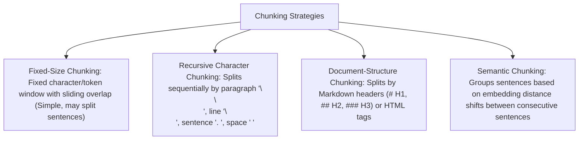

# File 08: Text Chunking Strategies for RAG Systems

## Overview
**Chunking** breaks large documents into smaller text passages prior to embedding generation and vector database indexing. Choosing optimal chunking strategies (**Fixed-Size**, **Recursive Character**, **Document-Structure / Markdown**, **Semantic Chunking**) directly impacts RAG retrieval precision and context relevance.

---

## 1. Chunking Strategies Taxonomy



---

## 2. Recursive Character Chunking Implementation

```javascript
class RecursiveCharacterTextSplitter {
    constructor(chunkSize = 200, chunkOverlap = 40, separators = ["\n\n", "\n", ". ", " "]) {
        this.chunkSize = chunkSize;
        this.chunkOverlap = chunkOverlap;
        this.separators = separators;
    }

    splitText(text) {
        const chunks = [];
        let start = 0;

        while (start < text.length) {
            let end = Math.min(start + this.chunkSize, text.length);

            // Find nearest separator boundary before 'end'
            if (end < text.length) {
                let foundSep = false;
                for (const sep of this.separators) {
                    const sepIdx = text.lastIndexOf(sep, end);
                    if (sepIdx > start) {
                        end = sepIdx + sep.length;
                        foundSep = true;
                        break;
                    }
                }
            }

            const chunk = text.substring(start, end).trim();
            if (chunk) chunks.push(chunk);

            // Advance start boundary considering overlap
            start = end - this.chunkOverlap;
            if (start >= text.length || end === text.length) break;
        }

        return chunks;
    }
}

const sampleDoc = `Node.js is an open-source, cross-platform JavaScript runtime. It executes code outside a web browser.\n\nExpress is a minimal web framework for Node.js. It simplifies HTTP server creation and middleware pipeline routing.`;

const splitter = new RecursiveCharacterTextSplitter(100, 20);
console.log("Generated Chunks:", splitter.splitText(sampleDoc));
```

---

## Key Takeaways
1. **Chunk Overlap** (e.g. 10-20% overlap) preserves semantic context across chunk boundaries.
2. **Recursive Character Splitter** is the industry standard default choice for plain text processing.
3. Use **Document-Structure Splitters** when processing Markdown or HTML to preserve section header context.
