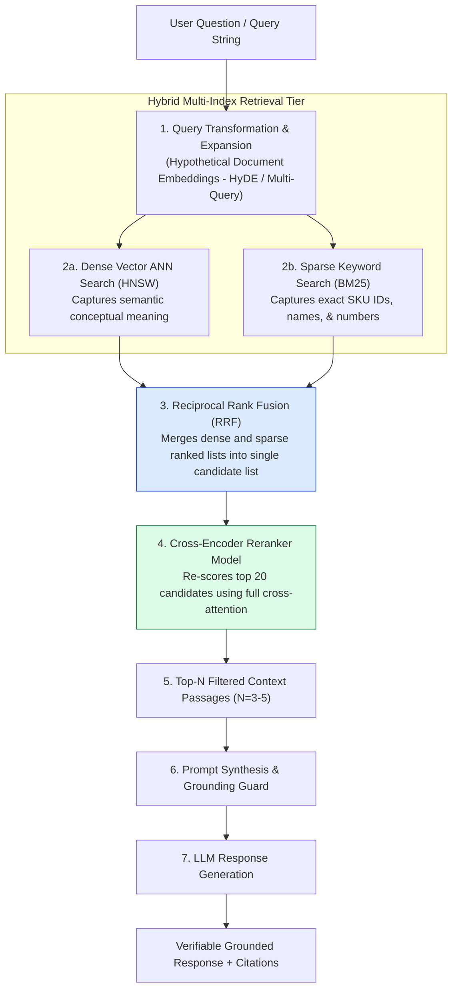
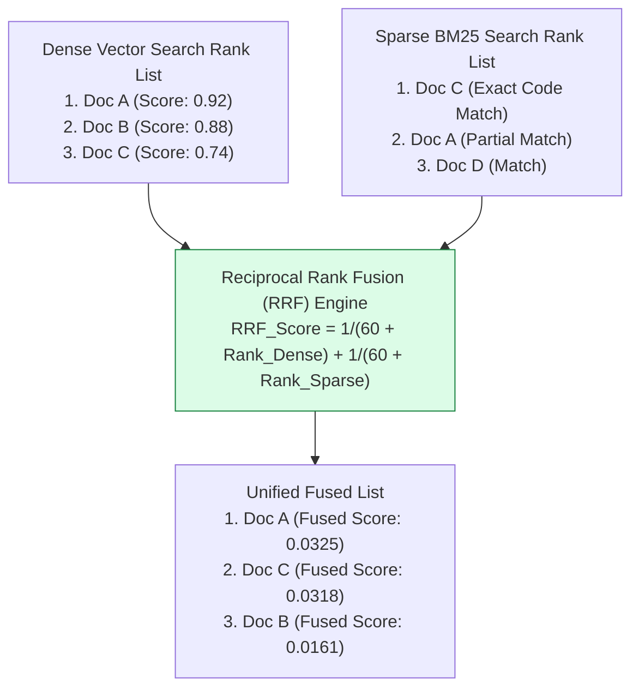
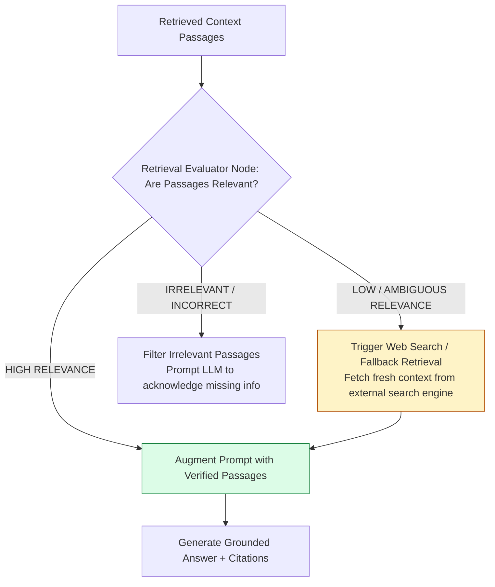

# Module 09: Retrieval-Augmented Generation (RAG), Hybrid Search, and Reranking Architecture

## Overview

While LLMs possess impressive reasoning abilities, their pre-training weights lack real-time proprietary data, recent information, and deep private enterprise context. **Retrieval-Augmented Generation (RAG)** bridges this gap by dynamically retrieving verified source passages from external databases, augmenting the prompt context payload before generating a grounded response.

Understanding **Naïve vs. Advanced RAG Pipeline Architectures**, **Hybrid Search (Dense Vector + Sparse BM25 Keyword Search)**, **Reciprocal Rank Fusion (RRF)**, **Cross-Encoder Reranking**, and **Corrective RAG (CRAG)** is essential.

---

## 1. Enterprise Advanced RAG Pipeline Architecture



---

## 2. Hybrid Search & Reciprocal Rank Fusion (RRF) Mechanics

Combining **Dense Vector Similarity** with **Sparse BM25 Keyword Search** eliminates single-retriever failure modes (e.g., vector search failing on exact serial numbers or BM25 failing on synonyms). **RRF** calculates a fused score for each document $d$:

$$RRF\_Score(d) = \sum_{m \in M} \frac{1}{k + r_m(d)}$$

Where $k \approx 60$ is a smoothing constant, and $r_m(d)$ is the rank position of document $d$ in retriever $m$:



### RAG Retrieval Pipeline Feature Matrix

| RAG Tier | Primary Mechanism | Processing Latency | Precision / Recall Impact | Best Use Case |
| :--- | :--- | :--- | :--- | :--- |
| **Naïve RAG** | Vector Similarity Search only | Fast ($< 20\text{ms}$) | Low Precision (Prone to retrieval noise) | Simple prototypes, non-critical QA. |
| **Hybrid Search (RRF)** | Dense Vector + Sparse BM25 | Fast ($30\text{ms} - 50\text{ms}$) | High Recall (Captures concepts & exact codes) | Enterprise documentation with mixed technical jargon & prose. |
| **Cross-Encoder Reranker** | Deep joint attention re-scoring | Moderate ($50\text{ms} - 150\text{ms}$) | **Maximum Precision ($+25\%$ accuracy boost)** | High-stakes RAG (Medical, Legal, Finance). |

---

## 3. Corrective RAG (CRAG) Self-Correction Decision Loop



---

## 4. Practical Implementation Showcase: Production RAG Orchestrator Engine

```javascript
class ProductionRAGOrchestrator {
  constructor(vectorStore, bm25Store, llmClient, options = {}) {
    this.vectorStore = vectorStore;
    this.bm25Store = bm25Store;
    this.client = llmClient;
    this.rrfK = options.rrfK || 60;
  }

  /**
   * Reciprocal Rank Fusion (RRF) algorithm to combine dense and sparse search results
   */
  _computeRRF(denseResults, sparseResults) {
    const rrfMap = new Map();

    denseResults.forEach((doc, rank) => {
      const score = 1.0 / (this.rrfK + (rank + 1));
      rrfMap.set(doc.id, { doc, score: (rrfMap.get(doc.id)?.score || 0) + score });
    });

    sparseResults.forEach((doc, rank) => {
      const score = 1.0 / (this.rrfK + (rank + 1));
      const existing = rrfMap.get(doc.id);
      rrfMap.set(doc.id, { doc: doc || existing?.doc, score: (existing?.score || 0) + score });
    });

    return Array.from(rrfMap.values())
      .sort((a, b) => b.score - a.score)
      .map((item) => ({ ...item.doc, rrfScore: Number(item.score.toFixed(6)) }));
  }

  /**
   * Complete Advanced RAG execution pipeline
   */
  async executeRAG(userQuery, options = { topK: 3 }) {
    console.log(`🔍 [RAG EXECUTION] Processing query: "${userQuery}"`);

    // 1. Parallel Hybrid Retrieval (Dense Vector + Sparse BM25)
    const [denseDocs, sparseDocs] = await Promise.all([
      this.vectorStore.search(userQuery, 5),
      this.bm25Store.search(userQuery, 5)
    ]);

    // 2. Reciprocal Rank Fusion (RRF)
    const fusedDocs = this._computeRRF(denseDocs, sparseDocs);
    const topPassages = fusedDocs.slice(0, options.topK);

    console.log(`⚡ [RAG HYBRID] Retrieved & fused top ${topPassages.length} passages.`);

    // 3. Construct Augmented Prompt Contract with Grounding Constraints
    const contextBlock = topPassages
      .map((p, idx) => `[Source ${idx + 1} | ID: ${p.id}]:\n${p.content}`)
      .join("\n\n");

    const systemPrompt = `You are an enterprise AI Knowledge Assistant.
Answer the user question using ONLY the provided context passages below.
If the context does not contain enough information to answer, state "I do not have sufficient information in my knowledge base to answer this question."
Do NOT invent or extrapolate facts outside the context. Cite source IDs in your answer (e.g. [Source 1]).`;

    const userPrompt = `### GROUND TRUTH CONTEXT\n${contextBlock}\n\n### USER QUESTION\n${userQuery}\n\n### GROUNDED ANSWER:`;

    // 4. LLM Generation
    const llmAnswer = await this.client.generateCompletion(systemPrompt, userPrompt);

    return {
      answer: llmAnswer,
      citations: topPassages.map((p) => ({ id: p.id, score: p.rrfScore }))
    };
  }
}

// Mock Dependencies Simulation
const mockVectorStore = {
  search: async (q, k) => [
    { id: "chunk_101", content: "Express.js uses 4 parameters (err, req, res, next) for error middleware." },
    { id: "chunk_102", content: "Node.js non-blocking I/O delegates tasks to libuv worker pool." }
  ]
};

const mockBM25Store = {
  search: async (q, k) => [
    { id: "chunk_101", content: "Express.js uses 4 parameters (err, req, res, next) for error middleware." },
    { id: "chunk_103", content: "MongoDB Atlas Vector Search supports HNSW vector indexing." }
  ]
};

const mockLLMClient = {
  generateCompletion: async (sys, user) =>
    "Express.js specifies that error handling middleware must accept 4 parameters: `(err, req, res, next)` [Source 1]."
};

// Test Orchestrator
const rag = new ProductionRAGOrchestrator(mockVectorStore, mockBM25Store, mockLLMClient);
rag.executeRAG("How do error middleware signatures work in Express?")
  .then((res) => console.log("\nGrounded RAG Result:\n", JSON.stringify(res, null, 2)));
```

---

## Key Production Takeaways

1. **Implement Hybrid Search (Dense + Sparse)**: Relying solely on vector embeddings leads to retrieval failures for exact codes, serial numbers, or function names. Always fuse dense vector search with sparse BM25 keyword search using RRF.
2. **Re-rank Top Candidates with a Cross-Encoder**: Pass top 20 candidate passages from Hybrid Search through a Cross-Encoder model (e.g. `bge-reranker-large` or Cohere Rerank) to trim down to the top 3-5 hyper-relevant passages, boosting RAG accuracy by up to $25\%$.
3. **Enforce Grounding System Prompts**: Explicitly instruct the LLM to answer using *only* the retrieved context and to state *"I do not have sufficient information"* when context is lacking, eliminating hallucinations.
4. **Attach Grounded Source Citations**: Require the LLM to output inline citation tags (e.g. `[Source 1]`) matching retrieved chunk metadata IDs so users can audit source documents.

