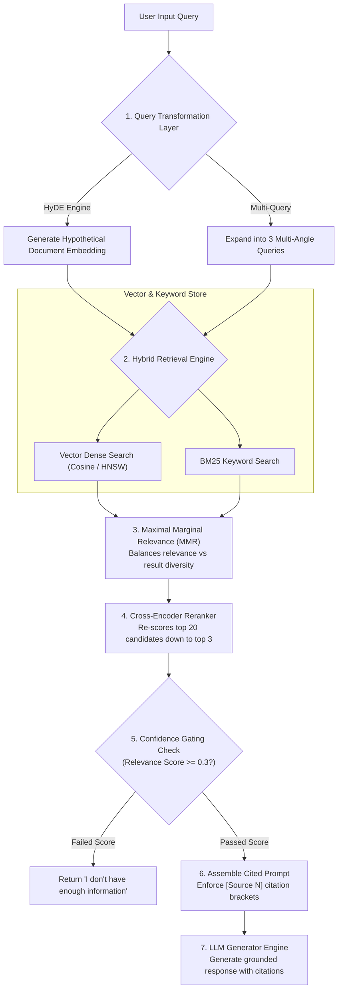

# Module 09: RAG Architecture — Retrieval-Augmented Generation, HyDE, MMR, Reranking, & Citations

## Theoretical Overview & Architecture Lifecycle

**Retrieval-Augmented Generation (RAG)** is the dominant architectural pattern for enterprise LLM applications. Rather than relying solely on frozen pre-trained model weights (which hallucinate or lack private data context), RAG dynamically retrieves authoritative document fragments from external knowledge stores and injects them into the LLM's prompt context at inference time.



### Real-World Analogy: UPSC Aspirant Notes
Think of a UPSC civil services exam candidate preparing for Mains:
- **Fine-Tuning (Memorization)**: Trying to memorize every single economic figure and census stat in a 1,000-page book by heart. Memory decays and statistics get outdated.
- **RAG (Open-Book Retrieval)**: Highlighting key sections in organized binder notes (chunking & embedding). During the exam, she flips directly to the specific highlighted page on GDP figures (retrieval) and writes a structured answer citing the source report (generation). Her strength lies in **fast retrieval and grounded synthesis**, not blind memorization.

---

## 1. RAG Architectural Stages & Lifecycle (`Section 1`)

| Stage | Name | Purpose & Description | Primary Output Artifact |
| :--- | :--- | :--- | :--- |
| **1** | **Ingest** | Loads raw files (PDFs, Markdown, SQL tables, web pages). | Raw text strings |
| **2** | **Chunk** | Splits documents into cohesive semantic units. | Chunks + metadata |
| **3** | **Embed** | Converts chunks to dense float vectors using encoder models. | Vectors in Vector DB |
| **4** | **Query** | Receives natural language question from user. | User Query string |
| **5** | **Transform** | Expands query via HyDE or Multi-Query generation. | Transformed queries |
| **6** | **Retrieve** | Executes hybrid dense/sparse vector search across DB. | Top-K candidate chunks |
| **7** | **Rerank** | Re-evaluates top candidates using a Cross-Encoder reranker. | Top 3-5 ranked chunks |
| **8** | **Generate** | Synthesizes grounded response using context with citations. | Final cited response |

---

## 2. Naive RAG vs. Advanced Enterprise RAG (`Section 3`)

| Architectural Component | Naive RAG (Proof-of-Concept) | Advanced Enterprise RAG (Production) |
| :--- | :--- | :--- |
| **Query Processing** | Uses raw user query as-is without modification. | **HyDE (Hypothetical Doc Embeddings) & Multi-Query Expansion**. |
| **Retrieval Strategy** | Simple Top-K Cosine Similarity. | **Hybrid Search (Vector + BM25 Keyword) + MMR Diversity**. |
| **Reranking Pass** | None (Relies entirely on initial vector score). | **Cross-Encoder Reranking (Cohere Rerank / BGE Reranker)**. |
| **Context Assembly** | Simple string concatenation. | **Deduplication, relevance sorting, lost-in-middle ordering**. |
| **Citation Tracking** | None (Unverified generation). | **Strict source bracket enforcement (`[Source 1]`) & regex parser**. |
| **Failure Handling** | Generates plausible hallucinations on low score. | **Confidence threshold gating ("I don't have enough info")**. |

---

## 3. Query Transformation: HyDE & Multi-Query (`Section 4`)

Short, vague user queries often match poorly with detailed document chunks in vector space. **HyDE** generates a hypothetical answer first, embedding the fake answer to match real documents.

```javascript
// 1. HyDE: Hypothetical Document Embedding Prompt Builder
function buildHyDEPrompt(query) {
  return `Write a short paragraph that would answer this question.
Do NOT search or use real data — write what a good answer WOULD look like.

Question: ${query}

Hypothetical answer:`;
}

// 2. Multi-Query Expansion Prompt Builder
function buildMultiQueryPrompt(query) {
  return `Generate 3 different search queries that would help answer this question.
Each query should approach the topic from a different angle.

Original question: ${query}

Query 1:
Query 2:
Query 3:`;
}
```

---

## 4. Advanced Retrieval: MMR & Hybrid Search (`Section 5`)

```javascript
// Maximal Marginal Relevance (MMR): Balances Relevance & Diversity
function mmrRetrieve(query, documents, embedFn, topK = 3, lambda = 0.7) {
  const queryEmb = embedFn(query);
  const scored = documents.map((doc, i) => ({
    ...doc, index: i,
    relevance: cosineSimilarity(queryEmb, doc.embedding),
  }));

  const selected = [];
  const remaining = [...scored];

  for (let k = 0; k < topK && remaining.length > 0; k++) {
    let bestIdx = -1, bestMMR = -Infinity;

    for (let i = 0; i < remaining.length; i++) {
      const relevance = remaining[i].relevance;
      let maxSimToSelected = 0;
      for (const sel of selected) {
        maxSimToSelected = Math.max(maxSimToSelected, cosineSimilarity(remaining[i].embedding, sel.embedding));
      }
      
      // MMR Formula: lambda * relevance - (1 - lambda) * max_similarity_to_selected
      const mmr = lambda * relevance - (1 - lambda) * maxSimToSelected;
      if (mmr > bestMMR) { bestMMR = mmr; bestIdx = i; }
    }
    if (bestIdx >= 0) {
      selected.push({ ...remaining[bestIdx], mmrScore: bestMMR });
      remaining.splice(bestIdx, 1);
    }
  }
  return selected;
}

// Hybrid Search: Vector Dense + Keyword Sparse Combination
function hybridSearch(query, documents, embedFn, topK = 3, alpha = 0.6) {
  const vectorResults = documents.map((doc, i) => ({
    ...doc, index: i,
    vectorScore: cosineSimilarity(embedFn(query), doc.embedding),
  }));
  const kwResults = keywordSearch(query, documents, documents.length);

  return vectorResults.map(vr => {
    const kr = kwResults.find(k => k.index === vr.index);
    const kwScore = kr ? kr.keywordScore : 0;
    return { ...vr, hybridScore: alpha * vr.vectorScore + (1 - alpha) * kwScore };
  }).sort((a, b) => b.hybridScore - a.hybridScore).slice(0, topK);
}
```

---

## 5. RAG Failure Modes & Mitigation Matrix (`Section 8`)

| Failure Mode | Root Cause | Architectural Mitigation Strategy |
| :--- | :--- | :--- |
| **Retrieval Miss** | Query terms do not match chunk vocabulary. | Implement HyDE and Multi-Query Expansion. |
| **Retrieval Noise** | Low-relevance chunks pollute LLM prompt. | Add Cross-Encoder Reranker & raise similarity threshold. |
| **Lost-in-the-Middle** | LLM ignores context placed in prompt center. | Order top chunks at the beginning and end of the prompt. |
| **Hallucination** | LLM generates facts missing from context. | Enforce strict system instructions & citation verification. |
| **Low Confidence** | Knowledge base lacks information for query. | Apply confidence threshold gating (`score >= 0.3`). |

---

## 6. RAG vs. Fine-Tuning Decision Framework (`Section 9`)

```javascript
// Decision Matrix: RAG vs Fine-Tuning
const ragVsFT = [
  { dimension: "Primary Objective", RAG: "Access private / dynamic external facts", FineTuning: "Adapt style, tone, format, or specialized syntax" },
  { dimension: "Data Freshness", RAG: "Real-time (Instant vector store update)", FineTuning: "Static (Frozen at training date)" },
  { dimension: "Hallucination Risk", RAG: "Low (Grounded in retrieved sources)", FineTuning: "High (No external grounding)" },
  { dimension: "Source Citations", RAG: "Fully traceable with bracketed citations", FineTuning: "Black box (Cannot cite source)" },
  { dimension: "Initial Setup Cost", RAG: "Low (Vector DB + API calls)", FineTuning: "High (GPU training runs & dataset preparation)" }
];
```

---

## Key Production Takeaways

1. **RAG is the #1 Enterprise AI Pattern**: Use RAG whenever applications require accurate, up-to-date responses grounded in private data.
2. **Transform Queries Before Searching**: Implement HyDE or Multi-Query expansion to bridge the vocabulary gap between short user questions and long document chunks.
3. **Use Cross-Encoder Reranking**: Retrieve top 20 candidate chunks with fast bi-encoder vector search, then refine to the top 3-5 using a cross-encoder reranker.
4. **Enforce Citation Brackets**: Require LLMs to cite sources (`[1]`, `[2]`) in prompt instructions to verify factual grounding.
5. **Gate Unconfident Queries**: Implement confidence thresholds (`score >= 0.3`) to respond with *"I don't have enough information"* when retrieval returns weak candidates.
