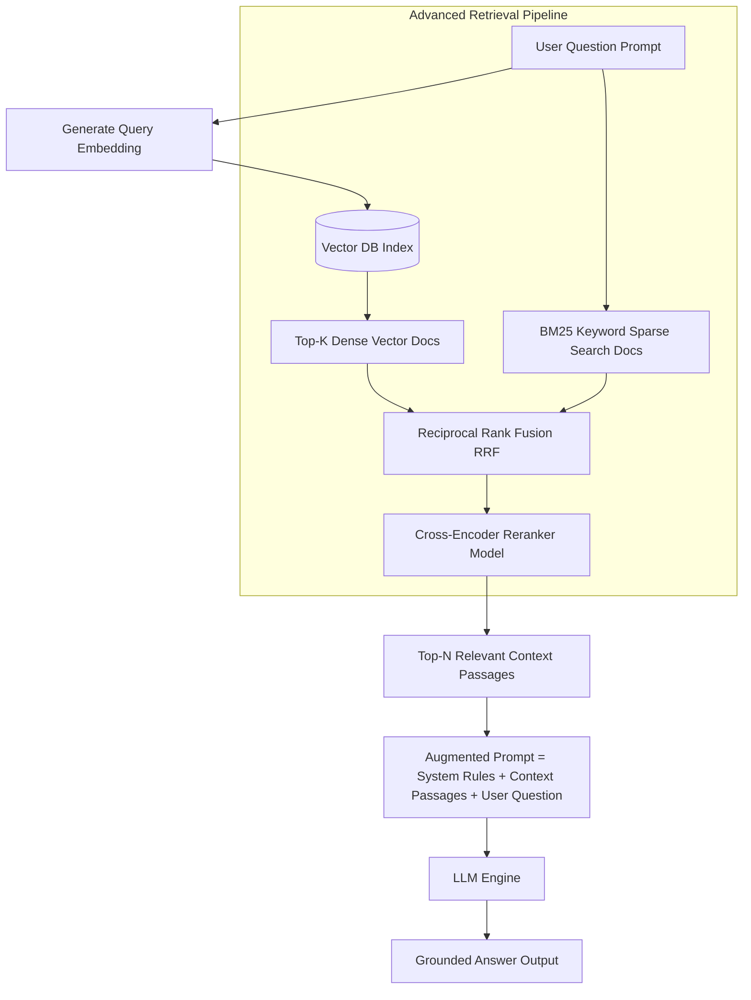

# File 09: Retrieval-Augmented Generation (RAG) Architecture

## Overview
**Retrieval-Augmented Generation (RAG)** grounds LLM responses in real-time, external domain knowledge by retrieving relevant context passages from a vector database or search index prior to generating a completion. Advanced techniques include **Hybrid Search**, **Reranking**, and **Self-RAG**.

---

## 1. RAG Pipeline Architecture (Naïve vs Advanced)



---

## 2. Minimal RAG System Implementation

```javascript
class RAGPipeline {
    constructor(vectorDb, mockLlm) {
        this.vectorDb = vectorDb;
        this.llm = mockLlm;
    }

    async answerQuery(userQuestion) {
        console.log(`[RAG QUERY] "${userQuestion}"`);

        // 1. Vector Retrieval Phase
        const queryVector = [0.85, 0.15, 0.05]; // Simulated query embedding
        const retrievedDocs = this.vectorDb.query(queryVector, 2);

        const contextText = retrievedDocs.map((doc, idx) => `[Doc ${idx + 1}]: ${doc.text}`).join("\n\n");
        console.log(`[RETRIEVED CONTEXT]\n${contextText}\n`);

        // 2. Augmented Prompt Construction Phase
        const augmentedPrompt = `
You are a helpful domain AI Assistant. Answer the user question using ONLY the provided context below.

CONTEXT PASSAGES:
${contextText}

USER QUESTION: ${userQuestion}
ANSWER:`;

        // 3. Generation Phase
        const answer = await this.llm(augmentedPrompt);
        return { answer, retrievedDocs };
    }
}
```

---

## Key Takeaways
1. **RAG** eliminates LLM hallucinations by supplying verifiable source passages inside the context window.
2. Use **Hybrid Search** (Dense Vector Search + Sparse Keyword BM25) for high retrieval recall.
3. Use a **Cross-Encoder Reranker** to re-score and select the top most relevant context chunks before sending them to the LLM.
