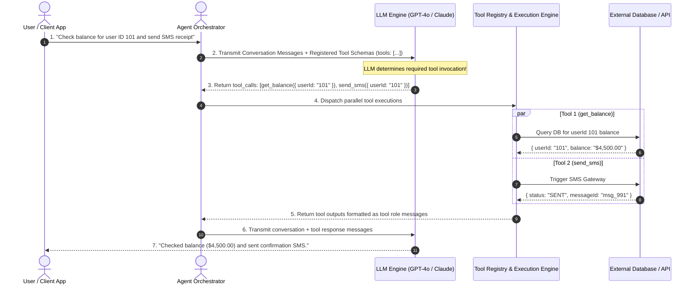
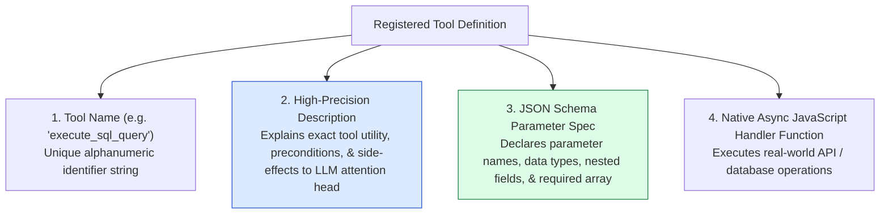
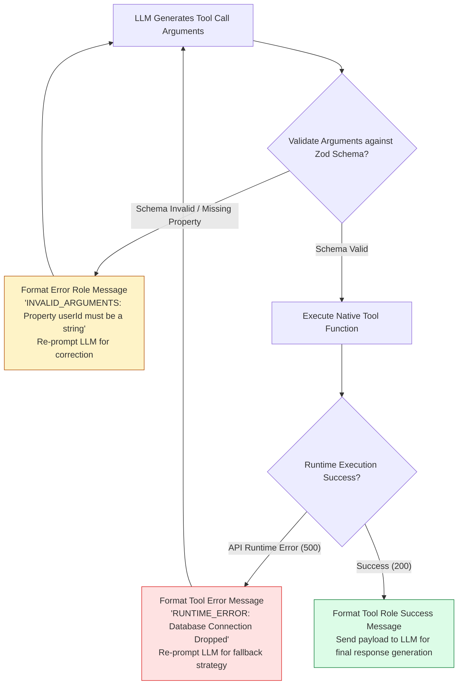

# Module 10: Tool Calling, Function Calling Protocols, and Dynamic Tool Registries

## Overview

**Tool Calling (Function Calling)** enables Large Language Models to escape static text generation and execute real-world deterministic computational operations. Instead of generating natural language, the LLM outputs a structured JSON object containing a target **Tool Name** and **Arguments Payload** conforming to an explicit **JSON Schema** specification contract.

Understanding **Native Function Calling Protocols**, **Dynamic Tool Registries**, **Strict JSON Schema / Zod Parameter Validation**, **Parallel Tool Invocation**, and **Tool Error Interception Loops** is essential for building autonomous AI agents.

---

## 1. Tool Calling Execution Loop & Protocol Sequence



---

## 2. Tool Definition Anatomy & JSON Schema Specification



### Function Calling Provider Protocol Comparison

| Provider / Standard | Tool Choice Settings | Parameter Schema Standard | Parallel Tool Calls Supported? |
| :--- | :--- | :--- | :--- |
| **OpenAI / Azure** | `tool_choice: "auto"` \| `"required"` \| `{ type: "function", ... }` | JSON Schema Draft 7 | **YES** (`parallel_tool_calls: true`) |
| **Anthropic Claude** | `tool_choice: { type: "auto" }` \| `{ type: "tool", name: "x" }` | JSON Schema | **YES** (Native multi-tool outputs) |
| **Google Gemini** | `functionCallingConfig: { mode: "AUTO" }` | OpenAPI Schema | **YES** |
| **MCP (Model Context Protocol)** | Open Protocol Schema Standard | JSON Schema | **YES** (Standardized client/server tools) |

---

## 3. Tool Execution Error Interception & Self-Correction Loop



---

## 4. Practical Implementation Showcase: Production Tool Registry & Dispatcher

```javascript
class ProductionToolRegistry {
  constructor() {
    this.tools = new Map(); // toolName -> { name, description, parameters, handler }
  }

  /**
   * Registers a tool with JSON schema and native execution handler
   */
  register(name, description, parametersSchema, handlerFn) {
    if (this.tools.has(name)) {
      throw new Error(`Tool '${name}' is already registered.`);
    }

    this.tools.set(name, {
      name,
      description,
      parameters: parametersSchema,
      handler: handlerFn
    });
  }

  /**
   * Exports tool schemas in standard OpenAI API format
   */
  exportOpenAISchemas() {
    return Array.from(this.tools.values()).map((tool) => ({
      type: "function",
      function: {
        name: tool.name,
        description: tool.description,
        parameters: tool.parameters
      }
    }));
  }

  /**
   * Dispatches and executes a single or multi-tool call request safely
   */
  async executeToolCall(toolCallRequest) {
    const { id, function: fnCall } = toolCallRequest;
    const { name, arguments: rawArgs } = fnCall;

    const tool = this.tools.get(name);
    if (!tool) {
      return {
        tool_call_id: id,
        role: "tool",
        name,
        content: JSON.stringify({ error: "TOOL_NOT_FOUND", message: `Tool '${name}' is not supported.` })
      };
    }

    try {
      // Parse JSON string arguments safely
      const args = typeof rawArgs === "string" ? JSON.parse(rawArgs) : rawArgs;

      console.log(`🛠️ [TOOL EXECUTOR] Running '${name}' with args:`, JSON.stringify(args));
      const result = await tool.handler(args);

      return {
        tool_call_id: id,
        role: "tool",
        name,
        content: JSON.stringify({ status: "success", data: result })
      };
    } catch (err) {
      console.error(`🚨 [TOOL ERROR] Exception in '${name}':`, err.message);
      return {
        tool_call_id: id,
        role: "tool",
        name,
        content: JSON.stringify({ error: "TOOL_EXECUTION_FAILED", message: err.message })
      };
    }
  }
}

// Example Usage & Tool Registrations
const registry = new ProductionToolRegistry();

// 1. User Balance Fetcher Tool
registry.register(
  "get_user_balance",
  "Fetches the active account balance and currency for a verified user ID.",
  {
    type: "object",
    properties: {
      userId: { type: "string", description: "The unique user account identifier." }
    },
    required: ["userId"]
  },
  async ({ userId }) => {
    // Simulated DB lookup
    if (userId === "invalid") throw new Error("User ID does not exist.");
    return { userId, balance: 2450.75, currency: "USD" };
  }
);

// 2. Transaction Logger Tool
registry.register(
  "log_audit_event",
  "Logs an administrative audit event record into system logs.",
  {
    type: "object",
    properties: {
      action: { type: "string", description: "The action name being audited." },
      severity: { type: "string", enum: ["INFO", "WARN", "CRITICAL"] }
    },
    required: ["action", "severity"]
  },
  async ({ action, severity }) => ({ logId: `log_${Date.now()}`, action, severity, recorded: true })
);

// Simulated LLM Tool Call Dispatch Test
const mockLLMToolCall = {
  id: "call_abc123",
  type: "function",
  function: {
    name: "get_user_balance",
    arguments: '{"userId": "usr_99182"}'
  }
};

registry.executeToolCall(mockLLMToolCall).then((res) => {
  console.log("\nTool Response Message Payload:\n", JSON.stringify(res, null, 2));
});
```

---

## Key Production Takeaways

1. **Descriptions Are Prompts for Tools**: The description string in a tool schema acts as an instruction to the LLM's attention mechanism. Make tool descriptions precise, specifying exact input types, units, and side-effects.
2. **Always Validate Tool Arguments at Runtime**: Never execute LLM-generated arguments blindly in application code. Validate arguments using JSON Schema or Zod before executing database queries or system commands.
3. **Handle Tool Errors Gracefully**: When a tool throws a runtime exception, catch it and return a formatted tool role error message back to the LLM so the model can self-correct or inform the user.
4. **Leverage Parallel Tool Calling**: Enable parallel tool calls (`parallel_tool_calls: true`) to allow the LLM to trigger multiple independent tools (e.g. fetching weather, calendar, and email in parallel) in a single turn.

