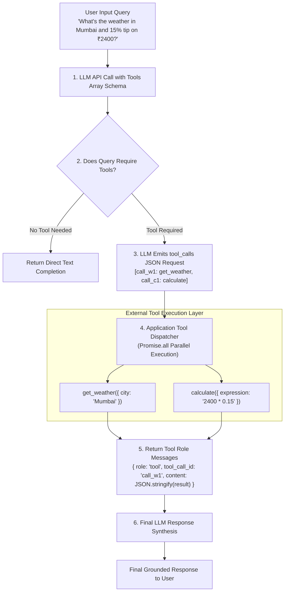

# Module 10: Tool Calling & Function Calling Architecture

## Theoretical Overview & The Agent Switchboard Pattern

Without external tools, a Large Language Model is a **"Brain in a Jar"**—it possesses rich internal reasoning capabilities but cannot perform real-world actions, query live database records, or interact with external REST APIs.

**Tool Calling (Function Calling)** provides the mechanism by which applications expose typed API interfaces to the LLM. The LLM acts like a **Call-Center Operator behind a Switchboard**: when a user request requires live weather, database lookups, or mathematical evaluation, the model emits a structured JSON payload requesting a specific tool call. **Your application code (the switchboard operator) executes the tool**, captures the output, and returns the result back to the model context.



### Real-World Analogy: Call-Center Agent with a Switchboard
Think of a customer service agent at a multi-brand tele-help center:
- **No Direct Knowledge**: The agent doesn't memorize inventory prices or weather forecasts in her head.
- **Switchboard Lines (Tools Array)**: She has 3 direct lines on her switchboard: Line 1 (Weather Bureau `get_weather`), Line 2 (Calculations `calculate`), Line 3 (E-Commerce Store `search_products`).
- **Patching the Line**: When a customer asks for weather and a discount calculation, she patches into both lines simultaneously, waits for the responses, and translates the answers into a polite response.

---

## 1. Schema Wire Format: OpenAI vs. Google Gemini (`Sections 2 & 3`)

| Schema Component | OpenAI Format (`gpt-4o`) | Google Gemini Format (`gemini-1.5-flash`) |
| :--- | :--- | :--- |
| **Tool Container Key** | `tools: [{ type: "function", function: { ... } }]` | `tools: [{ functionDeclarations: [{ ... }] }]` |
| **Data Type Casing** | Lowercase JSON Schema (`"object"`, `"string"`) | **UPPERCASE** types (`"OBJECT"`, `"STRING"`) |
| **LLM Output Request** | `assistantMessage.tool_calls[]` array | `parts[].functionCall` object |
| **Call Correlation ID** | Explicit `tool_call_id: "call_abc123"` | Matched by function `name` |
| **Result Feedback Role** | `{ role: "tool", tool_call_id, content: "..." }` | `{ role: "user", parts: [{ functionResponse: ... }] }` |

```javascript
// OpenAI Tool Schema Definition
const openaiTools = [
  {
    type: "function",
    function: {
      name: "get_weather",
      description: "Get the current weather for a given city in Celsius or Fahrenheit.",
      parameters: {
        type: "object",
        properties: {
          city: { type: "string", description: "City name, e.g. 'Mumbai'" },
          units: { type: "string", enum: ["celsius", "fahrenheit"], description: "Temperature unit" },
        },
        required: ["city"],
      },
    },
  },
];
```

---

## 2. Tool Schema Design Best Practices (`Section 4`)

The tool schema **IS the prompt** for tool selection. Poor descriptions cause models to invoke wrong tools or pass malformed arguments.

```javascript
// BAD Schema Example (Vague names, unhelpful descriptions, untyped params)
const badTool = {
  name: "do_stuff",
  description: "Does things",
  parameters: { type: "object", properties: { x: { type: "string" } } },
};

// GOOD Schema Example (Descriptive name, precise documentation, enums, required fields)
const goodTool = {
  name: "search_products",
  description: "Search the e-commerce product catalog by keyword. Returns name, price in INR, and category.",
  parameters: {
    type: "object",
    properties: {
      query: { type: "string", description: "Search keyword, e.g. 'wireless earbuds'" },
      max_results: { type: "integer", description: "Number of results (1-10). Default 5." },
      price_max: { type: "number", description: "Optional upper price limit in INR." },
    },
    required: ["query"],
  },
};
```

---

## 3. Parallel Tool Call Execution (`Section 5`)

When a user prompt asks a compound question (e.g. *"What's the weather in Mumbai AND what's 15% tip on ₹2400?"*), the LLM emits multiple `tool_calls` in a single response. Applications should execute these calls concurrently via `Promise.all`:

```javascript
// OpenAI Assistant Message containing Parallel Tool Calls
const parallelAssistantResponse = {
  role: "assistant",
  content: null,
  tool_calls: [
    {
      id: "call_w1",
      type: "function",
      function: { name: "get_weather", arguments: '{"city":"Mumbai"}' },
    },
    {
      id: "call_c1",
      type: "function",
      function: { name: "calculate", arguments: '{"expression":"2400 * 0.15"}' },
    },
  ],
};
```

---

## 4. End-to-End Tool Dispatcher & Execution Loop (`Section 7`)

```javascript
// 1. Core Tool Implementation Registry
const TOOL_IMPLEMENTATIONS = {
  get_weather({ city, units = "celsius" }) {
    const weatherDb = {
      Mumbai: { temp: 33, desc: "Humid and partly cloudy" },
      Delhi: { temp: 42, desc: "Scorching hot" },
    };
    const data = weatherDb[city] || { temp: 25, desc: "Pleasant" };
    return { city, temperature: data.temp, unit: units, description: data.desc };
  },

  calculate({ expression }) {
    const sanitized = expression.replace(/[^0-9+\-*/().%^ ]/g, "");
    const result = Function(`"use strict"; return (${sanitized.replace(/\^/g, "**")})`)();
    return { expression, result };
  },
};

// 2. Safe Tool Dispatcher
function dispatchToolCall(name, argsString) {
  const fn = TOOL_IMPLEMENTATIONS[name];
  if (!fn) return { error: `Unknown tool: ${name}` };
  try {
    const args = JSON.parse(argsString);
    return fn(args);
  } catch (e) {
    return { error: `Failed to parse tool arguments: ${e.message}` };
  }
}

// 3. Autonomous Tool-Calling Execution Loop
async function runToolCallingLoop(userMessage, callLLM, maxIterations = 5) {
  const messages = [
    { role: "system", content: "You are a helpful assistant with access to external tools." },
    { role: "user", content: userMessage }
  ];

  for (let i = 0; i < maxIterations; i++) {
    const response = await callLLM(messages);

    // If model requests tool calls, execute & append tool role responses
    if (response.tool_calls && response.tool_calls.length > 0) {
      messages.push(response);

      for (const toolCall of response.tool_calls) {
        const { name, arguments: args } = toolCall.function;
        const result = dispatchToolCall(name, args);

        messages.push({
          role: "tool",
          tool_call_id: toolCall.id,
          content: JSON.stringify(result), // Content MUST be a string!
        });
      }
      continue; // Re-prompt LLM with tool outputs
    }

    // No tool call requested — return final answer
    return response.content;
  }
}
```

---

## Key Production Takeaways

1. **LLMs Never Execute Tools**: Models only emit structured JSON requests. Your backend code is responsible for executing tools and validating security boundaries.
2. **The Schema IS the Tool Prompt**: Clear tool names (`get_weather`), detailed property descriptions, and strict `required` fields are mandatory for accurate tool selection.
3. **Execute Parallel Calls Concurrently**: Process multiple `tool_calls` using `Promise.all` to minimize turn latency in multi-tool user queries.
4. **Stringify Tool Response Content**: Always wrap tool execution results in `JSON.stringify()` before returning them in `{ role: "tool", tool_call_id, content }` messages.
5. **Implement Robust Error Recovery**: Never let a tool execution exception crash your agent loop; return `{ error: "Description" }` back to the model so it can self-correct or notify the user.


## Learn from the implementation

Use the matching source file as an executable example, not just something to copy. Before running it, state in your own words what data enters the module, what it returns, and which values it changes. Then trace one realistic request from the caller through each function.

Pay special attention to these questions:

- **Data flow:** Which object, array, string, or state value moves between functions? What shape must it have?
- **Control flow:** Which branch, loop, early return, or retry changes the outcome? What condition selects it?
- **Async boundaries:** Where does the code wait for an LLM, database, network, file system, or tool? What should happen if that operation rejects or returns no result?
- **Side effects:** Which lines log information, make an external request, store data, or mutate in-memory state? Keep those distinct from pure calculations.
- **Production limits:** Which assumptions are only safe for a tutorial—for example, in-memory storage, fixed thresholds, approximate token counts, mock data, or a hard-coded batch size?

A useful practice is to change one input at a time and predict the result before executing it. If you can explain why the output changed, when the module should be used, and one way it could fail, you understand the concept rather than only the syntax.
