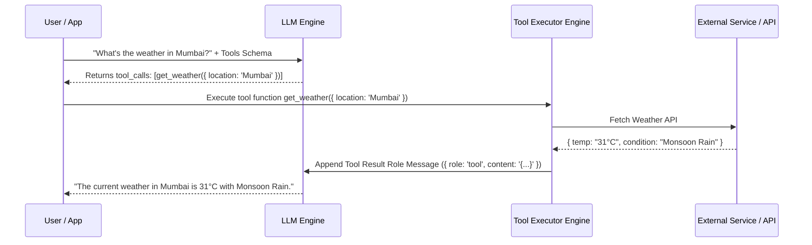

# File 10: Tool Calling and Function Calling in LLMs

## Overview
**Tool Calling (Function Calling)** empowers LLMs to interact with external APIs, databases, calculations, and web search engines by returning structured JSON tool invocations matching predefined schemas (OpenAI / Gemini function calling schemas).

---

## 1. Tool Calling Execution Loop



---

## 2. Structured Tool Calling Registry & Dispatcher Implementation

```javascript
class ToolRegistry {
    constructor() {
        this.tools = new Map();
        this.schemas = [];
    }

    registerTool(name, description, parametersSchema, executeFn) {
        this.tools.set(name, executeFn);
        this.schemas.push({
            type: "function",
            function: {
                name,
                description,
                parameters: parametersSchema
            }
        });
    }

    async executeToolCall(toolCall) {
        const { name, arguments: argsJson } = toolCall.function;
        const toolFn = this.tools.get(name);

        if (!toolFn) throw new Error(`Tool '${name}' not found in registry`);

        const args = typeof argsJson === "string" ? JSON.parse(argsJson) : argsJson;
        console.log(`[EXECUTING TOOL] ${name}(${JSON.stringify(args)})`);
        return await toolFn(args);
    }
}

// Tool Registration Example
const registry = new ToolRegistry();
registry.registerTool(
    "fetch_user_balance",
    "Fetches account balance for a given userId",
    {
        type: "object",
        properties: { userId: { type: "string" } },
        required: ["userId"]
    },
    async ({ userId }) => ({ userId, balance: 15000, currency: "INR" })
);
```

---

## Key Takeaways
1. Tool calling allows LLMs to **execute actions in the real world** via structured JSON schemas.
2. The LLM generates the **tool call parameter intent**; your application code executes the tool and sends the result back to the LLM.
3. Validate tool arguments using **Zod** or JSON Schema before executing tools.
