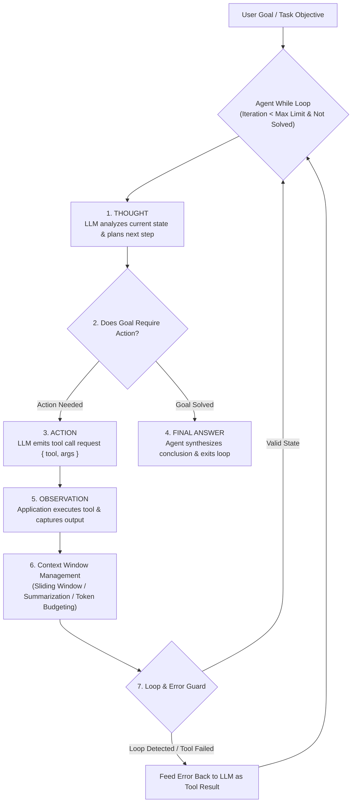

# Module 11: ReAct Loop & Agent Internals — Autonomous Execution, Context Management, & Error Recovery

## Theoretical Overview & The ReAct Engine Architecture

The **ReAct (Reason + Act)** pattern (Yao et al., 2022) is the foundational execution engine behind autonomous AI agents. Unlike static chain-of-thought (CoT) prompting (which can only reason about static knowledge) or raw tool execution (which acts impulsively without planning), ReAct **interleaves internal reasoning (`Thought`), tool execution (`Action`), and environment feedback (`Observation`)** in an iterative while-loop.



### Real-World Analogy: Detective Byomkesh Bakshi Solving a Case
Think of classic Indian sleuth Detective Byomkesh Bakshi investigating a mystery:
- **Initial Goal**: Identify who committed the crime at the old *haveli*.
- **Thought 1**: *"The victim was found at the haveli. I should start by checking who visited that night."*
- **Action 1**: Inspects the guest register (`check_guest_register({ location: "haveli" })`).
- **Observation 1**: *"Ramesh signed in at 9:00 PM, but the security guard swore nobody entered after 8:00 PM."*
- **Thought 2**: *"The guard's testimony contradicts the register. Let me review the CCTV footage to see if the guard lied."*
- **Action 2**: Reviews CCTV footage (`review_cctv({ location: "haveli", time: "9pm" })`).
- **Observation 2**: *"CCTV shows Ramesh entering at 9:05 PM while the guard was absent from his post."*
- **Final Answer**: *"The guard is the prime accomplice. He deliberately abandoned his post and lied to investigators."*

---

## 1. CoT vs. Direct Tool Calling vs. ReAct Pattern (`Section 1`)

| Paradigm | Architectural Flow | Primary Strength | Critical Failure Mode |
| :--- | :--- | :--- | :--- |
| **Chain-of-Thought (CoT)** | $\text{Thought} \to \text{Thought} \to \text{Answer}$ | Improves internal logic and math accuracy. | Cannot fetch external data or run live tools. |
| **Direct Tool Calling** | $\text{Action} \to \text{Observation} \to \text{Answer}$ | Executes API actions quickly. | Impulsive tool selection without strategic planning. |
| **ReAct Loop** | $\text{Thought} \to \text{Action} \to \text{Observation} \to \dots \to \text{Answer}$ | **Interleaves reasoning with real-time environment observations**. | Risk of infinite loops if stopping bounds are absent. |

---

## 2. Core ReAct Agent Implementation (`Section 2`)

```javascript
// Detective Tool Registry (Environment Interface)
const detectiveTools = {
  check_guest_register({ location }) {
    const registers = {
      haveli: [{ name: "Ramesh Kapoor", time: "9:00 PM" }, { name: "Sunita Devi", time: "7:30 PM" }],
    };
    return registers[location] || { error: "No register found for " + location };
  },

  review_cctv({ location, time }) {
    const footage = { haveli_9pm: "Shows Ramesh entering at 9:05 PM. Guard absent." };
    return footage[`${location}_${time}`] ? { footage: footage[`${location}_${time}`] } : { footage: "No footage" };
  },

  interrogate({ person }) {
    const statements = { guard: "I was at my post all night. Nobody came after 8 PM." };
    return { person, statement: statements[person] || "Unknown person" };
  },
};

// Core ReAct Loop Architecture (~100 lines)
function reactLoop(initialTask, maxIterations = 10) {
  const trace = [];
  const context = [{ role: "system", content: "You are detective Byomkesh Bakshi." }, { role: "user", content: initialTask }];
  let iteration = 0;
  let solved = false;
  let finalAnswer = null;

  while (iteration < maxIterations && !solved) {
    iteration++;

    // 1. Generate THOUGHT + ACTION (LLM step)
    const step = getLLMStep(context); // Simulated or real API call

    // 2. Record THOUGHT
    trace.push({ type: "thought", content: step.thought, step: iteration });
    context.push({ role: "assistant", content: `Thought: ${step.thought}` });

    // 3. Check for Final Answer (Stopping Condition)
    if (!step.action) {
      finalAnswer = step.answer;
      solved = true;
      break;
    }

    // 4. Record & Execute ACTION
    const { tool, args } = step.action;
    trace.push({ type: "action", tool, args, step: iteration });

    // 5. OBSERVATION (Execute Tool)
    let observation;
    try {
      observation = detectiveTools[tool](args);
    } catch (err) {
      observation = { error: `Tool execution failed: ${err.message}` };
    }

    trace.push({ type: "observation", content: observation, step: iteration });
    context.push({ role: "tool", content: JSON.stringify(observation) });

    // 6. Manage Context Window (Keep last 6 messages + system prompt)
    if (context.length > 7) {
      context.splice(1, context.length - 7);
    }
  }

  return { answer: finalAnswer || "Inconclusive - max iterations reached", trace, iterations: iteration };
}
```

---

## 3. Planning Strategies: Plan-Then-Execute vs. ReAct (`Section 3`)

```javascript
// Strategy 1: Plan-Then-Execute (Decomposes task into static plan before running)
function planThenExecute(goal) {
  const plan = [
    "Check guest register at haveli",
    "Review CCTV footage around 9 PM",
    "Interrogate the guard",
    "Draw final conclusion"
  ];
  const results = plan.map(step => executeStep(step));
  return results;
}

// Strategy 2: Iterative ReAct (Dynamic pathing adjusted after every observation)
// Recommended for unpredictable environments, live web search, or debugging tasks.
```

---

## 4. Context Window & Token Budget Management (`Sections 5 & 6`)

Agents generate long message histories over multi-step loops. Context management prevents out-of-memory budget crashes.

```javascript
// 1. Sliding Window Strategy
function slidingWindow(messages, windowSize = 4) {
  if (messages.length <= windowSize) return messages;
  const systemMsg = messages.find(m => m.role === "system");
  const recent = messages.slice(-windowSize);
  return systemMsg && !recent.includes(systemMsg) ? [systemMsg, ...recent] : recent;
}

// 2. Token Budget Allocator
function tokenBudget(messages, maxTokens = 8000) {
  const systemTokens = Math.ceil(messages[0].content.length / 4);
  const toolSchemaTokens = 500;
  const reserveForResponse = 1000;
  const availableForHistory = maxTokens - systemTokens - toolSchemaTokens - reserveForResponse;

  let usedTokens = 0;
  const fittingMessages = [];

  // Work backwards from most recent message
  for (let i = messages.length - 1; i >= 1; i--) {
    const msgTokens = Math.ceil((messages[i].content || "").length / 4);
    if (usedTokens + msgTokens > availableForHistory) break;
    usedTokens += msgTokens;
    fittingMessages.unshift(messages[i]);
  }

  return [messages[0], ...fittingMessages];
}
```

---

## 5. Infinite Loop Detection & Error Recovery (`Sections 7 & 8`)

```javascript
// Infinite Loop Detector: Identifies repeated identical tool invocations
function loopDetector(trace) {
  const actionCounts = {};
  for (const entry of trace) {
    if (entry.type === "action") {
      const key = `${entry.tool}:${JSON.stringify(entry.args)}`;
      actionCounts[key] = (actionCounts[key] || 0) + 1;
      if (actionCounts[key] >= 3) {
        return { looping: true, action: key }; // Force exit & answer with available info
      }
    }
  }
  return { looping: false };
}

// Resilient Tool Execution with Error Feedback
async function resilientToolCall(toolFn, args, maxRetries = 3) {
  for (let attempt = 1; attempt <= maxRetries; attempt++) {
    try {
      return await toolFn(args);
    } catch (err) {
      if (attempt === maxRetries) {
        // Return structured error payload so the LLM can re-plan around it
        return { error: `Tool failed after ${maxRetries} attempts: ${err.message}` };
      }
      await new Promise(r => setTimeout(r, Math.pow(2, attempt) * 100));
    }
  }
}
```

---

## Key Production Takeaways

1. **ReAct Interleaves Thought, Action, & Observation**: Always force the agent to emit a `Thought` step before issuing a tool `Action` to improve tool choice reasoning.
2. **Set Strict Hard Limits on Iterations**: Always configure `maxIterations` ($5 - 10$) to prevent runaway loops and API cost spikes.
3. **Implement Infinite Loop Detection**: Monitor the execution trace and force termination if the agent invokes the exact same tool and arguments 3 consecutive times.
4. **Feed Errors Back as Tool Results**: When a tool fails, return a JSON payload describing the error (`{ error: "CCTV offline" }`) so the LLM can adjust its plan dynamically.
5. **Manage Context Window Budget**: Implement sliding windows or token budgeting to prune older tool results while preserving the system prompt.
