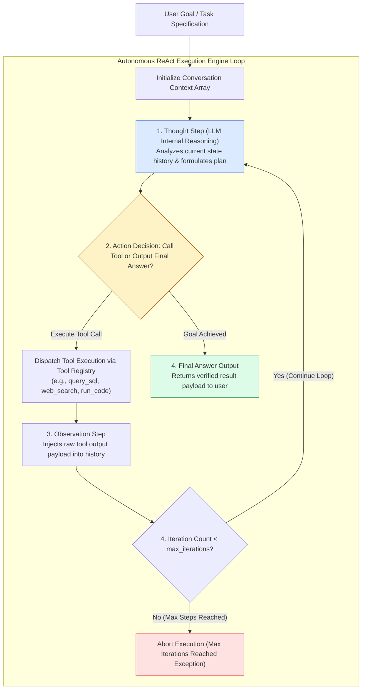
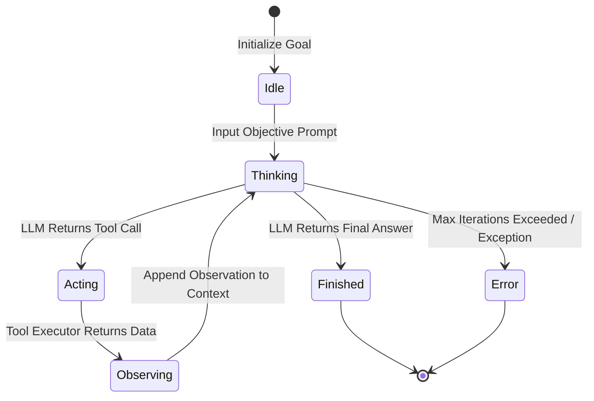
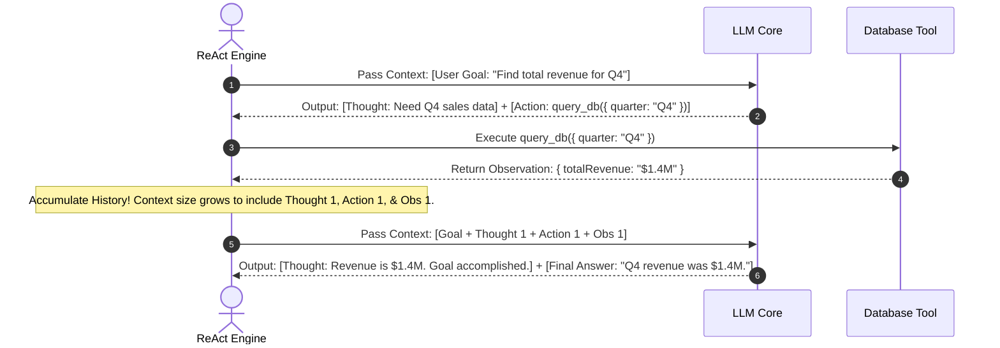

# Module 11: ReAct Framework, Autonomous Agent Loops, and State Accumulation

## Overview

The **ReAct (Reasoning + Acting)** framework is the foundational paradigm for autonomous AI agents. Unlike passive one-shot LLMs, a ReAct agent operates in an interactive closed loop, interleaving step-by-step reasoning (**Thought**), tool execution (**Action**), and environmental feedback retrieval (**Observation**) until its goal is achieved or a maximum iteration guardrail is triggered.

Understanding **Thought-Action-Observation State Machine Loops**, **Execution History Context Accumulation**, **Infinite Loop Guards (`max_iterations`)**, and **Self-Correction Patterns** is essential for production agent engineering.

---

## 1. ReAct Loop Closed-Cycle Topology



---

## 2. ReAct Agent State Transition Matrix



### ReAct Agent Execution States Reference Matrix

| State Name | Trigger Condition | Primary Input Payload | Output Artifact |
| :--- | :--- | :--- | :--- |
| **Idle** | Initialization | User task goal string | Context Array initialization |
| **Thinking** | Prompt payload dispatched to LLM | Complete accumulated context history | Inner monologue reasoning & tool choice |
| **Acting** | LLM outputs tool call parameters | Tool name & arguments JSON | Real-world side-effect (DB write, API call) |
| **Observing** | Tool execution completes | Raw tool return output | New `{ role: "tool", content: ... }` message |
| **Finished** | LLM outputs terminal final answer | Final synthesized text | Returned solution payload to client |

---

## 3. Context History Accumulation Dynamics



---

## 4. Practical Implementation Showcase: Enterprise ReAct Agent Engine

```javascript
class EnterpriseReActAgent {
  constructor(llmClient, toolRegistry, options = {}) {
    this.client = llmClient;
    this.tools = toolRegistry;
    this.maxSteps = options.maxSteps || 6;
  }

  /**
   * Runs the main Thought-Action-Observation ReAct execution loop
   */
  async executeGoal(userGoal) {
    console.log(`🤖 [AGENT INITIALIZED] Goal: "${userGoal}"`);

    const contextHistory = [
      {
        role: "system",
        content: `You are an autonomous ReAct AI Agent. Solve the user goal step-by-step.
Interleave your reasoning into Thought, Action, and Observation sequences.
Use tools when external information is needed. Output your final result clearly when finished.`
      },
      { role: "user", content: userGoal }
    ];

    let currentStep = 0;

    while (currentStep < this.maxSteps) {
      currentStep++;
      console.log(`\n🔄 --- REACT LOOP STEP ${currentStep}/${this.maxSteps} ---`);

      // 1. THOUGHT STEP: LLM generates next action or final answer
      const llmResponse = await this.client.generateResponse(contextHistory, this.tools.exportSchemas());

      if (llmResponse.finalAnswer) {
        console.log(`✅ [FINAL ANSWER]: ${llmResponse.finalAnswer}`);
        return {
          status: "SUCCESS",
          totalSteps: currentStep,
          result: llmResponse.finalAnswer,
          history: contextHistory
        };
      }

      if (llmResponse.toolCall) {
        const { id, name, args } = llmResponse.toolCall;
        console.log(`💭 [THOUGHT]: ${llmResponse.thought}`);
        console.log(`⚡ [ACTION]: Call Tool '${name}' with args:`, JSON.stringify(args));

        // Append Thought & Action to Context History
        contextHistory.push({
          role: "assistant",
          content: `Thought: ${llmResponse.thought}`,
          tool_calls: [{ id, function: { name, arguments: JSON.stringify(args) } }]
        });

        // 2. OBSERVATION STEP: Execute Tool and capture output
        let toolObservation;
        try {
          toolObservation = await this.tools.execute(name, args);
          console.log(`👁️ [OBSERVATION]:`, JSON.stringify(toolObservation));
        } catch (err) {
          toolObservation = { error: "TOOL_EXECUTION_ERROR", message: err.message };
          console.error(`🚨 [OBSERVATION ERROR]:`, err.message);
        }

        // Append Observation to Context History
        contextHistory.push({
          role: "tool",
          tool_call_id: id,
          name,
          content: JSON.stringify(toolObservation)
        });
      }
    }

    throw new Error(`AGENT_MAX_ITERATIONS_EXCEEDED: Agent failed to complete goal within ${this.maxSteps} steps.`);
  }
}

// Mock Dependencies Simulation
const mockToolRegistry = {
  exportSchemas: () => [
    { name: "query_database", description: "Queries SQL database tables" }
  ],
  execute: async (name, args) => {
    if (args.query.includes("users")) return { rowCount: 1420, active: 1390 };
    return { rowCount: 0 };
  }
};

const mockLLMClient = {
  stepCount: 0,
  generateResponse: async (history, tools) => {
    mockLLMClient.stepCount++;
    if (mockLLMClient.stepCount === 1) {
      return {
        thought: "Need to check active user count in the database.",
        toolCall: { id: "call_1", name: "query_database", args: { query: "SELECT count(*) FROM users WHERE status='active'" } }
      };
    }
    return {
      thought: "The database returned 1,390 active users. Goal is complete.",
      finalAnswer: "There are currently 1,390 active users registered in the system database."
    };
  }
};

// Execution Test
const agent = new EnterpriseReActAgent(mockLLMClient, mockToolRegistry, { maxSteps: 5 });
agent.executeGoal("Calculate total active users in our platform")
  .then((res) => console.log("\nAgent Execution Report:\n", JSON.stringify(res, null, 2)));
```

---

## Key Production Takeaways

1. **Mandate `maxSteps` Iteration Bounds**: Always enforce a strict `maxSteps` limit (e.g. 5 to 10 iterations) inside the agent loop to prevent infinite recursive tool-calling loops and runaway API costs.
2. **Preserve Complete Observation Context**: Include raw tool execution outputs in context as `{ role: "tool" }` messages so the LLM can observe errors, self-correct parameter arguments, and continue reasoning.
3. **Prune History to Guard Context Windows**: Long-running ReAct agents accumulate large context histories rapidly. Implement context window pruning or summarization when execution steps exceed 8 iterations.
4. **Log Thought Traces for Observability**: Log every `Thought`, `Action`, and `Observation` step to centralized tracing platforms (LangSmith, OpenTelemetry) to diagnose agent failure points easily.

