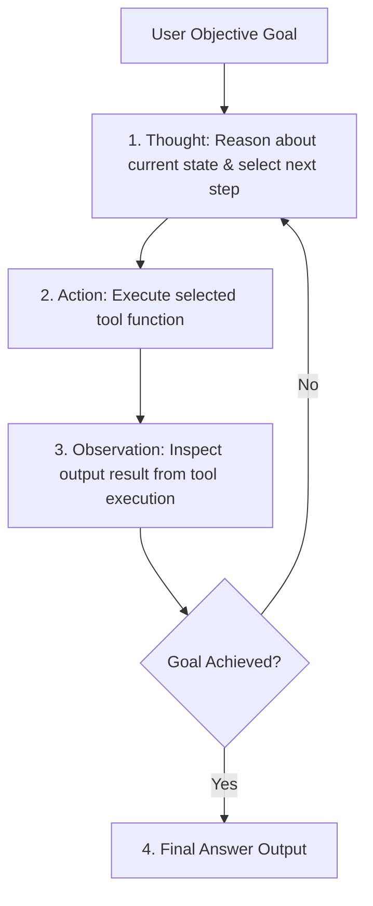

# File 11: ReAct Loop and Autonomous Agent Internals

## Overview
The **ReAct (Reasoning + Acting)** framework enables autonomous AI agents to solve complex tasks by interleaving step-by-step reasoning (**Thought**), tool execution (**Action**), and environmental feedback inspection (**Observation**) in a continuous execution loop.

---

## 1. ReAct Execution Loop Cycle



---

## 2. ReAct Agent Implementation

```javascript
class ReActAgent {
    constructor(toolsRegistry, maxSteps = 5) {
        this.tools = toolsRegistry;
        this.maxSteps = maxSteps;
    }

    async run(goal) {
        console.log(`[AGENT GOAL] ${goal}\n`);
        const history = [`Task Goal: ${goal}`];

        for (let step = 1; step <= this.maxSteps; step++) {
            console.log(`=== ReAct Step ${step} ===`);

            // 1. THOUGHT & ACTION GENERATION
            const thought = `Step ${step}: Need to check database stats for ${goal}`;
            console.log(`[THOUGHT] ${thought}`);

            // Simulated Tool Decision
            if (step === 1) {
                const action = { tool: "query_db", args: { table: "users" } };
                console.log(`[ACTION] Execute ${action.tool}(${JSON.stringify(action.args)})`);

                // 2. OBSERVATION
                const observation = `[OBSERVATION] Found 1,250 active user records.`;
                console.log(observation + "\n");
                history.push(thought, JSON.stringify(action), observation);
            } else {
                console.log(`[FINAL ANSWER] Goal accomplished: ${goal}`);
                return "1,250 active users verified.";
            }
        }
    }
}
```

---

## Key Takeaways
1. ReAct combines **Thought** (reasoning), **Action** (tool execution), and **Observation** (feedback).
2. Always set a **`maxSteps` boundary guard** to prevent infinite agent execution loops.
3. Keep an execution history log of all past thoughts, actions, and observations in the context buffer.
