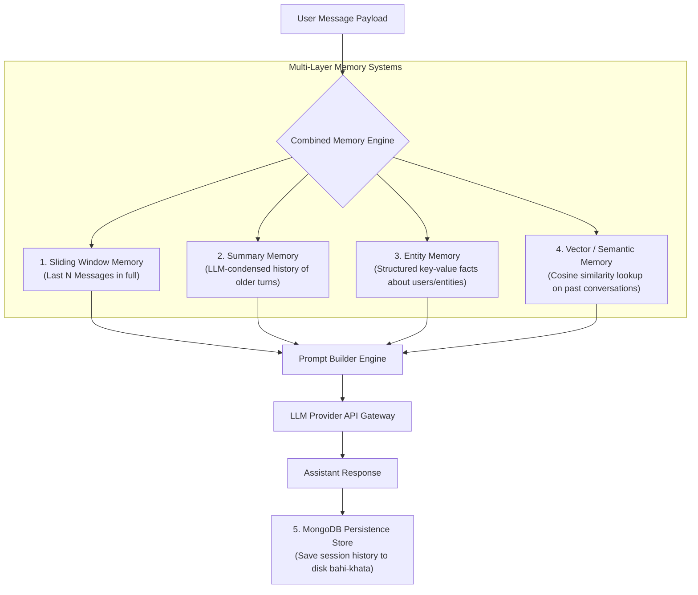

# Module 12: Agent Memory Systems — Conversation Buffer, Sliding Window, Summary, Entity, Vector, & MongoDB Persistence

## Theoretical Overview & Memory System Architecture

Every API call to a Large Language Model is inherently **stateless**. An LLM possesses no internal memory between requests—it treats every API call as an isolated event. To build conversational AI agents, personalized assistants, and multi-turn workflows, applications must engineer an **External Memory System** that injects historical context, user preferences, and retrieved facts into the prompt payload before dispatching the request.



### Real-World Analogy: Kirana Store Owner Sharma-Ji
Think of Sharma-ji, who has run a grocery (*kirana*) store in Chandni Chowk for 40 years:
- **Conversation Buffer (Short-Term Memory)**: Sharma-ji remembers every word spoken during your current visit ("Add Parle-G for my grandson").
- **Sliding Window (Recent History)**: He remembers your last 3 visits this week without needing his ledger.
- **Summary Memory**: He condenses 40 years of interactions into: *"Gupta-ji buys Tata Salt and Aashirvaad Atta monthly."*
- **Entity Memory**: He maintains specific facts: *"Gupta-ji lives in B-12; his grandson is Rohit; he owes ₹200."*
- **Vector / Semantic Memory**: When asked about wedding catering, he recalls similar past situations: *"Ah! Mehta-ji ordered 20 kg kaju katli for his daughter's wedding last year."*
- **MongoDB Persistence (Ledger Bahi-Khata)**: He writes down every transaction in his physical ledger book so nothing is lost when the shop closes for the night.

---

## 1. Memory Architectures Comparison Matrix (`Section 1`)

| Memory Strategy | Technical Mechanism | Primary Advantage | Primary Disadvantage | Recommended Use Case |
| :--- | :--- | :--- | :--- | :--- |
| **Conversation Buffer** | Appends raw messages to an array sent with every API call. | $100\%$ exact recall of every message. | Context window fills quickly; high token costs. | Short 3-5 turn customer service chats. |
| **Sliding Window** | Retains only the last $N$ messages (e.g. last 6 turns). | Fixed, predictable token consumption. | Forgets old information past the window boundary. | Standard multi-turn chatbots. |
| **Summary Memory** | LLM condenses older messages into a summary block when threshold is exceeded. | Retains historical context in minimal tokens. | Slight risk of summary detail loss. | Long multi-hour support sessions. |
| **Entity Memory** | Extracts & tracks structured key-value facts about named entities. | Excellent personalization (names, preferences, rules). | Requires NER / entity extraction logic. | Personal AI assistants, CRM tools. |
| **Vector Memory** | Embeds past messages and retrieves semantically similar turns via Cosine Sim. | Recalls relevant facts across months of history. | Vector search infrastructure required. | Long-term user memory across sessions. |
| **MongoDB Persistence** | Persists conversation sessions & vector embeddings to disk storage. | Survives application restarts & crashes. | Disk I/O latency. | Production enterprise databases. |

---

## 2. Memory Implementation Components (`Sections 2–6`)

```javascript
// 1. Sliding Window Memory (Keeps last N turns)
class SlidingWindowMemory {
  constructor(windowSize = 6) {
    this.messages = [];
    this.windowSize = windowSize;
  }

  addMessage(role, content) {
    this.messages.push({ role, content });
    if (this.messages.length > this.windowSize) {
      return { dropped: this.messages.shift() };
    }
    return { dropped: null };
  }

  getMessages() { return [...this.messages]; }
}

// 2. Summary Memory (Condenses old turns via LLM)
class SummaryMemory {
  constructor(maxBeforeSummary = 6, keepRecent = 4) {
    this.messages = [];
    this.summaries = [];
    this.maxBeforeSummary = maxBeforeSummary;
    this.keepRecent = keepRecent;
  }

  addMessage(role, content) {
    this.messages.push({ role, content });
    if (this.messages.length > this.maxBeforeSummary) {
      this._summarize();
    }
  }

  _summarize() {
    const oldMessages = this.messages.slice(0, -this.keepRecent);
    const summaryText = oldMessages.map(m => `${m.role}: ${m.content}`).join(" | ");
    this.summaries.push(`[Previous conversation summary: ${summaryText.slice(0, 150)}...]`);
    this.messages = this.messages.slice(-this.keepRecent);
  }

  getMessages() {
    const summaryMsg = this.summaries.length > 0 ? [{ role: "system", content: this.summaries.join("\n") }] : [];
    return [...summaryMsg, ...this.messages];
  }
}

// 3. Entity Memory (Key-Value Fact Tracker)
class EntityMemory {
  constructor() { this.entities = {}; }

  update(entityName, facts) {
    if (!this.entities[entityName]) this.entities[entityName] = {};
    Object.assign(this.entities[entityName], facts);
  }

  getContextString() {
    return Object.entries(this.entities).map(([name, facts]) => {
      const factStr = Object.entries(facts).map(([k, v]) => `${k}: ${v}`).join(", ");
      return `${name}: ${factStr}`;
    }).join("\n");
  }
}
```

---

## 3. MongoDB Persistence Layer (`Section 7`)

```javascript
// MongoDB Document Schema & Storage Interface
const conversationSchema = {
  sessionId: "session_abc123",
  userId: "gupta_ji",
  messages: [
    { role: "user", content: "Give me salt", timestamp: "2024-03-15T10:00:00Z" },
    { role: "assistant", content: "Tata Salt Rs. 28", timestamp: "2024-03-15T10:00:01Z" }
  ],
  summary: "Gupta-ji bought salt and atta. Monthly customer.",
  entities: { "Gupta-ji": { usualOrder: ["salt", "atta"], grandson: "Rohit" } },
  updatedAt: "2024-03-15T10:05:00Z"
};

class MongoMemoryStore {
  constructor() { this.db = new Map(); } // Simulated Mongo Connection

  async saveConversation(sessionId, messages, summary, entities) {
    const doc = { sessionId, messages, summary, entities, updatedAt: new Date().toISOString() };
    this.db.set(sessionId, doc);
    return doc;
  }

  async loadConversation(sessionId) {
    return this.db.get(sessionId) || null;
  }
}
```

---

## 4. Orchestrating a Combined Memory Prompt (`Section 8`)

Production agents combine all memory layers into a unified prompt assembly pipeline:

```javascript
class CombinedMemory {
  constructor() {
    this.buffer = new SlidingWindowMemory(6);
    this.summary = new SummaryMemory(8, 4);
    this.entities = new EntityMemory();
    this.vectors = new VectorMemory();
  }

  addInteraction(role, content) {
    this.buffer.addMessage(role, content);
    this.summary.addMessage(role, content);
    if (role === "user") this.vectors.store(content, { role });
  }

  buildPrompt(currentUserMessage) {
    const parts = [];

    // 1. System Base Prompt
    parts.push({ role: "system", content: "You are Sharma-ji, a Kirana store owner." });

    // 2. Entity Context (Key-Value Facts)
    const entityCtx = this.entities.getContextString();
    if (entityCtx) parts.push({ role: "system", content: `Known customer facts:\n${entityCtx}` });

    // 3. Relevant Vector Memory (Semantic Search)
    const relevant = this.vectors.retrieve(currentUserMessage, 2);
    if (relevant.length > 0) {
      parts.push({ role: "system", content: `Relevant past interactions:\n${relevant.map(r => r.text).join("\n")}` });
    }

    // 4. Conversation Summary
    const summaryMsgs = this.summary.getMessages();
    const summaryPart = summaryMsgs.find(m => m.role === "system" && m.content.includes("summary"));
    if (summaryPart) parts.push(summaryPart);

    // 5. Sliding Window Messages
    parts.push(...this.buffer.getMessages());

    // 6. Current User Input
    parts.push({ role: "user", content: currentUserMessage });

    return parts;
  }
}
```

---

## Key Production Takeaways

1. **LLMs Are Stateless**: Every API request must supply all necessary conversational history, facts, and context inside the prompt payload.
2. **Use Sliding Windows to Control Token Costs**: Limit conversation history to the last $N$ turns (e.g. 6 messages) to maintain low token costs.
3. **Summarize Long Sessions**: Automatically trigger LLM summarization when message counts exceed limits to preserve historical context without blowing context budgets.
4. **Leverage Entity Memory for Personalization**: Store specific key-value facts about users (names, preferences, transaction limits) in structured entity tables.
5. **Persist State to Disk with MongoDB**: Save user session states and vector embeddings to MongoDB so agent memory survives server restarts and crashes.


## Learn from the implementation

Use the matching source file as an executable example, not just something to copy. Before running it, state in your own words what data enters the module, what it returns, and which values it changes. Then trace one realistic request from the caller through each function.

Pay special attention to these questions:

- **Data flow:** Which object, array, string, or state value moves between functions? What shape must it have?
- **Control flow:** Which branch, loop, early return, or retry changes the outcome? What condition selects it?
- **Async boundaries:** Where does the code wait for an LLM, database, network, file system, or tool? What should happen if that operation rejects or returns no result?
- **Side effects:** Which lines log information, make an external request, store data, or mutate in-memory state? Keep those distinct from pure calculations.
- **Production limits:** Which assumptions are only safe for a tutorial—for example, in-memory storage, fixed thresholds, approximate token counts, mock data, or a hard-coded batch size?

A useful practice is to change one input at a time and predict the result before executing it. If you can explain why the output changed, when the module should be used, and one way it could fail, you understand the concept rather than only the syntax.
