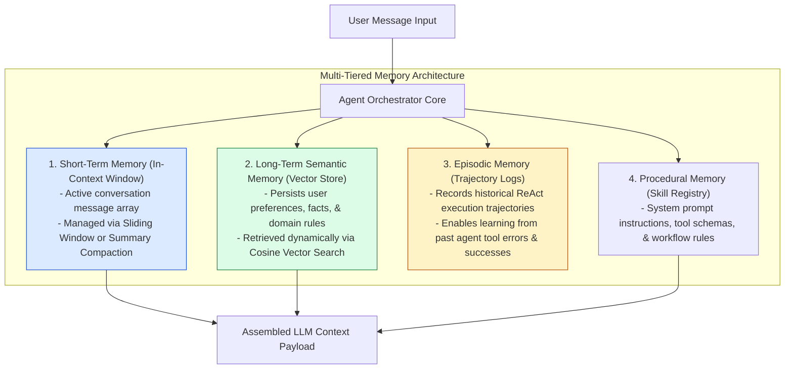
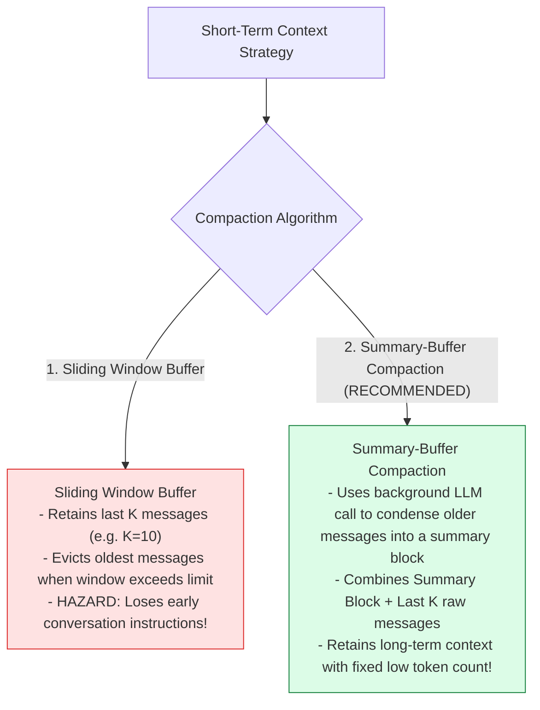
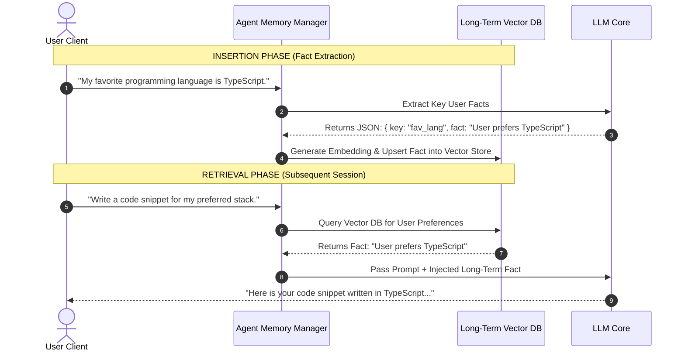

# Module 12: Memory Systems, Conversation Buffers, and Long-Term Vector Recall

## Overview

Autonomous agents require multi-tiered **Memory Systems** to maintain state, recall user preferences across sessions, and prevent context window saturation. Agent memory is divided into three distinct functional tiers: **Short-Term Memory** (transient sliding-window conversation buffer), **Long-Term Memory** (persistent vector-backed semantic recall), and **Episodic Memory** (historical logs of past execution trajectories).

Understanding **Memory Taxonomies**, **Sliding-Window vs. Summary-Buffer Compaction Algorithms**, **Vector-Backed Knowledge Retrieval**, and **Episodic Learning** is critical for long-running AI agents.

---

## 1. Multi-Tiered Agent Memory System Architecture



---

## 2. Short-Term Memory Management Strategies



### Memory Tier Functional Comparison Matrix

| Memory Tier | Storage Infrastructure | Lifespan / TTL | Retrieval Mechanism | Primary Operational Purpose |
| :--- | :--- | :--- | :--- | :--- |
| **Short-Term Memory** | RAM Array / Redis Cache | Active Session | Sequential Sliding Index | Contextual coherence during active multi-turn conversation. |
| **Long-Term Memory** | Vector Database (Qdrant/Pinecone) | Permanent | Vector Similarity Search | Recalling user profile facts, preferences, and domain data. |
| **Episodic Memory** | Document Store (MongoDB / Postgres) | Permanent | Key-Lookup / Metric Query | Learning from past agent execution trajectories & tool errors. |
| **Procedural Memory** | Code Base / System Prompts | Static | Programmatic Import | Instructing agent on tool schemas and operational workflow rules. |

---

## 3. Long-Term Memory Retrieval & Insertion Lifecycle



---

## 4. Practical Implementation Showcase: Enterprise Summary-Buffer Memory Manager

```javascript
class SummaryBufferMemoryManager {
  constructor(llmClient, options = {}) {
    this.client = llmClient;
    this.maxRecentMessages = options.maxRecentMessages || 4;
    this.runningSummary = "";
    this.recentMessages = []; // { role, content }
  }

  /**
   * Adds a new message turn and triggers automatic summarization if window overflows
   */
  async addMessage(role, content) {
    this.recentMessages.push({ role, content, timestamp: Date.now() });
    console.log(`📥 [MEMORY INGESTED] [${role.toUpperCase()}]: "${content.substring(0, 40)}..."`);

    // Check if recent message buffer exceeds threshold
    if (this.recentMessages.length > this.maxRecentMessages) {
      await this._compactMemory();
    }
  }

  /**
   * Summarizes older messages and updates the running summary
   */
  async _compactMemory() {
    const overflowCount = this.recentMessages.length - this.maxRecentMessages;
    const messagesToSummarize = this.recentMessages.splice(0, overflowCount);

    console.log(`⚡ [MEMORY COMPACTION] Condensing ${messagesToSummarize.length} older messages into Running Summary...`);

    const textToSummarize = messagesToSummarize.map((m) => `${m.role}: ${m.content}`).join("\n");

    const summaryPrompt = `You are a Memory Compactor. Condense the following conversation history into a concise factual summary block.
CURRENT SUMMARY: "${this.runningSummary || "None"}"
MESSAGES TO ADD:
${textToSummarize}

UPDATED COMPACT SUMMARY:`;

    this.runningSummary = await this.client.generateCompletion(summaryPrompt);
    console.log(`📝 [NEW RUNNING SUMMARY]: "${this.runningSummary}"`);
  }

  /**
   * Compiles complete context array ready for LLM consumption
   */
  getCompiledContext() {
    const context = [];

    if (this.runningSummary) {
      context.push({
        role: "system",
        content: `SUMMARY OF PAST CONVERSATION:\n${this.runningSummary}`
      });
    }

    return context.concat(this.recentMessages);
  }
}

// Simulated LLM Client
const mockLLMClient = {
  generateCompletion: async (prompt) => {
    return "User is Priya. She works as a Senior Backend Engineer and is configuring Express API Gateways.";
  }
};

// Execution Test
async function testMemory() {
  const memory = new SummaryBufferMemoryManager(mockLLMClient, { maxRecentMessages: 2 });

  await memory.addMessage("user", "Hi, my name is Priya.");
  await memory.addMessage("assistant", "Hello Priya! Nice to meet you.");
  await memory.addMessage("user", "I am building an Express API Gateway.");
  await memory.addMessage("assistant", "Great! Are you using rate limiting?");

  console.log("\nCompiled Context Payload:\n", JSON.stringify(memory.getCompiledContext(), null, 2));
}

testMemory();
```

---

## Key Production Takeaways

1. **Use Summary-Buffer Memory for Long Conversations**: Plain sliding window memory drops older context completely. Summary-Buffer memory condenses older turns into a running summary block, preserving context with minimal token overhead.
2. **Extract Facts for Long-Term Vector Memory**: Don't dump entire conversation transcripts into vector databases. Use an extraction prompt to extract concise entity facts (`{ entity: "user", attribute: "locale", value: "en-US" }`) before storing.
3. **Log Trajectories for Episodic Memory**: Store complete ReAct execution logs (`Goal`, `Thoughts`, `Actions`, `Observations`) in a document store to analyze agent failures and fine-tune future workflows.
4. **Isolate Memory by User Session & Tenant**: Always partition memory stores by `user_id` and `session_id` to prevent user context cross-contamination and data privacy breaches.

