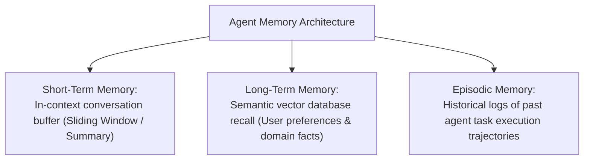

# File 12: Memory Systems for Autonomous Agents

## Overview
Autonomous agents rely on structured **Memory Systems** to maintain state across conversations and tasks. Agent memory is divided into **Short-Term Memory** (in-context message buffer), **Long-Term Memory** (vector database semantic recall), and **Episodic Memory** (past task execution trajectories).

---

## 1. Agent Memory Systems Taxonomy



---

## 2. Sliding Window & Semantic Long-Term Memory Implementation

```javascript
class AgentMemorySystem {
    constructor(maxWindowSize = 4) {
        this.shortTermWindow = [];
        this.maxWindowSize = maxWindowSize;
        this.longTermVectorStore = new Map(); // Fact -> Vector
    }

    addConversationTurn(role, content) {
        this.shortTermWindow.push({ role, content, timestamp: Date.now() });

        // Maintain Sliding Window Capacity
        if (this.shortTermWindow.length > this.maxWindowSize) {
            const evicted = this.shortTermWindow.shift();
            console.log(`[SHORT-TERM EVICTION] Evicted old message: "${evicted.content.substring(0, 25)}..."`);
        }
    }

    saveLongTermFact(factKey, factDetails) {
        this.longTermVectorStore.set(factKey, { factDetails, savedAt: new Date() });
        console.log(`[LONG-TERM MEMORY STORED] ${factKey}: "${factDetails}"`);
    }

    getShortTermContext() {
        return this.shortTermWindow.map(m => `${m.role}: ${m.content}`).join("\n");
    }
}

const memory = new AgentMemorySystem(2);
memory.saveLongTermFact("user_preference", "Prefers dark mode UI and concise responses.");
memory.addConversationTurn("user", "Hello!");
memory.addConversationTurn("assistant", "Hi Priya! How can I help you today?");
memory.addConversationTurn("user", "Can you explain memory systems?");

console.log("\nCurrent Context Window:\n", memory.getShortTermContext());
```

---

## Key Takeaways
1. **Short-Term Memory** manages active conversation turns using sliding windows or LLM summary compaction.
2. **Long-Term Memory** persists user preferences and core domain knowledge across sessions using Vector DBs.
3. **Episodic Memory** records past agent tool execution trajectories to improve future problem-solving.
