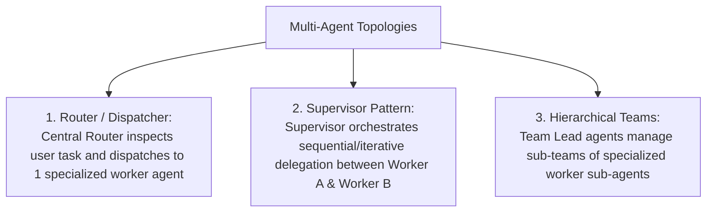

# File 13: Multi-Agent Systems and Collaboration Patterns

## Overview
Complex tasks often exceed the capabilities of a single agent. **Multi-Agent Systems** deploy multiple specialized agents collaborating across structured communication topologies (**Router / Dispatcher**, **Supervisor**, **Hierarchical Teams**, **Peer-to-Peer Consensus**).

---

## 1. Multi-Agent Collaboration Topologies



---

## 2. Supervisor Multi-Agent System Implementation

```javascript
class SpecializedAgent {
    constructor(name, systemRole) {
        this.name = name;
        this.systemRole = systemRole;
    }

    async process(task) {
        console.log(`[AGENT ${this.name}] Processing task: "${task}"`);
        return `Result from ${this.name} for task '${task}'`;
    }
}

class SupervisorAgent {
    constructor() {
        this.agents = new Map();
    }

    registerAgent(domain, agent) {
        this.agents.set(domain, agent);
    }

    async orchestrate(userRequest) {
        console.log(`[SUPERVISOR] Orchestrating user request: "${userRequest}"`);

        // Step 1: Research Agent
        const researcher = this.agents.get("research");
        const researchResult = await researcher.process(userRequest);

        // Step 2: Writer Agent
        const writer = this.agents.get("writing");
        const finalDraft = await writer.process(`Draft report using research: ${researchResult}`);

        return finalDraft;
    }
}

const supervisor = new SupervisorAgent();
supervisor.registerAgent("research", new SpecializedAgent("Researcher", "Find facts"));
supervisor.registerAgent("writing", new SpecializedAgent("Writer", "Draft articles"));

supervisor.orchestrate("Analyze Q4 AI market trends");
```

---

## Key Takeaways
1. Multi-agent systems decompose monolithic tasks into specialized worker agent domains.
2. The **Supervisor Pattern** delegates sub-tasks dynamically and evaluates worker output quality.
3. Pass clear, structured messages between agents using standardized envelope formats.
