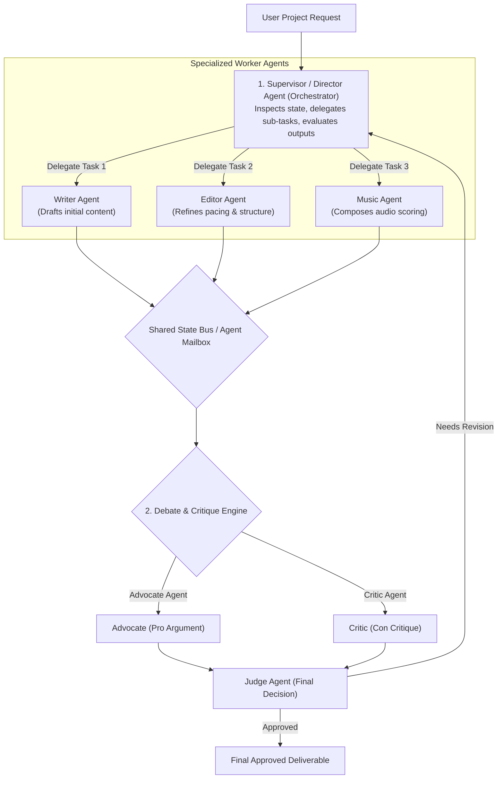

# Module 13: Multi-Agent Systems — Supervisor, Pipeline, Peer-to-Peer, & Debate Patterns

## Theoretical Overview & Multi-Agent Collaboration Topology

A single LLM agent attempting to handle complex end-to-end business workflows quickly encounters prompt bloat, high error rates, and degraded reasoning quality. **Multi-Agent Architecture** applies the software engineering principle of **Division of Labor**: breaking a complex objective down into a network of specialized LLM agents (e.g. Researcher, Writer, Critic, Supervisor), each governed by a focused role prompt, scoped tools, and structured inter-agent communication channels.



### Real-World Analogy: Bollywood Film Crew Production
Think of making a Bollywood blockbuster feature film:
- **Director (Supervisor)**: The central authority who reviews the overall vision, delegates tasks to specialists, and demands rewrites when quality falls short.
- **Script Writer (Specialized Worker)**: Focuses exclusively on writing raw dialogue and scene setups without worrying about camera angles or color grading.
- **Cinematographer & Editor (Sequential Pipeline)**: The cinematographer shoots raw footage and hands it off to the editor, who cuts and polishes the sequence.
- **Director vs. Editor Debate**: The director and editor engage in a structured debate over whether keeping a 5-minute song sequence hurts movie pacing. A judge evaluates both arguments to make the optimal call for the audience.

---

## 1. Single-Agent Limitations vs. Multi-Agent Topology (`Section 1`)

| System Architecture | Scope & Design | Primary Bottleneck | Key Production Advantage |
| :--- | :--- | :--- | :--- |
| **Single Monolithic Agent** | Single prompt handles research, drafting, validation, formatting. | Prompt bloat; single mistake derails entire turn; hard to debug. | Simple low-latency execution for trivial tasks. |
| **Multi-Agent Network** | Network of specialized agents (Researcher, Editor, Critic) coordinated by protocol. | Higher latency and multi-call token consumption. | **High specialization, modular upgrades, self-critique, higher quality**. |

---

## 2. Multi-Agent Orchestration Patterns Taxonomy (`Sections 2–5`)

```javascript
// Pattern 1: Sequential Pipeline (Writer -> Director -> Editor -> Music)
function runPipeline(topic) {
  const script = writerAgent(topic);
  const shots = directorAgent(script);
  const editedCut = editorAgent(shots);
  const finalScore = musicAgent(editedCut);
  return finalScore;
}

// Pattern 2: Supervisor / Orchestrator Pattern
function supervisorAgent(request, maxRounds = 3) {
  const state = { request, currentOutput: null };
  const workflow = [
    { agent: "writer", task: "write" },
    { agent: "editor", task: "edit" },
    { agent: "reviewer", task: "review" }
  ];

  for (let round = 0; round < maxRounds; round++) {
    for (const step of workflow) {
      const result = agents[step.agent](state.currentOutput);
      state.currentOutput = result.output;
      if (step.agent === "reviewer" && result.approved) return state; // Approved!
    }
  }
  return state;
}

// Pattern 3: Debate / Critique Pattern (Advocate vs Critic -> Judge Verdict)
function debatePattern(topic) {
  const advocateArg = advocateAgent(topic);
  const criticArg = criticAgent(topic, advocateArg);
  const verdict = judgeAgent(advocateArg, criticArg);
  return verdict;
}
```

| Pattern Name | Execution Topology | Primary Advantage | Best Use Case |
| :--- | :--- | :--- | :--- |
| **Sequential Pipeline** | $A \to B \to C \to D$ | Simple, predictable linear data transformation. | Automated article generation, ETL pipelines. |
| **Supervisor (Orchestrator)** | Central Controller $\leftrightarrow$ Workers | Dynamic delegation, revision loops, centralized control. | Complex software engineering, multi-step research. |
| **Peer-to-Peer** | Agent $A \leftrightarrow$ Agent $B$ | Direct collaboration without central bottlenecks. | Creative brainstorming, negotiation protocols. |
| **Debate / Critique** | Pro vs. Con $\to$ Judge | Eliminates bias, catches hallucinations, improves quality. | Red-teaming, high-stakes decision making, compliance. |

---

## 3. Communication State Architecture: Shared State vs. Message Passing (`Section 6`)

```javascript
// 1. Shared State Bus (In-Memory Shared Object)
const sharedProjectState = {
  script: null,
  editedCut: null,
  status: "in_progress",
  logs: []
};

// 2. Message Passing Protocol (Decoupled Agent Mailbox)
class AgentMailbox {
  constructor() { this.queues = {}; }

  register(agentName) { this.queues[agentName] = []; }

  send(from, to, content) {
    const message = { from, to, content, timestamp: Date.now() };
    this.queues[to].push(message);
  }

  receive(agentName) {
    const msgs = this.queues[agentName] || [];
    this.queues[agentName] = [];
    return msgs;
  }
}
```

---

## 4. Agent Discovery & Capability Registry (`Section 7`)

```javascript
// Standard Agent Communication Message Schema
const messageProtocol = {
  id: "msg_001",
  from: "supervisor",
  to: "editor",
  type: "task", // task | result | error | feedback
  priority: "high",
  content: { action: "edit_scene", params: { sceneId: 3, targetPacing: "fast" } },
  timestamp: Date.now(),
};

// Agent Capability Registry Engine
const agentRegistry = {
  writer: { capabilities: ["write_script", "write_dialogue"], status: "available" },
  editor: { capabilities: ["edit_scene", "color_grade"], status: "busy" },
  music: { capabilities: ["compose_score"], status: "available" },
};

function findAvailableAgent(capability) {
  for (const [name, info] of Object.entries(agentRegistry)) {
    if (info.capabilities.includes(capability) && info.status === "available") {
      return name;
    }
  }
  return null;
}
```

---

## Key Production Takeaways

1. **Adopt Multi-Agent Systems for Complex Objectives**: Divide heavy tasks among specialized agents to avoid single-prompt bloat and improve output accuracy.
2. **Supervisor Pattern for Centralized Workflows**: Implement a Supervisor Agent to dynamically route tasks, review worker progress, and trigger revision loops when quality thresholds are missed.
3. **Debate Pattern for Quality Control**: Pair an Advocate agent with a Critic agent and a Judge agent to review high-stakes decisions and eliminate hallucinations.
4. **Use Message Passing for Scalable Decoupling**: Choose asynchronous message passing (`AgentMailbox`) over mutating global objects to prevent race conditions in distributed multi-agent systems.
5. **Enforce Structured Agent Message Protocols**: Standardize message payloads (`id`, `from`, `to`, `type`, `content`) and maintain an `agentRegistry` for dynamic task routing.


## Learn from the implementation

Use the matching source file as an executable example, not just something to copy. Before running it, state in your own words what data enters the module, what it returns, and which values it changes. Then trace one realistic request from the caller through each function.

Pay special attention to these questions:

- **Data flow:** Which object, array, string, or state value moves between functions? What shape must it have?
- **Control flow:** Which branch, loop, early return, or retry changes the outcome? What condition selects it?
- **Async boundaries:** Where does the code wait for an LLM, database, network, file system, or tool? What should happen if that operation rejects or returns no result?
- **Side effects:** Which lines log information, make an external request, store data, or mutate in-memory state? Keep those distinct from pure calculations.
- **Production limits:** Which assumptions are only safe for a tutorial—for example, in-memory storage, fixed thresholds, approximate token counts, mock data, or a hard-coded batch size?

A useful practice is to change one input at a time and predict the result before executing it. If you can explain why the output changed, when the module should be used, and one way it could fail, you understand the concept rather than only the syntax.
