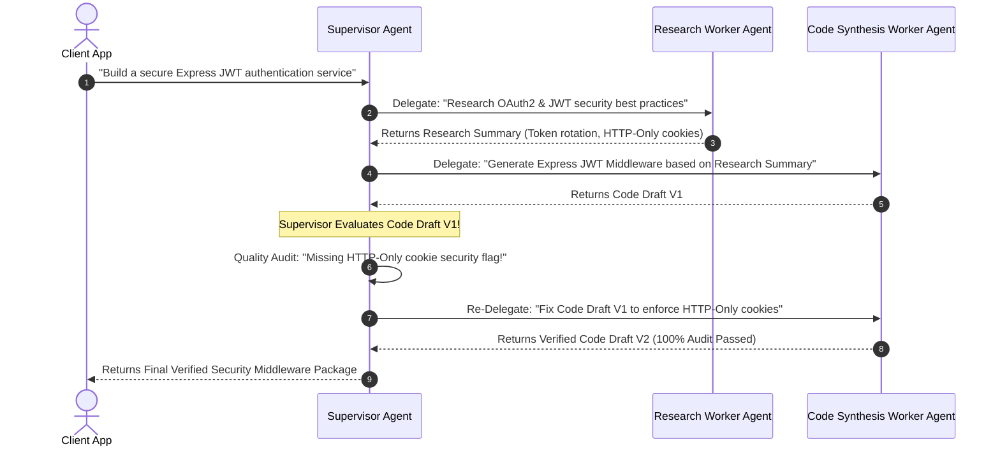
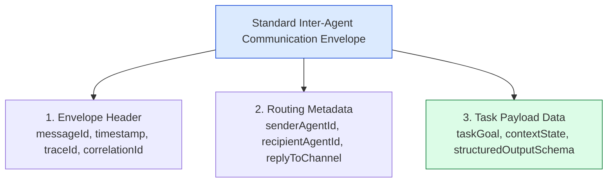

# Module 13: Multi-Agent Architecture, Topologies, and Collaborative Patterns

## Overview

As agentic tasks scale in complexity (e.g. enterprise software development, automated market research, or multi-department compliance auditing), single monolithic agents become unreliable due to context window pollution and instruction conflict. **Multi-Agent Systems (MAS)** decompose complex workflows into networks of specialized autonomous worker agents collaborating under structured communication topologies (**Router/Dispatcher**, **Supervisor-Worker**, **Hierarchical Tree**, and **Swarm Peer-to-Peer**).

Understanding **Multi-Agent Communication Protocols**, **Supervisor Delegation Loops**, **Shared State Graph Synchronization**, and **Agent Conflict Resolution** is fundamental to modern AI system design.

---

## 1. Multi-Agent Topologies & Orchestration Taxonomies

```mermaid
flowchart TD
    subgraph 1. Router / Dispatcher Pattern
        RInput[User Request] --> Router{Router Agent}
        Router -- "Task A" --> AgentA[Domain Agent A (Finance)]
        Router -- "Task B" --> AgentB[Domain Agent B (Legal)]
    end

    subgraph 2. Supervisor-Worker Pattern
        SInput[Task Goal] --> Supervisor[Supervisor Agent Core]
        Supervisor --> Worker1[Researcher Worker Agent]
        Supervisor --> Worker2[Coder Worker Agent]
        Worker1 -->|Report Back| Supervisor
        Worker2 -->|Report Back| Supervisor
    end

    subgraph 3. Hierarchical Team Graph
        HInput[Project Spec] --> EngineeringLead[Engineering Lead Agent]
        EngineeringLead --> FrontendLead[Frontend Lead Agent]
        EngineeringLead --> BackendLead[Backend Lead Agent]
        FrontendLead --> UIWorker[React UI Worker]
        BackendLead --> DBWorker[SQL DB Worker]
    end

    style Supervisor fill:#dbeafe,stroke:#1d4ed8
    style EngineeringLead fill:#dcfce7,stroke:#15803d
    style Router fill:#fef3c7,stroke:#b45309
```

---

## 2. Supervisor-Worker Execution & Evaluation Loop

In the **Supervisor Pattern**, a central Supervisor Agent delegates sub-tasks to specialized Worker Agents, evaluates worker output quality, and re-delegates tasks if quality checks fail:



### Multi-Agent Topology Comparison Matrix

| Topology Pattern | Control Model | Communication Overhead | Complexity | Primary Use Case |
| :--- | :--- | :--- | :--- | :--- |
| **Router / Dispatcher** | Deterministic 1-to-1 Routing | Low | Low | Routing user queries to domain-specific customer support agents. |
| **Supervisor-Worker** | Centralized Orchestrator | Medium | Medium | Multi-step research, code generation, and quality audit pipelines. |
| **Hierarchical Teams** | Multi-tier Manager/Worker | High | High | Building entire software applications from spec to deployment. |
| **Swarm Peer-to-Peer** | Decentralized consensus | Very High | Maximum | Collaborative brainstorming, competitive red-teaming, debate. |

---

## 3. Standardized Inter-Agent Communication Envelope

Agents communicate asynchronously using structured message envelopes containing metadata, sender credentials, task context, and schema payloads:



---

## 4. Practical Implementation Showcase: Enterprise Supervisor-Worker System

```javascript
class BaseSpecializedWorker {
  constructor(name, domain, roleDescription) {
    this.name = name;
    this.domain = domain;
    this.roleDescription = roleDescription;
  }

  async executeTask(taskDescription, contextPayload) {
    console.log(`🔨 [WORKER: ${this.name} (${this.domain})] Executing task: "${taskDescription}"...`);
    // Simulated domain logic
    return {
      worker: this.name,
      domain: this.domain,
      status: "COMPLETED",
      output: `[${this.domain.toUpperCase()} OUTPUT] Completed task '${taskDescription}' successfully.`
    };
  }
}

class ProductionSupervisorAgent {
  constructor(workersMap) {
    this.workers = workersMap; // domain -> BaseSpecializedWorker
  }

  /**
   * Orchestrates multi-agent execution pipeline
   */
  async orchestratePipeline(masterGoal) {
    console.log(`👑 [SUPERVISOR INITIALIZED] Master Project Goal: "${masterGoal}"\n`);
    const projectState = { masterGoal, history: [] };

    // 1. Delegate Step 1: Research Domain
    const researchWorker = this.workers.get("research");
    if (!researchWorker) throw new Error("Missing 'research' worker.");
    
    const researchRes = await researchWorker.executeTask(
      "Find API design standards for microservices",
      projectState
    );
    projectState.history.push(researchRes);

    // 2. Delegate Step 2: Architecture Domain
    const archWorker = this.workers.get("architecture");
    if (!archWorker) throw new Error("Missing 'architecture' worker.");

    const archRes = await archWorker.executeTask(
      `Design system schema based on research: ${researchRes.output}`,
      projectState
    );
    projectState.history.push(archRes);

    // 3. Supervisor Quality Check
    console.log(`\n🔍 [SUPERVISOR AUDIT] Evaluating combined outputs...`);
    const qualityPassed = true; // Simulated evaluation logic

    if (qualityPassed) {
      console.log(`✅ [SUPERVISOR AUDIT PASSED] Orchestration finished cleanly.`);
      return {
        status: "SUCCESS",
        finalArtifact: `UNIFIED PROJECT DELIVERABLE:\n1. ${researchRes.output}\n2. ${archRes.output}`,
        executionHistory: projectState.history
      };
    }
  }
}

// Execution Test
const workerRegistry = new Map();
workerRegistry.set("research", new BaseSpecializedWorker("ResearcherAgent", "research", "Find domain facts"));
workerRegistry.set("architecture", new BaseSpecializedWorker("ArchitectAgent", "architecture", "Design system schemas"));

const supervisor = new ProductionSupervisorAgent(workerRegistry);
supervisor
  .orchestratePipeline("Design Enterprise E-Commerce Checkout API")
  .then((res) => console.log("\nMulti-Agent Pipeline Report:\n", JSON.stringify(res, null, 2)));
```

---

## Key Production Takeaways

1. **Assign Single Responsibilities to Worker Agents**: Avoid creating generic "do everything" agents. Assign narrow roles (e.g. `SecurityAuditor`, `SQLGenerator`, `DocumentationWriter`) for high task precision.
2. **Use the Supervisor Pattern for Quality Control**: Introduce a Supervisor Agent to validate worker outputs before delivering them to users, re-delegating tasks when worker outputs fail verification tests.
3. **Standardize Inter-Agent Message Envelopes**: Pass structured JSON envelopes between agents containing `traceId`, `senderAgentId`, and `taskGoal` to ensure full auditability across agent teams.
4. **Use Shared State Graphs (e.g., LangGraph)**: Structure multi-agent workflows as state graphs where nodes represent agents and edges represent conditional routing rules.

