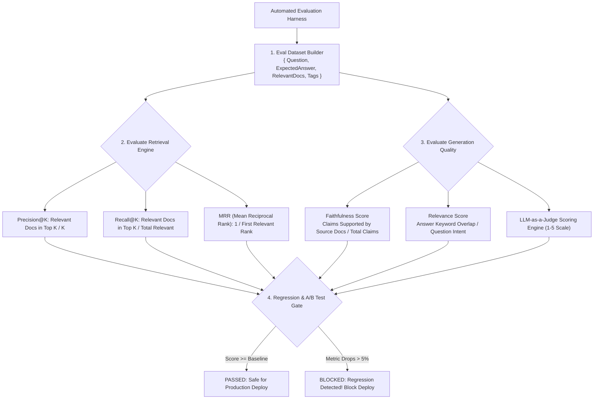

# Module 15: Evaluation & Testing Architecture — LLM-as-a-Judge, Retrieval Metrics, A/B Prompt Testing, & Regression Harnesses

## Theoretical Overview & Data-Driven Evaluation

In generative AI engineering, shipping without evaluation is "shipping vibes, not software." Applications that lack rigorous evaluation pipelines suffer from undetected hallucinations, degraded retrieval precision, and unmonitored API cost inflation.

Borrowing from modern telemetry-driven engineering (the **CRED Telemetry Mindset**), LLM architectures must continuously evaluate **Retrieval Metrics** (Precision@K, Recall@K, MRR), **Generation Quality** (Faithfulness, Relevance), **Prompt Performance** (A/B Testing), and **Regression Prevention** (CI/CD Automated Eval Harnesses).



### Real-World Analogy: CRED Cashback & Conversions Telemetry
Think of CRED's product engineering telemetry:
- **Measure Everything**: CRED tracks every impression, button tap, bill payment conversion, and cashback claim. They never guess whether a new UI feature works—they run A/B tests and inspect conversion metrics.
- **RAG Application Telemetry**: In an LLM application, you cannot simply say "the bot feels smart." You must measure whether doc retrieval found the correct page ($P@K$), whether the answer hallucinates facts (Faithfulness), and whether a new system prompt causes a metric regression before deploying to production.

---

## 1. Core LLM Evaluation Metrics Taxonomy (`Sections 1, 3, & 4`)

| Evaluation Metric | Mathematical Formula / Calculation | Target Threshold | Primary Threat Mitigated |
| :--- | :--- | :--- | :--- |
| **Precision@K** | $\frac{\text{Relevant Docs in Top } K}{K}$ | $\ge 0.70$ | Retrieval noise & prompt clutter. |
| **Recall@K** | $\frac{\text{Relevant Docs in Top } K}{\text{Total Relevant Docs in DB}}$ | $\ge 0.80$ | Missing critical source documents. |
| **MRR (Mean Reciprocal Rank)** | $\frac{1}{|Q|} \sum_{i=1}^{|Q|} \frac{1}{\text{rank}_i}$ | $\ge 0.85$ | Useful information buried far down search rankings. |
| **Faithfulness Score** | $\frac{\text{Claims Supported by Context}}{\text{Total Claims Generated}}$ | $\ge 0.90$ | **Hallucinations & fabricated facts**. |
| **Relevance Score** | $\frac{\text{Answer Terms Overlapping Question}}{\text{Question Key Terms}}$ | $\ge 0.85$ | Off-topic or non-responsive answers. |
| **LLM-as-a-Judge Score** | Prompt-guided 1-5 scale rubric | $\ge 4.0 / 5.0$ | Tone, formatting, and completeness flaws. |

---

## 2. Retrieval Metrics Implementation (`Section 3`)

```javascript
// 1. Precision@K Calculation
function precisionAtK(retrieved, relevant, k) {
  const topK = retrieved.slice(0, k);
  const relevantInTopK = topK.filter(doc => relevant.includes(doc));
  return relevantInTopK.length / k;
}

// 2. Recall@K Calculation
function recallAtK(retrieved, relevant, k) {
  const topK = retrieved.slice(0, k);
  const relevantInTopK = topK.filter(doc => relevant.includes(doc));
  return relevant.length === 0 ? 0 : relevantInTopK.length / relevant.length;
}

// 3. Mean Reciprocal Rank (MRR) Calculation
function meanReciprocalRank(retrievedSets, relevantSets) {
  let totalRR = 0;
  for (let i = 0; i < retrievedSets.length; i++) {
    const retrieved = retrievedSets[i];
    const relevant = new Set(relevantSets[i]);
    let rr = 0;
    for (let j = 0; j < retrieved.length; j++) {
      if (relevant.has(retrieved[j])) {
        rr = 1 / (j + 1);
        break;
      }
    }
    totalRR += rr;
  }
  return totalRR / retrievedSets.length;
}
```

---

## 3. Generation Quality: Faithfulness & Relevance Scorer (`Section 4`)

```javascript
// Faithfulness Scorer (Checks if generated claims are supported by source context)
function measureFaithfulness(answer, sourceDocuments) {
  const claims = answer.split(/[.!?]+/).filter(s => s.trim().length > 5);
  const sourceText = sourceDocuments.join(" ").toLowerCase();
  let supportedClaims = 0;

  for (const claim of claims) {
    const words = claim.toLowerCase().split(/\s+/).filter(w => w.length > 4);
    const matched = words.filter(w => sourceText.includes(w));
    const support = words.length > 0 ? matched.length / words.length : 0;
    if (support > 0.5) supportedClaims++;
  }

  return {
    score: claims.length > 0 ? supportedClaims / claims.length : 0,
    totalClaims: claims.length,
    supportedClaims,
  };
}
```

---

## 4. LLM-as-a-Judge Evaluation Engine (`Section 2`)

```javascript
// LLM-as-a-Judge Evaluation Engine (Simulated or via API Prompt)
function llmAsJudge(question, answer, referenceAnswer, criteria) {
  const prompt = `
You are an expert evaluator. Score the following answer on a scale of 1-5.

QUESTION: ${question}
ANSWER: ${answer}
REFERENCE: ${referenceAnswer}

CRITERIA:
${criteria.map(c => `- ${c}`).join("\n")}

Respond with JSON: { "score": 1-5, "reasoning": "..." }`;

  // Evaluation heuristic breakdown
  const scores = {
    relevance: answer.toLowerCase().includes(question.split(" ").slice(-2).join(" ").toLowerCase()) ? 4 : 2,
    faithfulness: answer.split(" ").filter(w => referenceAnswer.toLowerCase().includes(w.toLowerCase())).length > 3 ? 4 : 2,
  };
  const avg = (scores.relevance + scores.faithfulness) / 2;

  return { score: Math.round(avg), breakdown: scores, reasoning: avg >= 3.5 ? "Faithful and relevant" : "Regressed" };
}
```

---

## 5. Automated CI/CD Regression Testing Harness (`Sections 7 & 8`)

```javascript
// CI/CD Regression Testing Gate
function regressionTest(baselineScores, newScores, threshold = 0.05) {
  const results = [];
  let hasRegression = false;

  for (const [metric, baseVal] of Object.entries(baselineScores)) {
    const newVal = newScores[metric];
    const diff = newVal - baseVal;
    const regressed = diff < -threshold;

    if (regressed) hasRegression = true;
    results.push({ metric, baseline: baseVal, new: newVal, diff, status: regressed ? "REGRESSION" : "PASSED" });
  }

  return { passed: !hasRegression, results };
}

// Full Reusable Evaluation Harness
class EvalHarness {
  constructor(name) { this.name = name; }

  async run(evalDataset) {
    const metrics = { faithfulness: [], relevance: [], precisionAt3: [] };
    for (const example of evalDataset.examples) {
      // Execute system & record scores
    }
    return { name: this.name, metrics };
  }
}
```

---

## Key Production Takeaways

1. **Adopt a Telemetry-First Mindset**: Never deploy prompt changes or model upgrades based on subjective impressions. Always evaluate against a benchmark dataset.
2. **Implement LLM-as-a-Judge for Scalable Quality Evaluation**: Use flagship LLM models (e.g. GPT-4o) with explicit scoring rubrics to evaluate generation quality at scale.
3. **Monitor Precision@K, Recall@K, & MRR for RAG**: Track retrieval metrics independently from generation metrics to isolate whether errors stem from document search or LLM synthesis.
4. **Measure Faithfulness to Prevent Hallucinations**: Calculate the percentage of generated claims supported by source context to catch hallucinations before users see them.
5. **Block Deploys on Metric Regression**: Integrate automated regression test suites into CI/CD pipelines to block deployments whenever core evaluation metrics drop below baseline thresholds.


## Learn from the implementation

Use the matching source file as an executable example, not just something to copy. Before running it, state in your own words what data enters the module, what it returns, and which values it changes. Then trace one realistic request from the caller through each function.

Pay special attention to these questions:

- **Data flow:** Which object, array, string, or state value moves between functions? What shape must it have?
- **Control flow:** Which branch, loop, early return, or retry changes the outcome? What condition selects it?
- **Async boundaries:** Where does the code wait for an LLM, database, network, file system, or tool? What should happen if that operation rejects or returns no result?
- **Side effects:** Which lines log information, make an external request, store data, or mutate in-memory state? Keep those distinct from pure calculations.
- **Production limits:** Which assumptions are only safe for a tutorial—for example, in-memory storage, fixed thresholds, approximate token counts, mock data, or a hard-coded batch size?

A useful practice is to change one input at a time and predict the result before executing it. If you can explain why the output changed, when the module should be used, and one way it could fail, you understand the concept rather than only the syntax.
