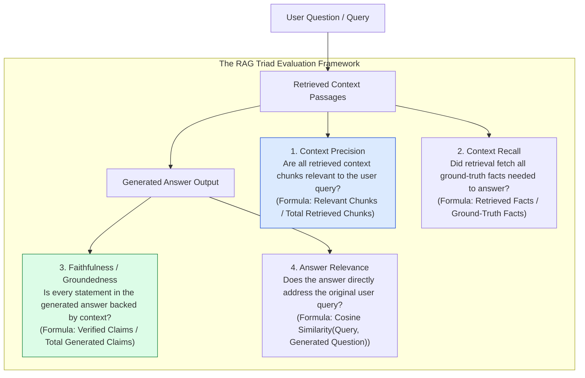
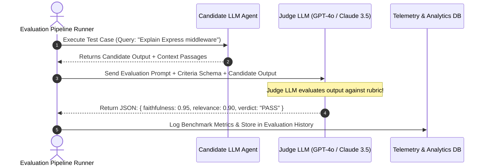
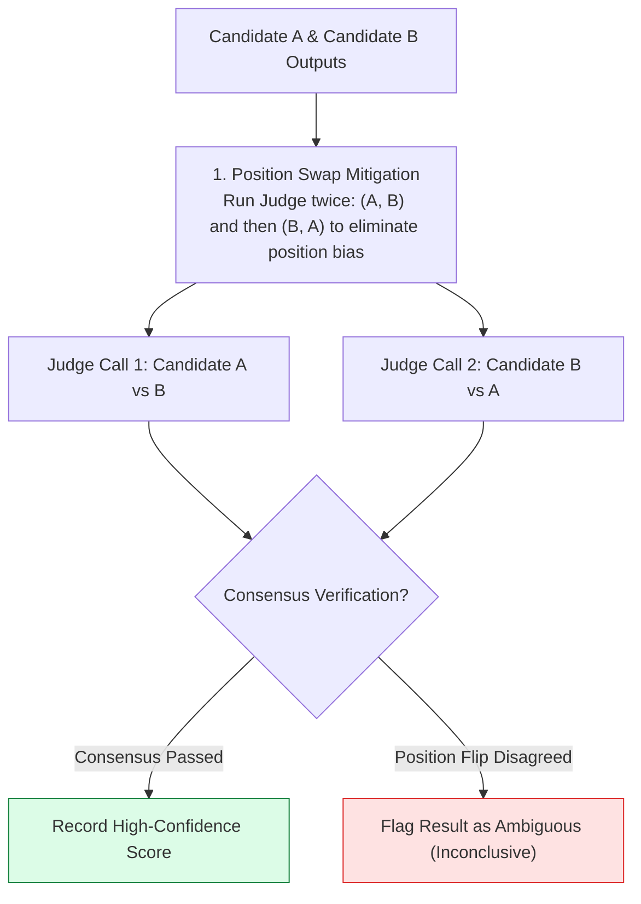

# Module 15: AI System Evaluation, RAG Triad Benchmarking, and LLM-as-a-Judge Frameworks

## Overview

Unlike traditional software engineering where unit test assertions yield deterministic pass/fail booleans (`assert(sum === 5)`), Large Language Model applications produce non-deterministic natural language outputs. **AI System Evaluation** requires a formal probabilistic evaluation framework utilizing the **RAG Triad Metrics** (Context Precision, Context Recall, Faithfulness, Answer Relevance) and **LLM-as-a-Judge** automated scoring loops.

Understanding **Quantitative Retrieval & Generation Metrics**, **LLM-as-a-Judge Scoring Architectures**, **Pairwise Win-Rate Arena Comparisons**, and **Continuous Evaluation Dataset Management** is critical for production reliability.

---

## 1. RAG Triad Evaluation Metric Topology



---

## 2. LLM-as-a-Judge Evaluation Pipeline Mechanics



### RAG & Agent Evaluation Strategy Comparison Matrix

| Evaluation Metric | Evaluator Type | Benchmark Range | Primary Failure Indicator | Recommended Tooling |
| :--- | :--- | :--- | :--- | :--- |
| **Context Precision** | Heuristic / LLM Judge | $0.0 - 1.0$ | Vector index noise; bad chunk size | **Ragas / TruLens** |
| **Context Recall** | LLM Judge vs Ground Truth | $0.0 - 1.0$ | Weak embedding model; missing keywords | **Ragas / DeepEval** |
| **Faithfulness** | LLM Judge Claim Verification | $0.0 - 1.0$ | Model hallucination; prompt leak | **Ragas / Promptfoo** |
| **Answer Relevance** | Embedding Cosine Distance | $0.0 - 1.0$ | Model off-topic divergence | **DeepEval** |
| **Pairwise Win Rate** | LLM Judge Arena (A vs B) | $\% \text{ Win Rate}$ | Model regression vs baseline model | **LMSYS Arena / Custom** |

---

## 3. Judge LLM Bias Mitigation Pipeline



---

## 4. Practical Implementation Showcase: Production LLM-as-a-Judge Evaluator Engine

```javascript
class ProductionLLMJudgeEvaluator {
  constructor(judgeLLMClient) {
    this.judge = judgeLLMClient;
  }

  /**
   * Evaluates Faithfulness (Groundedness) of an LLM completion against context passages
   */
  async evaluateFaithfulness(retrievedContext, generatedAnswer) {
    const judgeSystemPrompt = `You are an expert AI Benchmark Auditor.
Your task is to evaluate the FAITHFULNESS of a generated answer against retrieved context passages.
FAITHFULNESS measures if every claim in the answer is directly supported by the context without hallucinations.

Output strictly a JSON object adhering to this schema:
{
  "faithfulnessScore": number (0.0 to 1.0),
  "extractedClaims": string[],
  "unsupportedClaims": string[],
  "reasoning": string
}`;

    const judgeUserPrompt = `### RETRIEVED CONTEXT PASSAGES
${retrievedContext}

### GENERATED ANSWER TO EVALUATE
${generatedAnswer}

### FAITHFULNESS AUDIT:`;

    const rawResult = await this.judge.generateJSON(judgeSystemPrompt, judgeUserPrompt);
    return typeof rawResult === "string" ? JSON.parse(rawResult) : rawResult;
  }

  /**
   * Evaluates Answer Relevance against user query
   */
  async evaluateAnswerRelevance(userQuery, generatedAnswer) {
    const judgeSystemPrompt = `You are an AI Quality Auditor. Evaluate how directly and concisely the GENERATED ANSWER addresses the USER QUERY.

Output strictly a JSON object:
{
  "relevanceScore": number (0.0 to 1.0),
  "isOffTopic": boolean,
  "reasoning": string
}`;

    const judgeUserPrompt = `### USER QUERY: "${userQuery}"\n\n### GENERATED ANSWER: "${generatedAnswer}"`;

    const rawResult = await this.judge.generateJSON(judgeSystemPrompt, judgeUserPrompt);
    return typeof rawResult === "string" ? JSON.parse(rawResult) : rawResult;
  }
}

// Simulated Judge LLM API Client
const mockJudgeLLM = {
  generateJSON: async (sys, user) => {
    return {
      faithfulnessScore: 0.95,
      extractedClaims: [
        "Express middleware uses 4 parameters for error handlers",
        "Error middleware handles async route errors via next(err)"
      ],
      unsupportedClaims: [],
      reasoning: "All generated claims are fully supported by the provided context passages."
    };
  }
};

// Execution Test
const evaluator = new ProductionLLMJudgeEvaluator(mockJudgeLLM);

const context = "Express error middleware signatures require 4 parameters: (err, req, res, next). Calling next(err) passes errors to centralized handlers.";
const answer = "Express error handling middleware requires four parameters: (err, req, res, next). Calling next(err) triggers the error handler.";

evaluator.evaluateFaithfulness(context, answer)
  .then((report) => console.log("LLM-as-a-Judge Faithfulness Audit Report:\n", JSON.stringify(report, null, 2)));
```

---

## Key Production Takeaways

1. **Evaluate across the Complete RAG Triad**: Never measure accuracy using simple text string matching. Always evaluate across the four core metrics: Context Precision, Context Recall, Faithfulness, and Answer Relevance.
2. **Mitigate LLM-as-a-Judge Position Biases**: Judge models suffer from position bias (preferring whichever candidate answer is shown first). Mitigate this by swapping candidate order (A vs B, then B vs A) and verifying consensus.
3. **Build Golden Evaluation Benchmark Datasets**: Maintain a curated dataset of 100+ domain queries paired with ground-truth reference context chunks to run regression tests before deploying model or prompt updates.
4. **Use Stronger Models as Judges**: Use top-tier frontier models (GPT-4o or Claude 3.5 Sonnet) as evaluator judges when benchmarking smaller fine-tuned target models (e.g. Llama 3 8B).

