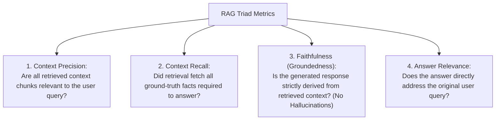

# File 15: AI System Evaluation, Benchmarking, and LLM-as-a-Judge

## Overview
Evaluating stochastic LLM agent outputs requires moving beyond simple unit tests towards automated benchmarks, retrieval metrics (**Context Precision, Context Recall**), generation metrics (**Faithfulness, Answer Relevance**), and **LLM-as-a-Judge** evaluation patterns.

---

## 1. RAG Triad Evaluation Metrics



---

## 2. LLM-as-a-Judge Evaluator Implementation

```javascript
class LLMAsAJudgeEvaluator {
    constructor(judgeLlmFn) {
        this.judgeLlm = judgeLlmFn;
    }

    async evaluateFaithfulness(contextPassages, generatedAnswer) {
        const evaluationPrompt = `
You are an impartial AI Quality Auditor. Evaluate if the ANSWER is strictly supported by the CONTEXT.

CONTEXT:
${contextPassages}

ANSWER:
${generatedAnswer}

Evaluate Faithfulness score from 1.0 (Fully Faithful) to 0.0 (Hallucinated).
Return JSON matching schema: { "score": number, "reason": string }`;

        const judgeResponse = await this.judgeLlm(evaluationPrompt);
        return JSON.parse(judgeResponse);
    }
}

// Mock Judge LLM
const mockJudge = async () => JSON.stringify({ score: 0.95, reason: "All statements backed by context." });
const evaluator = new LLMAsAJudgeEvaluator(mockJudge);

evaluator.evaluateFaithfulness("Node.js runs on V8.", "Node.js uses the V8 engine.")
    .then(res => console.log("Evaluation Result:", res));
```

---

## Key Takeaways
1. Evaluate RAG applications across the **RAG Triad**: Context Relevance, Faithfulness, and Answer Relevance.
2. Use **LLM-as-a-Judge** to evaluate qualitative tasks automatically at scale.
3. Establish regression benchmark test suites (eval datasets) before deploying agent updates to production.
