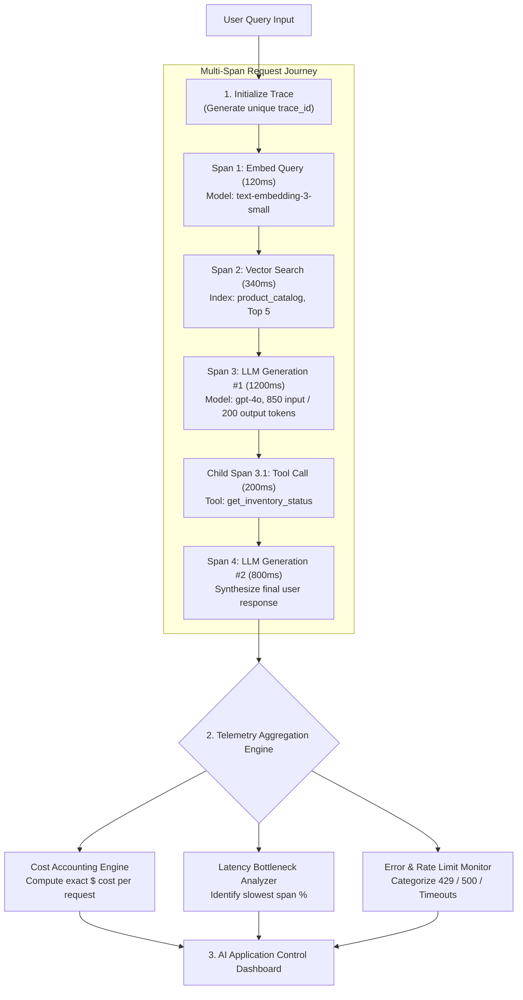

# Module 16: Observability & Tracing Architecture — Traces, Spans, Cost Accounting, & Telemetry Dashboards

## Theoretical Overview & The Three Pillars of AI Observability

Traditional REST APIs operate on simple request-response dynamics. In contrast, an enterprise AI application executes multi-step agent loops, embedding vector queries, database retrievals, tool invocations, and LLM completions. When a request fails or experiences high latency, identifying the root cause requires **Telemetry & Observability**.



### Real-World Analogy: Indian Railways Control Room
Think of the control room managing Indian Railways (handling 23 million passengers daily):
- **Log Book (Logs)**: Every station master logs signal switches and train departure times.
- **Track Circuits (Traces & Spans)**: Automated sensors track a specific train (*Trace*) as it crosses individual track segments (*Spans*).
- **Speed Recorder Black Box (Metrics)**: Records locomotive speed, fuel consumption, and brake usage over time.
- **Central Control Board (Dashboard)**: A giant illuminated board displaying all live train positions, signal statuses, and emergency alerts.

---

## 1. The Three Pillars of LLM Telemetry (`Section 1`)

| Telemetry Pillar | Definition & Scope | Primary Question Answered | Implementation Mechanism |
| :--- | :--- | :--- | :--- |
| **LOGS** | Structured text records of discrete events. | *"What happened at timestamp $T$?"* | Winston / Pino JSON logger. |
| **TRACES** | Full end-to-end execution journey composed of nested spans. | *"How did data flow across tools and LLMs?"* | OpenTelemetry / Custom Trace middleware. |
| **METRICS** | Aggregated numerical statistics over time. | *"What is our P95 latency and total daily cost?"* | Prometheus / Datadog / Custom Dashboard. |

---

## 2. Core Trace & Span Data Structures (`Section 2`)

```javascript
// Unique Identifier Generator
function generateId(prefix = "trace") {
  return `${prefix}_${Date.now()}_${Math.random().toString(36).slice(2, 8)}`;
}

// Span Data Structure (Represents a single step in a request journey)
class Span {
  constructor(name, traceId, parentSpanId = null) {
    this.spanId = generateId("span");
    this.traceId = traceId;
    this.parentSpanId = parentSpanId;
    this.name = name;
    this.startTime = Date.now();
    this.endTime = null;
    this.status = "running";
    this.metadata = {};
  }

  setMetadata(key, value) { this.metadata[key] = value; return this; }
  end(status = "ok") { this.endTime = Date.now(); this.status = status; return this; }
  get duration() { return (this.endTime || Date.now()) - this.startTime; }
}

// Trace Data Structure (Represents the overall request lifecycle)
class Trace {
  constructor(name) {
    this.traceId = generateId("trace");
    this.name = name;
    this.spans = [];
    this.startTime = Date.now();
  }

  startSpan(name, parentSpanId = null) {
    const span = new Span(name, this.traceId, parentSpanId);
    this.spans.push(span);
    return span;
  }
}
```

---

## 3. Tracing Middleware & Cost Accounting (`Sections 3 & 4`)

```javascript
// Model Pricing Matrix (per 1,000,000 tokens)
const PRICING = {
  "gpt-4o": { input: 2.5 / 1_000_000, output: 10.0 / 1_000_000 },
  "gpt-4o-mini": { input: 0.15 / 1_000_000, output: 0.6 / 1_000_000 },
  "text-embedding-3-small": { input: 0.02 / 1_000_000 },
};

// Cost Accounting Tracker
class CostTracker {
  constructor() { this.requests = []; }

  track(model, inputTokens, outputTokens = 0) {
    const p = PRICING[model];
    if (!p) return null;
    const totalCost = (inputTokens * (p.input || 0)) + (outputTokens * (p.output || 0));
    const record = { model, inputTokens, outputTokens, totalCost, timestamp: Date.now() };
    this.requests.push(record);
    return record;
  }

  getTotalCost() { return this.requests.reduce((sum, r) => sum + r.totalCost, 0); }
}
```

---

## 4. Latency Breakdown & Error Monitoring (`Sections 5 & 6`)

```javascript
// Latency Bottleneck Analyzer
function latencyBreakdown(trace) {
  const total = trace.totalDuration;
  return trace.spans.map(s => ({
    name: s.name,
    duration: s.duration,
    percentage: ((s.duration / total) * 100).toFixed(1) + "%"
  }));
}

// Error & Rate Limit Categorization Engine
class ErrorMonitor {
  constructor() { this.errors = []; }

  record(error, context = {}) {
    const type = this._categorize(error);
    const rec = { type, message: error.message, timestamp: Date.now(), context };
    this.errors.push(rec);
    return rec;
  }

  _categorize(error) {
    const msg = (error.message || "").toLowerCase();
    if (msg.includes("429") || msg.includes("rate limit")) return "rate_limit";
    if (msg.includes("timeout")) return "timeout";
    if (msg.includes("401") || msg.includes("auth")) return "auth_error";
    return "unknown";
  }
}
```

---

## 5. Control Room Telemetry Dashboard (`Section 8`)

```javascript
// Real-Time System Dashboard Engine
class Dashboard {
  constructor() {
    this.metrics = { requestCount: 0, totalLatency: 0, totalCost: 0, errorCount: 0, latencyBuckets: { "<500ms": 0, "500ms-1s": 0, ">1s": 0 } };
  }

  record(req) {
    this.metrics.requestCount++;
    this.metrics.totalLatency += req.latency;
    this.metrics.totalCost += req.cost;
    if (req.error) this.metrics.errorCount++;
    if (req.latency < 500) this.metrics.latencyBuckets["<500ms"]++;
    else if (req.latency < 1000) this.metrics.latencyBuckets["500ms-1s"]++;
    else this.metrics.latencyBuckets[">1s"]++;
  }

  display() {
    const avgLat = (this.metrics.totalLatency / this.metrics.requestCount).toFixed(0);
    console.log(`Requests: ${this.metrics.requestCount} | Avg Latency: ${avgLat}ms | Total Cost: $${this.metrics.totalCost.toFixed(4)}`);
  }
}
```

---

## Key Production Takeaways

1. **Implement Full Tracing**: Instrument every agent loop with parent traces and nested child spans to pinpoint execution delays.
2. **Track Dollar Costs per Request**: Log token usage and model tier pricing for every call to prevent unexpected monthly API bills.
3. **Analyze Latency Bottlenecks**: Calculate duration percentages across vector retrieval, prompt assembly, and model completion to isolate performance slowdowns.
4. **Categorize API Errors Automatically**: Monitor rate limit errors ($429$), timeouts, and authentication failures separately to trigger automated backoff strategies.
5. **Build Real-Time Dashboards & Alerts**: Maintain a control board tracking P95 latency, error rates, and cost spikes to ensure high application uptime.
