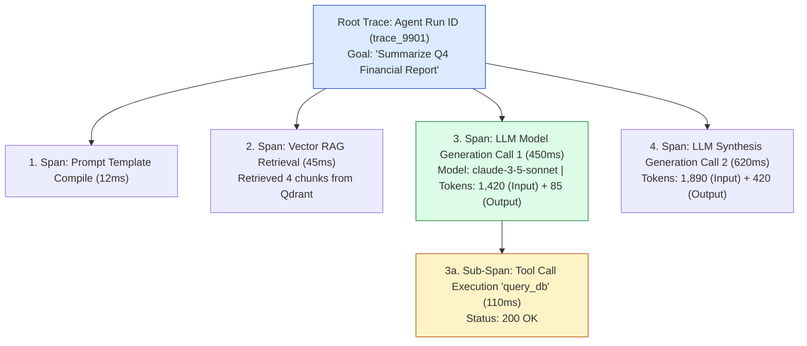
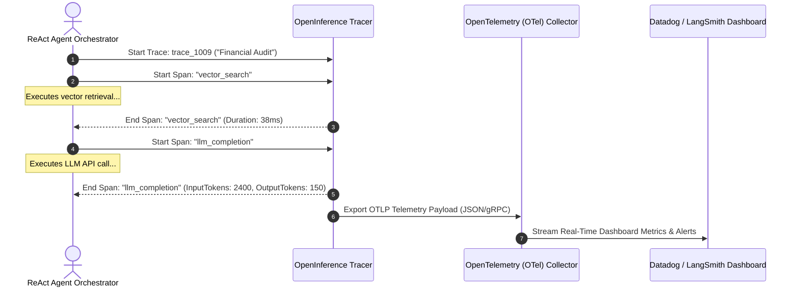
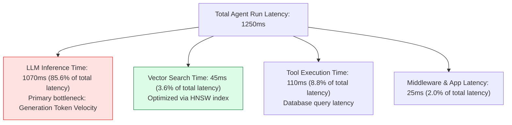

# Module 16: Agent Observability, Distributed Tracing, and OpenTelemetry Standards

## Overview

Unlike traditional web applications where a request flows through predictable controllers and SQL queries, autonomous AI agents execute multi-step non-deterministic reasoning loops, tool invocations, and vector searches. **Agent Observability** provides deep end-to-end visibility into agent execution trajectories, tracking **Traces**, nested **Spans**, latency bottlenecks, token consumption costs, and tool error rates using open standards like **OpenTelemetry** and **OpenInference**.

Understanding **Trace Spans Topology**, **Telemetry Metrics Collection (Tokens, Latency, Cost)**, and **Distributed Agent Tracing Engines** is critical for maintaining SLA reliability.

---

## 1. Agent Distributed Tracing Span Hierarchy



---

## 2. Telemetry Metrics Aggregation Pipeline



### Agent Observability Platform Feature Matrix

| Platform / Standard | Open Source? | OpenTelemetry Compliant? | Primary Strength | Recommended Use Case |
| :--- | :--- | :--- | :--- | :--- |
| **LangSmith** | SaaS / Self-Host | **YES** | Native integration with LangChain & LangGraph | Agent trajectory debugging & eval dataset management. |
| **Arize Phoenix** | **YES** | **YES** (OpenInference) | Real-time vector embedding drift & RAG evaluation | Open-source Kubernetes self-hosted tracing. |
| **OpenTelemetry (OTel)** | **YES** | **Native Standard** | Universal vendor-neutral tracing protocol | Enterprise infrastructure integration (Datadog/Grafana). |

---

## 3. Real-Time Latency & Cost Tracking Breakdown



---

## 4. Practical Implementation Showcase: OpenTelemetry-Compliant Agent Tracer

```javascript
class ProductionAgentTracer {
  constructor(serviceName) {
    this.serviceName = serviceName;
    this.activeTraces = new Map();
  }

  /**
   * Starts a new root agent execution trace
   */
  startTrace(traceName, metadata = {}) {
    const traceId = `tr_${Date.now()}_${Math.random().toString(36).substring(2, 7)}`;
    const traceRecord = {
      traceId,
      traceName,
      serviceName: this.serviceName,
      startTime: Date.now(),
      spans: [],
      metadata,
      metrics: { totalInputTokens: 0, totalOutputTokens: 0, estimatedCostUSD: 0 }
    };

    this.activeTraces.set(traceId, traceRecord);
    console.log(`📡 [TRACER STARTED] Trace ID: ${traceId} | Name: '${traceName}'`);
    return traceId;
  }

  /**
   * Starts a sub-span inside a trace (e.g. LLM call, vector search, tool invocation)
   */
  startSpan(traceId, spanName, spanType = "llm") {
    const trace = this.activeTraces.get(traceId);
    if (!trace) throw new Error(`Trace '${traceId}' not found.`);

    const spanId = `sp_${Math.random().toString(36).substring(2, 7)}`;
    const startTime = Date.now();

    const span = {
      spanId,
      spanName,
      spanType,
      startTime,
      endTime: null,
      durationMs: null,
      attributes: {}
    };

    trace.spans.push(span);

    return {
      endSpan: (attributes = {}) => {
        span.endTime = Date.now();
        span.durationMs = span.endTime - startTime;
        span.attributes = attributes;

        // Aggregate Token Telemetry if LLM Span
        if (attributes.inputTokens) trace.metrics.totalInputTokens += attributes.inputTokens;
        if (attributes.outputTokens) trace.metrics.totalOutputTokens += attributes.outputTokens;
        if (attributes.costUSD) trace.metrics.estimatedCostUSD += attributes.costUSD;

        console.log(`⏱️ [SPAN ENDED] '${spanName}' (${spanType}) in ${span.durationMs}ms`);
      }
    };
  }

  /**
   * Completes and exports the root trace payload
   */
  finishTrace(traceId) {
    const trace = this.activeTraces.get(traceId);
    if (!trace) return null;

    trace.endTime = Date.now();
    trace.totalDurationMs = trace.endTime - trace.startTime;

    this.activeTraces.delete(traceId);
    console.log(`🏁 [TRACE FINISHED] Total Duration: ${trace.totalDurationMs}ms | Tokens: ${trace.metrics.totalInputTokens + trace.metrics.totalOutputTokens}`);

    return trace;
  }
}

// Execution Test
const tracer = new ProductionAgentTracer("FinancialAgentService");

const traceId = tracer.startTrace("Q4 Audit Pipeline", { userId: "usr_99" });

// 1. Vector Search Span
const vectorSpan = tracer.startSpan(traceId, "Vector Retrieval", "retrieval");
setTimeout(() => {
  vectorSpan.endSpan({ vectorCount: 4, topScore: 0.94 });

  // 2. LLM Span
  const llmSpan = tracer.startSpan(traceId, "LLM Synthesis Call", "llm");
  setTimeout(() => {
    llmSpan.endSpan({ model: "claude-3-5-sonnet", inputTokens: 1200, outputTokens: 350, costUSD: 0.00885 });

    const finalTraceReport = tracer.finishTrace(traceId);
    console.log("\nExported OTLP Trace Payload:\n", JSON.stringify(finalTraceReport, null, 2));
  }, 100);
}, 50);
```

---

## Key Production Takeaways

1. **Instrument Every Step with OpenInference Spans**: Wrap LLM calls, vector searches, tool executions, and guardrail validations in dedicated trace spans to pinpoint latency bottlenecks instantly.
2. **Track Token Costs in Real Time**: Aggregate input and output token metrics across all sub-spans in a trace to calculate real-time execution costs and alert on runaway agent loops.
3. **Log Tool Parameters and Return Payloads**: Include tool parameter arguments and return payloads inside span attributes to troubleshoot agent tool calling errors.
4. **Use Standard OpenTelemetry (OTLP) Exporters**: Stream agent telemetry data via OTLP to enterprise observability stacks (Datadog, New Relic, Grafana) for centralized alerting.

