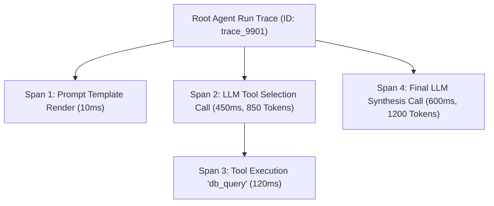

# File 16: Agent Observability, Tracing, and OpenTelemetry

## Overview
**Agent Observability** (LangSmith, Phoenix, Arize, OpenInference) provides complete visibility into complex multi-step agent reasoning loops, tracking execution latency, token consumption costs, tool calls, and nested trace spans across LLM calls.

---

## 1. Agent Distributed Trace Tree Architecture



---

## 2. Agent Tracer Tracker Implementation

```javascript
class AgentTracer {
    constructor(traceName) {
        this.traceId = `trace_${Date.now()}`;
        this.traceName = traceName;
        this.spans = [];
        this.startTime = Date.now();
    }

    startSpan(spanName, spanType = "llm") {
        const spanId = `span_${Math.random().toString(36).substring(2, 7)}`;
        const startTime = Date.now();
        const spanRecord = { spanId, spanName, spanType, startTime, endTime: null, metadata: {} };
        this.spans.push(spanRecord);

        return {
            endSpan: (metadata = {}) => {
                spanRecord.endTime = Date.now();
                spanRecord.durationMs = spanRecord.endTime - startTime;
                spanRecord.metadata = metadata;
                console.log(`[SPAN COMPLETE] ${spanName} (${spanType}) - ${spanRecord.durationMs}ms`);
            }
        };
    }

    getTraceSummary() {
        return {
            traceId: this.traceId,
            traceName: this.traceName,
            totalDurationMs: Date.now() - this.startTime,
            totalSpans: this.spans.length,
            spans: this.spans
        };
    }
}

const tracer = new AgentTracer("ReAct Customer Support Agent");
const llmSpan = tracer.startSpan("Decide Next Tool", "llm");
setTimeout(() => {
    llmSpan.endSpan({ model: "claude-3-5-sonnet", tokens: 420 });
    console.log("Trace Summary:", tracer.getTraceSummary());
}, 100);
```

---

## Key Takeaways
1. Track nested **Spans** (LLM generation, tool execution, vector retrieval) inside a parent **Trace**.
2. Record **token counts, latency per step, and execution cost** for every agent run.
3. Observability is essential for diagnosing agent loops that get stuck in infinite reasoning cycles.
