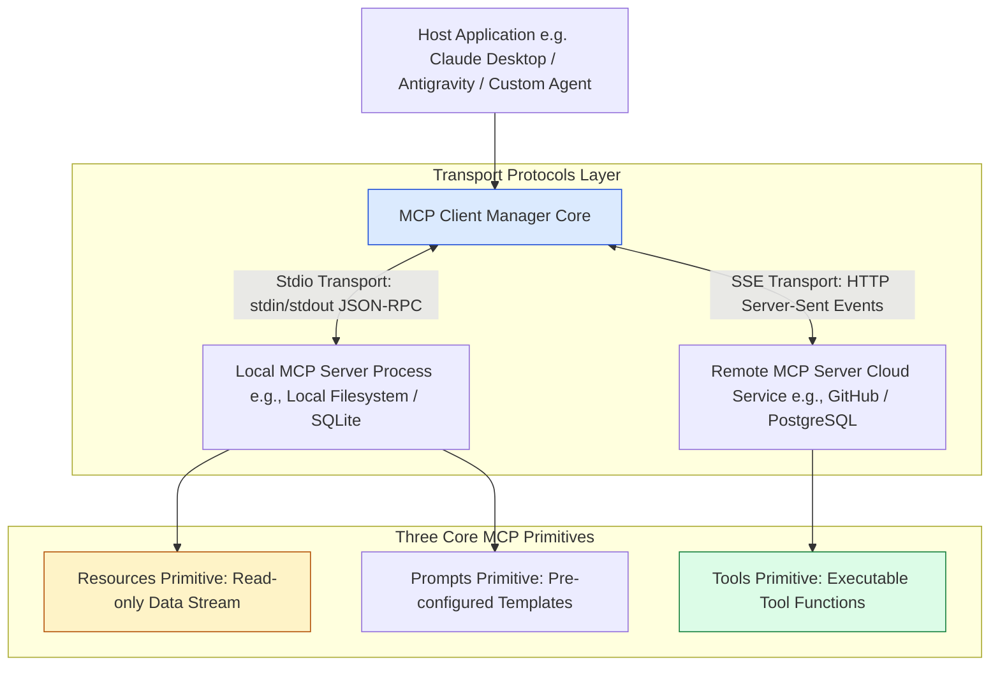
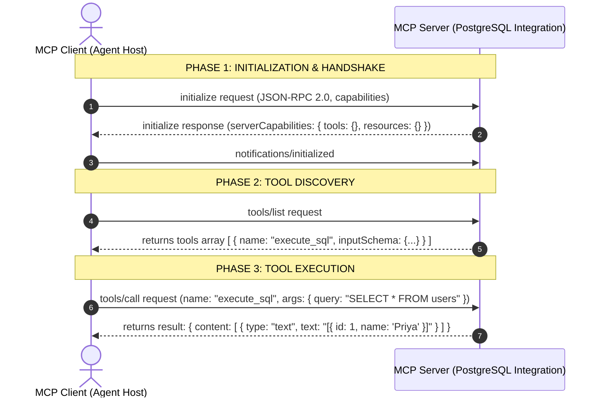
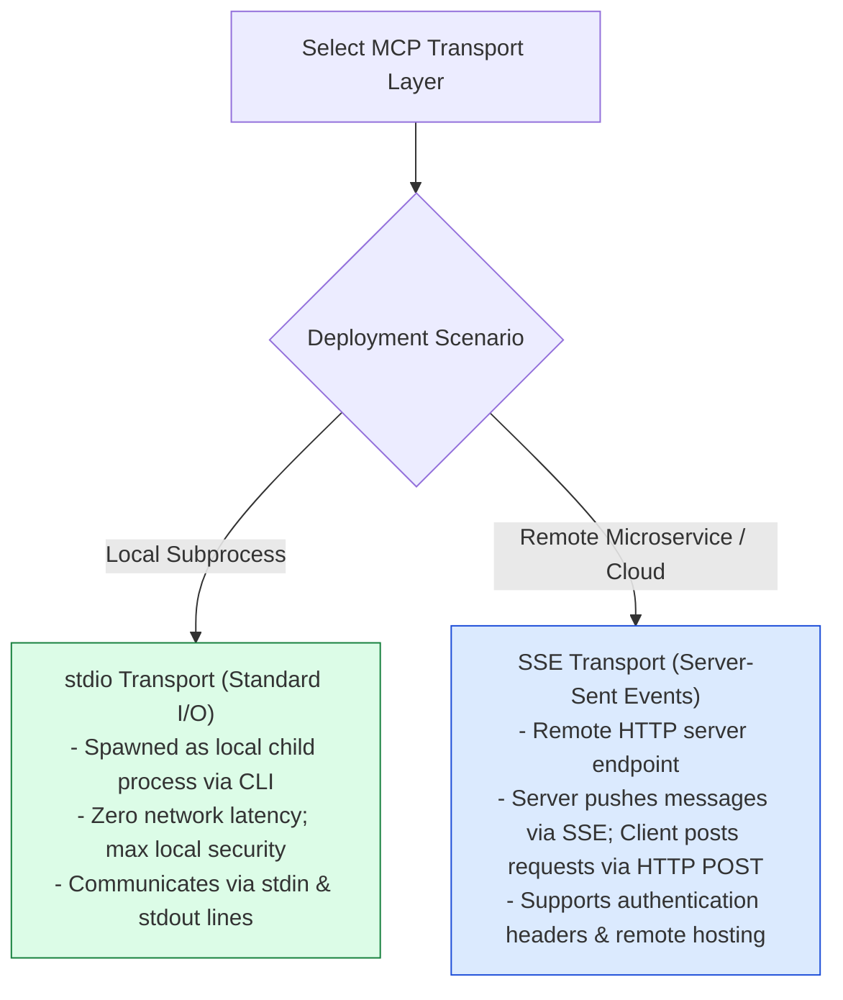

# Module 17: Model Context Protocol (MCP), Client-Server Architecture, and JSON-RPC Primitives

## Overview

Historically, connecting AI applications to external data sources (GitHub, Postgres, Slack, Google Drive) required building custom, ad-hoc API integrations for every client platform. The **Model Context Protocol (MCP)**, created by Anthropic, is an open standard client-server protocol that standardizes how AI applications (**MCP Clients**) discover and consume data sources, prompts, and executable tools from external servers (**MCP Servers**).

Understanding **MCP Client-Server Topology**, **The Three Core Primitives (`Resources`, `Prompts`, `Tools`)**, **Transport Layers (`stdio`, `SSE`)**, and **JSON-RPC 2.0 Protocol Message Flows** is essential for building modular agent architectures.

---

## 1. MCP Client-Server Architecture & Transport Layers



---

## 2. MCP Three Core Primitives & JSON-RPC Protocol Sequence



### MCP Core Primitives Reference Matrix

| Primitive Name | Flow Direction | Functional Role | Protocol Method | Example Resource URI / Payload |
| :--- | :--- | :--- | :--- | :--- |
| **`Resources`** | Server $\rightarrow$ Client | Read-only file/data context streams | `resources/list`, `resources/read` | `file:///var/logs/app.log`, `postgres://db/users` |
| **`Prompts`** | Server $\rightarrow$ Client | Parameterized prompt templates | `prompts/list`, `prompts/get` | `git-commit-message-builder({ diff: "..." })` |
| **`Tools`** | Client $\rightarrow$ Server | Executable side-effect operations | `tools/list`, `tools/call` | `execute_sql({ query: "..." })`, `create_github_issue()` |

---

## 3. Transport Layer Comparison: Stdio vs. SSE



---

## 4. Practical Implementation Showcase: Production MCP Server (JSON-RPC 2.0)

```javascript
class ProductionMCPServer {
  constructor(serverName, serverVersion = "1.0.0") {
    this.serverInfo = { name: serverName, version: serverVersion };
    this.tools = new Map();
    this.resources = new Map();
  }

  /**
   * Registers a Tool primitive
   */
  registerTool(name, description, inputSchema, handler) {
    this.tools.set(name, { name, description, inputSchema, handler });
  }

  /**
   * Registers a Resource primitive
   */
  registerResource(uri, name, mimeType, readHandler) {
    this.resources.set(uri, { uri, name, mimeType, readHandler });
  }

  /**
   * Handles incoming JSON-RPC 2.0 requests from MCP Client
   */
  async handleMessage(rpcRequest) {
    const { id, method, params } = rpcRequest;

    try {
      // Handshake Initialization
      if (method === "initialize") {
        return {
          jsonrpc: "2.0",
          id,
          result: {
            protocolVersion: "2024-11-05",
            capabilities: { tools: {}, resources: {} },
            serverInfo: this.serverInfo
          }
        };
      }

      // Tools Primitive List
      if (method === "tools/list") {
        const toolsList = Array.from(this.tools.values()).map((t) => ({
          name: t.name,
          description: t.description,
          inputSchema: t.inputSchema
        }));
        return { jsonrpc: "2.0", id, result: { tools: toolsList } };
      }

      // Tools Execution Call
      if (method === "tools/call") {
        const { name, arguments: args } = params;
        const tool = this.tools.get(name);
        if (!tool) throw new Error(`MCP Tool '${name}' not found.`);

        const outputData = await tool.handler(args);
        return {
          jsonrpc: "2.0",
          id,
          result: {
            content: [{ type: "text", text: typeof outputData === "string" ? outputData : JSON.stringify(outputData) }]
          }
        };
      }

      // Resources List
      if (method === "resources/list") {
        const resourceList = Array.from(this.resources.values()).map((r) => ({
          uri: r.uri,
          name: r.name,
          mimeType: r.mimeType
        }));
        return { jsonrpc: "2.0", id, result: { resources: resourceList } };
      }

      throw new Error(`Unsupported MCP Method: ${method}`);
    } catch (err) {
      return {
        jsonrpc: "2.0",
        id,
        error: { code: -32603, message: err.message }
      };
    }
  }
}

// Example Execution Test
const mcpServer = new ProductionMCPServer("Postgres-MCP-Server");

// Register Database Tool
mcpServer.registerTool(
  "execute_sql_query",
  "Executes a read-only SQL SELECT query on PostgreSQL database.",
  {
    type: "object",
    properties: { query: { type: "string", description: "The SQL SELECT statement." } },
    required: ["query"]
  },
  async ({ query }) => [
    { id: 101, username: "priya_dev", role: "admin" },
    { id: 102, username: "rahul_qa", role: "developer" }
  ]
);

// Register Server Log Resource
mcpServer.registerResource(
  "file:///var/logs/app.log",
  "Application Production Logs",
  "text/plain",
  async () => "[INFO] Server started on port 8080.\n[WARN] High RAM usage detected."
);

// Test 1: Tool List Request
mcpServer.handleMessage({ jsonrpc: "2.0", id: 1, method: "tools/list" })
  .then((res) => console.log("MCP 'tools/list' Response:\n", JSON.stringify(res, null, 2)));

// Test 2: Tool Execution Call Request
mcpServer.handleMessage({
  jsonrpc: "2.0",
  id: 2,
  method: "tools/call",
  params: { name: "execute_sql_query", arguments: { query: "SELECT * FROM users LIMIT 2" } }
}).then((res) => console.log("\nMCP 'tools/call' Execution Response:\n", JSON.stringify(res, null, 2)));
```

---

## Key Production Takeaways

1. **Standardize Integrations via MCP**: Adopt MCP to avoid building proprietary tool connectors for every distinct LLM app. Write an MCP Server once, and it instantly connects to Claude Desktop, IDEs, and agent host apps.
2. **Understand the Three Primitives**: Use `Resources` for passive data feeds (file content, DB tables), `Prompts` for server-side prompt templates, and `Tools` for active executable operations.
3. **Use Stdio Transport for Local Subprocesses**: Use `stdio` transport when running MCP servers as local CLI subprocesses for zero network latency and maximum security.
4. **Use SSE Transport for Remote Cloud APIs**: Deploy remote cloud MCP servers over HTTP Server-Sent Events (SSE) to support secure multi-tenant authentication and remote agent calls.

