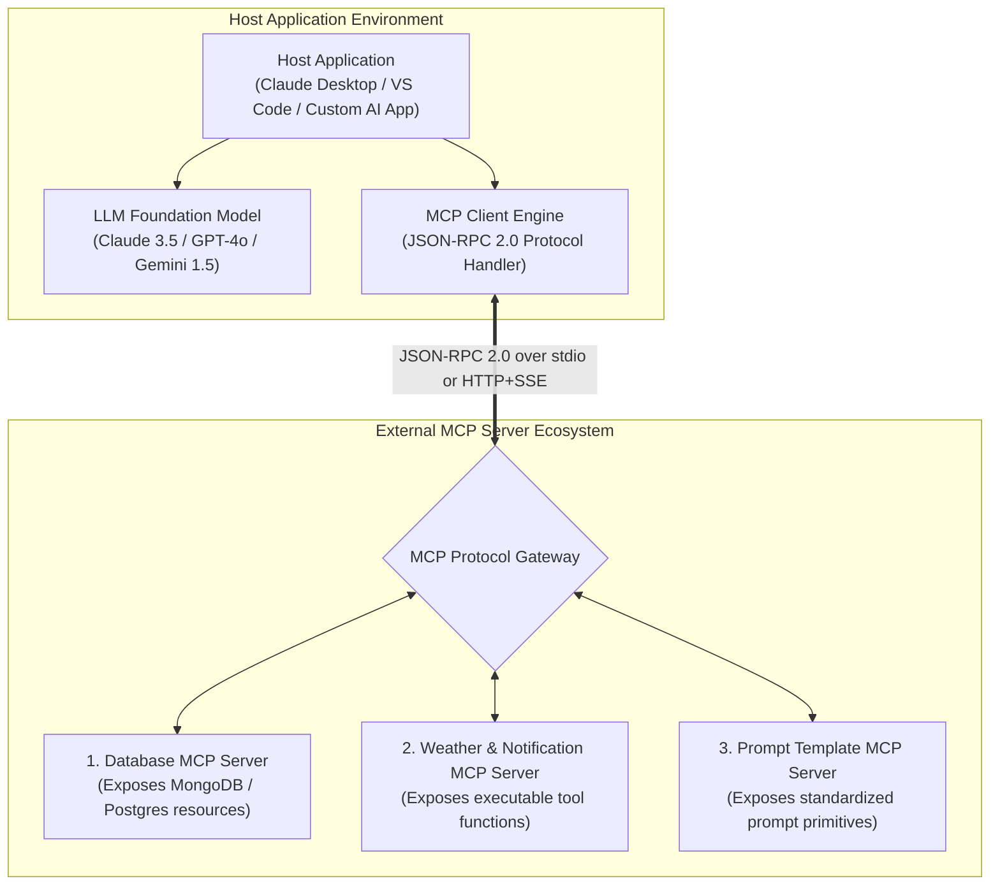

# Module 17: MCP — Model Context Protocol: Standardizing AI Tool & Data Interoperability

## Theoretical Overview & Protocol Architecture

Before the **Model Context Protocol (MCP)**, connecting AI models to external tools, databases, and APIs resulted in an $N \times M$ integration bottleneck: every LLM provider (OpenAI, Anthropic, Google Gemini, Ollama) required custom wire format schemas and API wrapper handlers.

MCP (open-sourced by Anthropic) establishes an open **standard protocol—the "UPI / USB-C for AI Tools"**. Under MCP, developers build an external tool or data connector **once as an MCP Server**. Any MCP-compliant application (**Host / Client**)—such as Claude Desktop, VS Code, Cursor, or a custom Node.js application—can automatically discover, inspect, and invoke those tools without custom integration code.



### Real-World Analogy: Unified Payments Interface (UPI)
Think of India's **UPI (Unified Payments Interface)** payment revolution:
- **Before UPI**: Money transfers were chaotic. Sending money required distinct NEFT/IMPS forms for each bank, or closed-loop digital wallets (Paytm, Mobikwik) that could not talk to each other.
- **After UPI**: A single open protocol connected every bank and payment application. Google Pay, PhonePe, and Paytm use the exact same underlying protocol. If a new bank launches tomorrow, it implements UPI once and instantly works with all apps.
- **MCP for AI**: MCP does the exact same thing for LLM tools. Build a database tool server once using MCP, and Claude Desktop, VS Code, Cursor, and custom agents can access it instantly.

---

## 1. Multi-Model Integration Scaling: Direct Calling vs. MCP (`Section 1`)

```
WITHOUT MCP (N Tools x M Models = N * M Custom Adapters):
  Tool A ──custom code──> OpenAI
  Tool A ──different code─> Claude
  Tool A ──yet another code─> Gemini

WITH MCP (N Tools + M Models = N + M Standard Connectors):
  Tool A ──MCP Protocol──> Any MCP-Compliant LLM Client
  Tool B ──MCP Protocol──> Any MCP-Compliant LLM Client
```

---

## 2. Architecture & Role Taxonomy (`Section 2`)

| Architecture Role | Definition & Purpose | Real-World Examples | Primary Responsibilities |
| :--- | :--- | :--- | :--- |
| **HOST** | The outer user-facing application interface. | Claude Desktop, VS Code + Continue, Cursor, Custom Chatbot. | Manages UI, controls client lifecycle, renders outputs. |
| **CLIENT** | The internal connector speaking MCP JSON-RPC 2.0. | Built-in Claude Client, `@modelcontextprotocol/sdk`. | Discovers servers, negotiates capabilities, routes tool calls. |
| **SERVER** | External process exposing data & executable code. | MongoDB Server, GitHub MCP, Slack MCP, Filesystem MCP. | Implements Resources, Tools, and Prompts; handles RPC. |

---

## 3. The Three Core MCP Primitives (`Section 3`)

| Primitive Name | Functionality & Nature | Wire URI / Schema Example | Real-World UPI Analogy |
| :--- | :--- | :--- | :--- |
| **RESOURCES** | Read-only contextual data readable by LLM. | `weather://current/mumbai`<br/>`db://users/profile/123` | Checking account balance or viewing bank statement. |
| **TOOLS** | Executable action functions invoked by LLM. | `send_notification({ userId, text })`<br/>`query_database({ filter })` | Initiating money transfer or paying utility bill. |
| **PROMPTS** | Reusable, parameterized system prompt templates. | `summarize_document({ document_uri })`<br/>`code_review({ file_uri })` | Quick "Pay Rent" or "Recharge Mobile" 1-tap shortcut. |

---

## 4. MCP Server Implementation Architecture (`Section 4`)

```javascript
// MCP Server Architecture (Skeleton JSON-RPC Protocol Dispatcher)
class MCPServer {
  constructor(name, version = "1.0.0") {
    this.name = name;
    this.version = version;
    this.resources = new Map();
    this.tools = new Map();
    this.prompts = new Map();
  }

  addResource(uri, name, handler) { this.resources.set(uri, { name, handler }); return this; }
  addTool(name, description, inputSchema, handler) { this.tools.set(name, { description, inputSchema, handler }); return this; }
  addPrompt(name, description, args, handler) { this.prompts.set(name, { description, args, handler }); return this; }

  // JSON-RPC 2.0 Method Dispatcher
  handleRequest(method, params) {
    switch (method) {
      case "resources/list":
        return { resources: Array.from(this.resources.entries()).map(([uri, r]) => ({ uri, name: r.name })) };
      case "resources/read":
        return { contents: [{ uri: params.uri, text: JSON.stringify(this.resources.get(params.uri)?.handler()) }] };
      case "tools/list":
        return { tools: Array.from(this.tools.entries()).map(([name, t]) => ({ name, description: t.description, inputSchema: t.inputSchema })) };
      case "tools/call":
        const tool = this.tools.get(params.name);
        return { content: [{ type: "text", text: JSON.stringify(tool.handler(params.arguments)) }] };
      default:
        return { error: `Method ${method} not implemented` };
    }
  }
}
```

---

## 5. MCP Client Side & LLM Dynamic Tool Discovery (`Section 5`)

```javascript
// Client-Side Dynamic Tool Discovery & Router
class MCPClient {
  constructor() {
    this.servers = new Map();
    this.allTools = [];
  }

  connect(serverName, serverInstance) {
    this.servers.set(serverName, serverInstance);
    const discovered = serverInstance.handleRequest("tools/list", {});
    discovered.tools?.forEach(t => this.allTools.push({ ...t, server: serverName }));
  }

  // Converts discovered MCP tools into standard OpenAI format
  getToolsForLLM() {
    return this.allTools.map(t => ({
      type: "function",
      function: { name: t.name, description: t.description, parameters: t.inputSchema }
    }));
  }

  callTool(toolName, args) {
    const target = this.allTools.find(t => t.name === toolName);
    const server = this.servers.get(target.server);
    return server.handleRequest("tools/call", { name: toolName, arguments: args });
  }
}
```

---

## 6. Comparison: Direct Function Calling vs. MCP Protocol (`Section 6`)

| Feature Aspect | Direct Function Calling (OpenAI / Gemini) | Model Context Protocol (MCP) |
| :--- | :--- | :--- |
| **Setup Overhead** | Low (Define schemas inline in application code). | Moderate (Requires Server + Client + JSON-RPC transport). |
| **Reusability** | Low (Tools coupled tightly to single application). | **High (Server works across Claude, VS Code, & custom apps)**. |
| **Multi-Model Portability**| Must write custom translation layers for each LLM provider. | Build once; any MCP-compatible LLM host can invoke it. |
| **Process Isolation** | Tools run inside the main application runtime memory space. | Servers run in separate sandboxed processes (stdio/HTTP). |
| **Ecosystem & Community**| Custom bespoke code per project. | Ecosystem of ready-made servers (Postgres, Slack, GitHub). |

---

## Key Production Takeaways

1. **MCP is the Open Standard for AI Interoperability**: Adopt MCP to eliminate custom per-model tool wrapper code and build reusable tool servers.
2. **Understand the 3 Primitives**: Use **Resources** for data reading, **Tools** for executable action side-effects, and **Prompts** for standardized templates.
3. **Decouple Tool Servers from Applications**: Run MCP servers as isolated background processes communicating over stdio or HTTP+SSE via JSON-RPC 2.0.
4. **Leverage the Ecosystem**: Utilize pre-built official and community MCP servers (GitHub, PostgreSQL, Filesystem, MongoDB, Puppeteer) rather than rebuilding integrations.
5. **Choose the Right Paradigm**: Use direct function calling for simple 1-off single-model bots; switch to MCP when building reusable enterprise tool networks across multiple LLM clients.


## Learn from the implementation

Use the matching source file as an executable example, not just something to copy. Before running it, state in your own words what data enters the module, what it returns, and which values it changes. Then trace one realistic request from the caller through each function.

Pay special attention to these questions:

- **Data flow:** Which object, array, string, or state value moves between functions? What shape must it have?
- **Control flow:** Which branch, loop, early return, or retry changes the outcome? What condition selects it?
- **Async boundaries:** Where does the code wait for an LLM, database, network, file system, or tool? What should happen if that operation rejects or returns no result?
- **Side effects:** Which lines log information, make an external request, store data, or mutate in-memory state? Keep those distinct from pure calculations.
- **Production limits:** Which assumptions are only safe for a tutorial—for example, in-memory storage, fixed thresholds, approximate token counts, mock data, or a hard-coded batch size?

A useful practice is to change one input at a time and predict the result before executing it. If you can explain why the output changed, when the module should be used, and one way it could fail, you understand the concept rather than only the syntax.
