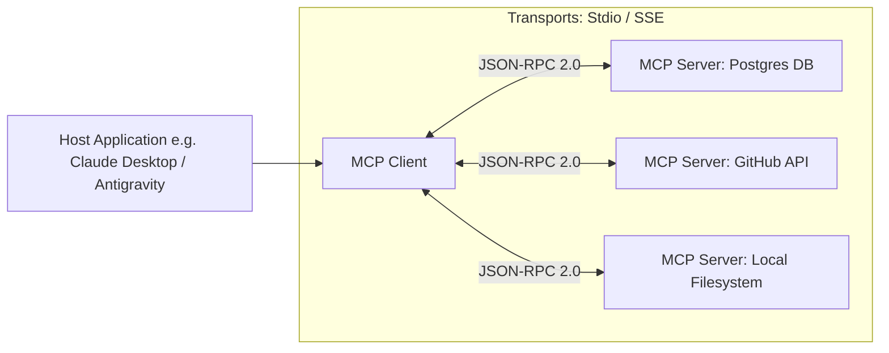

# File 17: Model Context Protocol (MCP) Architecture

## Overview
The **Model Context Protocol (MCP)** is an open-standard client-server protocol introduced by Anthropic that standardizes how AI applications (**MCP Clients**) connect to external data sources, local filesystems, databases, and tool servers (**MCP Servers**).

---

## 1. MCP Client-Server Architecture



### Three Primitives of MCP

| Primitive Name | Direction | Function |
| :--- | :--- | :--- |
| **`Resources`** | Server $\rightarrow$ Client | Read-only file/data context (e.g. `file:///logs/app.log`) |
| **`Prompts`** | Server $\rightarrow$ Client | Pre-configured prompt templates provided by server |
| **`Tools`** | Client $\rightarrow$ Server | Executable function calls exposed by server |

---

## 2. MCP JSON-RPC Protocol Implementation

```javascript
class SimpleMCPServer {
    constructor(serverName) {
        this.serverName = serverName;
        this.tools = new Map();
    }

    registerTool(name, description, inputSchema, handlerFn) {
        this.tools.set(name, { name, description, inputSchema, handlerFn });
    }

    // JSON-RPC 2.0 Message Request Handler
    async handleJsonRpcRequest(jsonRpcMessage) {
        const { id, method, params } = jsonRpcMessage;

        if (method === "tools/list") {
            const toolList = Array.from(this.tools.values()).map(t => ({
                name: t.name,
                description: t.description,
                inputSchema: t.inputSchema
            }));
            return { jsonrpc: "2.0", id, result: { tools: toolList } };
        }

        if (method === "tools/call") {
            const { name, arguments: args } = params;
            const tool = this.tools.get(name);
            if (!tool) throw new Error(`Tool ${name} not found`);

            const content = await tool.handlerFn(args);
            return {
                jsonrpc: "2.0",
                id,
                result: { content: [{ type: "text", text: JSON.stringify(content) }] }
            };
        }
    }
}

const mcpServer = new SimpleMCPServer("FileSystem-MCP");
mcpServer.registerTool("read_file", "Reads file contents", { path: "string" }, async ({ path }) => `Content of ${path}`);

mcpServer.handleJsonRpcRequest({ jsonrpc: "2.0", id: 1, method: "tools/list" })
    .then(res => console.log("MCP Response:", res));
```

---

## Key Takeaways
1. **MCP** decouples LLM applications from external integrations using standardized **JSON-RPC 2.0** messages.
2. Supports **Stdio** (local process communication) and **SSE (Server-Sent Events)** transport layers.
3. Provides **Resources**, **Prompts**, and **Tools** primitives out of the box.
