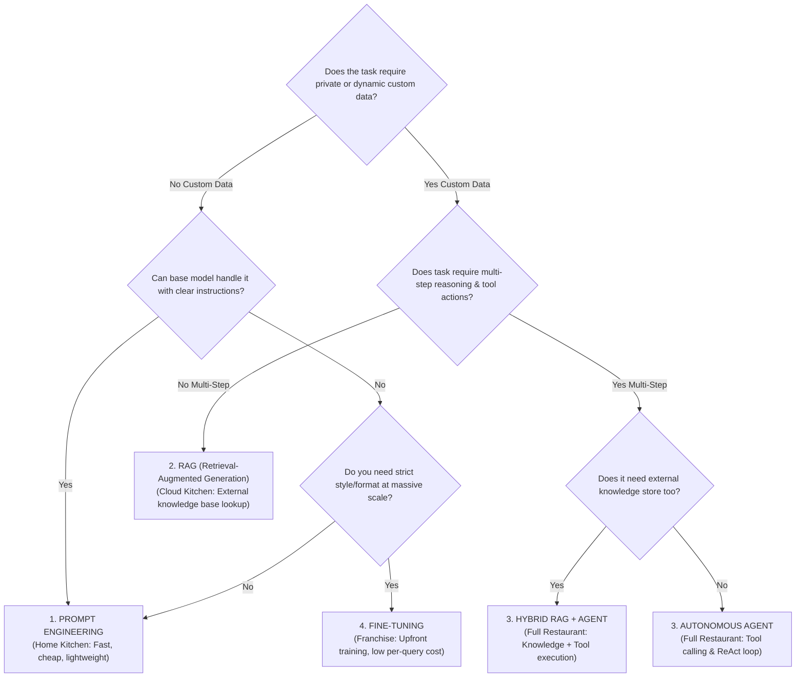
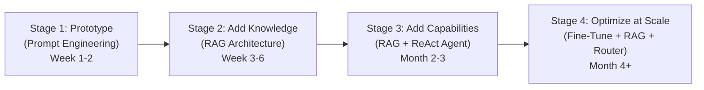

# Module 18: Architectural Decision Framework — Prompt Engineering, RAG, Autonomous Agents, & Fine-Tuning

## Theoretical Overview & Architecture Decision Spectrum

When engineering enterprise AI applications, choosing the right architectural paradigm is the single most critical strategic decision. Selecting an overly complex architecture (e.g. multi-agent networks) for a simple classification task inflates costs and latency; conversely, relying on basic prompt engineering for complex live dataset Q&A leads to hallucinations and failure.

The architectural options span a spectrum based on **Custom Knowledge Requirements**, **Multi-Step Tool Autonomy**, **Formatting Consistency**, and **Operational Scale**:



### Real-World Analogy: The Food Service Scale
Think of serving food to customers based on scale, budget, and operational goals:
- **Home Kitchen (Prompt Engineering)**: You cook at home for friends. Low setup cost, instant start, but limited to ingredients in your pantry (training data).
- **Cloud Kitchen (RAG)**: Rent a kitchen and deliver orders based on an updated digital menu (knowledge base). No physical dining room setup needed, but customers get exact items from the menu.
- **Full Restaurant (Agents)**: A full physical dining room with waiters, kitchen staff, and managers. Expensive and complex, but capable of handling any custom request dynamically.
- **Franchise Chain (Fine-Tuning)**: Standardized training programs where chefs prepare identical recipes across 100 locations. High upfront training cost, but fast and consistent at scale.

---

## 1. The Four Core AI Architectural Paradigms (`Section 1`)

| Paradigm | Primary Mechanism | Setup Time | Per-Query Cost | Primary Use Case |
| :--- | :--- | :--- | :--- | :--- |
| **Prompt Engineering** | System prompts, few-shot examples, JSON formatting. | Hours | Lowest | Text summary, classification, extraction. |
| **RAG** | Vector retrieval injects domain chunks into prompt context. | Days to Weeks | Medium | Knowledge base Q&A, documentation bots. |
| **Autonomous Agents** | ReAct while-loop with tool calling & multi-turn planning. | Weeks to Months | Highest | Multi-step research, coding, workflows. |
| **Fine-Tuning** | Gradient updates on model weights with domain datasets. | Weeks | Low (at scale) | Custom domain syntax, tone, offline models. |

---

## 2. Quantitative Cost Comparison (10,000 & 100,000 Queries/Month) (`Section 4`)

```javascript
// Monthly Cost Accounting Calculator
function calculateMonthlyCost(queriesPerMonth) {
  const avgInputTokens = 800;
  const avgOutputTokens = 300;

  const costs = {
    "Prompt Engineering (gpt-4o-mini)": {
      monthly: queriesPerMonth * ((0.8 * 0.00015) + (0.3 * 0.0006)),
      setup: "$0",
    },
    "RAG System (gpt-4o + Vector DB)": {
      monthly: (queriesPerMonth * ((0.8 * 0.0025) + (0.3 * 0.01))) + 50 /* Vector DB */,
      setup: "$500",
    },
    "Agent System (3.5 LLM calls/query)": {
      monthly: (queriesPerMonth * 3.5 * ((0.8 * 0.0025) + (0.3 * 0.01))) + 50,
      setup: "$2,000",
    },
    "Fine-Tuned Model (gpt-4o-mini)": {
      monthly: (queriesPerMonth * ((0.8 * 0.00015) + (0.3 * 0.0006))) + 200 /* Retraining */,
      setup: "$5,000",
    },
  };
  return costs;
}
```

| Architectural Paradigm | 10,000 Queries / Month | 100,000 Queries / Month | Initial Setup Cost |
| :--- | :--- | :--- | :--- |
| **Prompt Engineering (`gpt-4o-mini`)** | $\approx \$3.00$ | $\approx \$30.00$ | $\$0$ |
| **RAG System (`gpt-4o` + Vector DB)** | $\approx \$100.00$ | $\approx \$550.00$ | $\$500$ |
| **Autonomous Agent (3.5 calls/query)** | $\approx \$197.50$ | $\approx \$1,800.00$ | $\$2,000$ |
| **Fine-Tuned Model (`gpt-4o-mini`)** | $\approx \$203.00$ | $\approx \$230.00$ | $\$5,000$ |

---

## 3. Production Migration Lifecycle (`Section 5`)

Enterprise applications rarely launch at final scale. They evolve across four distinct stages:



---

## 4. Multi-Criteria Architectural Decision Matrix (`Section 6`)

| Evaluation Criteria | Prompt Engineering | RAG Architecture | Autonomous Agents | Fine-Tuning |
| :--- | :--- | :--- | :--- | :--- |
| **Custom Private Data Needed** | No | **Yes** | Optional / Via Tools | Yes (In training set) |
| **Multi-Step Reasoning & Action**| No | No | **Yes** | No |
| **Tool / API Execution Access** | No | No | **Yes** | No |
| **Response Format Consistency** | Low / Medium | Medium | Low / Medium | **High** |
| **Setup Time Required** | **Hours** | Days / Weeks | Weeks | Weeks |
| **Per-Query Token Cost** | **Lowest** | Medium | Highest | Low (at volume) |
| **Maintainability & Debugging** | **Easy** | Moderate | Hard | Complex |

---

## Key Production Golden Rules (`Section 8`)

1. **Start Simple First**: Always prototype with basic prompt engineering using standard models before building complex infrastructure.
2. **Adopt RAG for Private Knowledge**: Choose RAG whenever answers must be grounded in dynamic, private, or real-time documents.
3. **Use Agents for Multi-Step Workflows**: Introduce agent loops (`ReAct`) only when tasks require tool execution, web search, or iterative planning.
4. **Fine-Tune for Style & Volume Efficiency**: Fine-tune smaller models (`gpt-4o-mini` or Llama 3.1 8B) when you need strict output styling across millions of queries.
5. **Combine Patterns into Hybrids**: Real-world enterprise systems are hybrids—most commonly pairing **RAG for factual retrieval** with **Agents for tool execution**.


## Learn from the implementation

Use the matching source file as an executable example, not just something to copy. Before running it, state in your own words what data enters the module, what it returns, and which values it changes. Then trace one realistic request from the caller through each function.

Pay special attention to these questions:

- **Data flow:** Which object, array, string, or state value moves between functions? What shape must it have?
- **Control flow:** Which branch, loop, early return, or retry changes the outcome? What condition selects it?
- **Async boundaries:** Where does the code wait for an LLM, database, network, file system, or tool? What should happen if that operation rejects or returns no result?
- **Side effects:** Which lines log information, make an external request, store data, or mutate in-memory state? Keep those distinct from pure calculations.
- **Production limits:** Which assumptions are only safe for a tutorial—for example, in-memory storage, fixed thresholds, approximate token counts, mock data, or a hard-coded batch size?

A useful practice is to change one input at a time and predict the result before executing it. If you can explain why the output changed, when the module should be used, and one way it could fail, you understand the concept rather than only the syntax.
