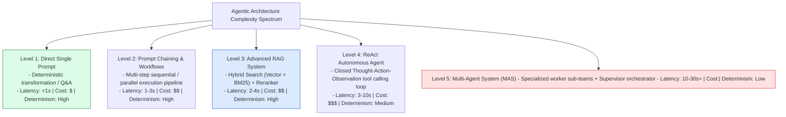
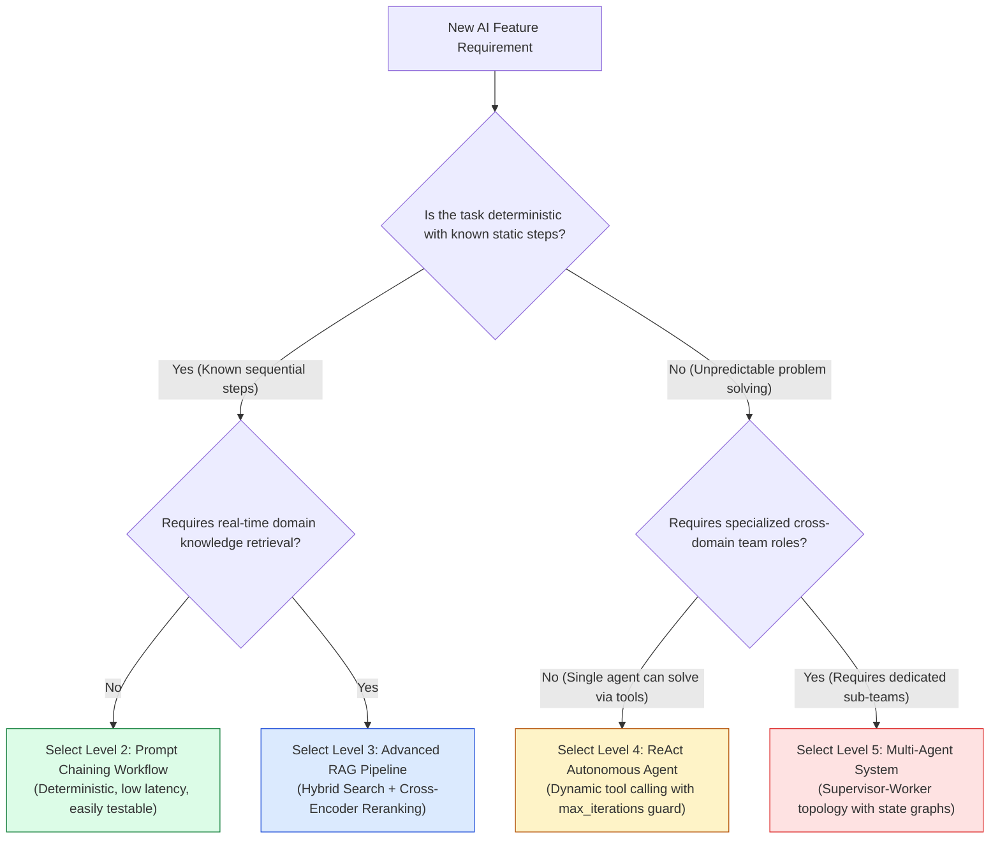
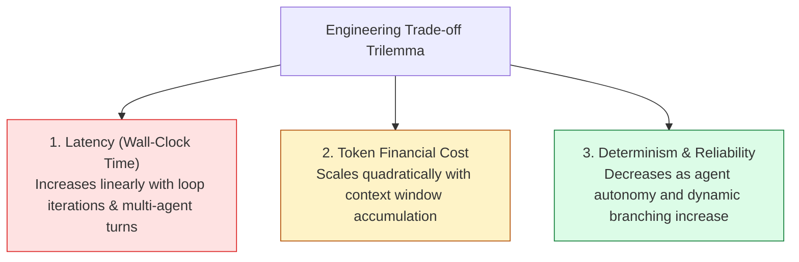

# Module 18: Architectural Decision Framework for Agentic AI Systems

## Overview

When building AI software, engineers often fall into the trap of **Over-Engineering**—deploying complex multi-agent swarms for simple tasks that could be solved reliably with a structured prompt chain. The **Architectural Decision Framework** organizes AI design patterns along a **5-Level Agentic Complexity Spectrum**, guiding teams to select the simplest architecture that satisfies system requirements while minimizing latency, token cost, and non-deterministic failure modes.

Understanding **The 5-Level Complexity Spectrum**, **Trade-off Evaluation Dynamics (Latency vs. Determinism vs. Cost)**, and **Architectural Selection Decision Trees** is essential for AI system architects.

---

## 1. The 5-Level Agentic Complexity Spectrum



---

## 2. Architectural Selection Decision Tree



### Architectural Spectrum Trade-off Matrix

| Pattern Level | Average Latency | API Token Cost | Testability & Debuggability | Failure Mode Risk | Recommended Target Use Case |
| :--- | :--- | :--- | :--- | :--- | :--- |
| **Level 1: Direct Prompt** | Sub-1 Second | $\$ (1\times)$ | Extremely High | Very Low | Formatting, classification, simple summaries. |
| **Level 2: Prompt Chain** | $1 - 3$ Seconds | $\$ \$ (2\times - 3\times)$ | High | Low | Multi-stage text generation, code refactoring. |
| **Level 3: Advanced RAG** | $2 - 4$ Seconds | $\$ \$ (2\times - 4\times)$ | High | Low-Medium | Customer support, internal enterprise search. |
| **Level 4: ReAct Agent** | $3 - 10$ Seconds | $\$ \$ \$ (5\times - 10\times)$ | Medium | Medium (Infinite loops) | Autonomous data analysis, coding assistants. |
| **Level 5: Multi-Agent** | $10 - 30+$ Seconds | $\$ \$ \$ \$ (15\times - 30\times)$ | Low | High (Deadlocks) | Building complete software projects, RED team. |

---

## 3. Cost-Latency-Accuracy Trade-off Pareto Frontier



---

## 4. Practical Implementation Showcase: Automated Architecture Decision Engine

```javascript
class ArchitectureDecisionEngine {
  /**
   * Evaluates feature requirements against the Agentic Complexity Spectrum
   */
  static evaluateArchitecture(requirements) {
    const {
      isStepSequenceKnown,
      requiresExternalData,
      requiresDynamicToolCalls,
      requiresMultiRoleDelegation,
      maxAllowedLatencyMs,
      monthlyBudgetUSD
    } = requirements;

    console.log("📊 [ARCHITECTURAL AUDIT] Evaluating system requirements...");

    // Rule 1: Multi-Agent System (Level 5)
    if (requiresMultiRoleDelegation) {
      if (maxAllowedLatencyMs < 10000) {
        console.warn("⚠️ [LATENCY WARNING] Level 5 Multi-Agent Systems typically require >10s latency.");
      }
      return {
        level: 5,
        pattern: "Multi-Agent System (Supervisor-Worker)",
        complexity: "VERY HIGH",
        estimatedLatency: "10,000ms - 30,000ms",
        rationale: "Requires specialized cross-domain worker roles collaborating asynchronously."
      };
    }

    // Rule 2: ReAct Autonomous Agent (Level 4)
    if (requiresDynamicToolCalls && !isStepSequenceKnown) {
      return {
        level: 4,
        pattern: "ReAct Autonomous Single Agent",
        complexity: "HIGH",
        estimatedLatency: "3,000ms - 10,000ms",
        rationale: "Requires interactive Thought-Action-Observation loop to discover execution path dynamically."
      };
    }

    // Rule 3: Advanced RAG System (Level 3)
    if (requiresExternalData) {
      return {
        level: 3,
        pattern: "Advanced RAG Pipeline (Hybrid Search + Cross-Encoder)",
        complexity: "MEDIUM",
        estimatedLatency: "1,500ms - 3,500ms",
        rationale: "Requires retrieving grounded facts from external vector database."
      };
    }

    // Rule 4: Prompt Chaining Workflow (Level 2)
    if (!isStepSequenceKnown === false) {
      return {
        level: 2,
        pattern: "Prompt Chaining Workflow",
        complexity: "LOW-MEDIUM",
        estimatedLatency: "1,000ms - 2,500ms",
        rationale: "Multi-step task follows a known, deterministic pipeline."
      };
    }

    // Rule 5: Direct Prompt (Level 1)
    return {
      level: 1,
      pattern: "Direct Single Prompt",
      complexity: "LOW",
      estimatedLatency: "300ms - 1,000ms",
      rationale: "Single-pass input-to-output text generation."
    };
  }
}

// Example Scenarios Evaluation
const scenarioA = {
  isStepSequenceKnown: false,
  requiresExternalData: true,
  requiresDynamicToolCalls: true,
  requiresMultiRoleDelegation: false,
  maxAllowedLatencyMs: 5000,
  monthlyBudgetUSD: 500
};

const decision = ArchitectureDecisionEngine.evaluateArchitecture(scenarioA);
console.log("\nArchitectural Decision Recommendation:\n", JSON.stringify(decision, null, 2));
```

---

## Key Production Takeaways

1. **Follow the Rule of Minimal Complexity**: Always default to the lowest level on the Agentic Complexity Spectrum that satisfies requirements. Do not build a Level 5 Multi-Agent system if a Level 2 Prompt Chain solves the problem.
2. **Deterministic Pipelines Beat Autonomous Loops**: If the sequence of steps to solve a task is known in advance, implement a deterministic Prompt Chain (Level 2) rather than letting an LLM guess the next step (Level 4).
3. **Budget for Latency and Token Inflation**: Higher-level patterns (ReAct and Multi-Agent) consume $10\times - 30\times$ more tokens and incur $5\times - 10\times$ higher latency than Level 1/2 prompts.
4. **Decouple RAG from Agent Autonomy**: Ensure RAG retrieval (Level 3) is fast and deterministic before wiring vector search tools into an autonomous ReAct loop (Level 4).
