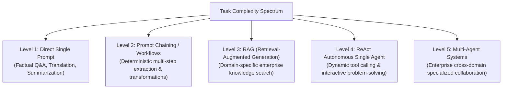

# File 18: Architectural Decision Framework for Agentic AI

## Overview
Building production AI applications requires selecting the appropriate pattern tier along the **Agentic Complexity Spectrum**—ranging from simple **Direct Prompting** to **Prompt Chains**, **RAG Pipelines**, **ReAct Autonomous Agents**, and **Multi-Agent Systems**.

---

## 1. Agentic Architecture Selection Spectrum



### Architectural Selection Decision Matrix

| Task Characteristics | Recommended Pattern | Key Benefit |
| :--- | :--- | :--- |
| Single-step input $\rightarrow$ output | **Direct Prompting** | Lowest latency, zero complexity |
| Multi-step deterministic pipeline | **Prompt Chaining** | High reliability, easy debugging |
| Large private knowledge base query | **RAG System** | Eliminates hallucinations, fresh data |
| Dynamic tool execution & reasoning loop | **ReAct Single Agent** | Solves unpredictable, open-ended tasks |
| Complex enterprise domain breakdown | **Multi-Agent System** | Modular, specialized worker sub-teams |

---

## 2. Agentic Pattern Selector Implementation

```javascript
class AgenticPatternSelector {
    static selectPattern(requirements) {
        const { requiresRealtimeData, isDeterministic, needsTools, requiresSpecializedRoles } = requirements;

        if (requiresSpecializedRoles) {
            return { pattern: "Multi-Agent System", level: 5, complexity: "High" };
        }
        if (needsTools) {
            return { pattern: "ReAct Autonomous Agent", level: 4, complexity: "Medium-High" };
        }
        if (requiresRealtimeData) {
            return { pattern: "RAG (Retrieval-Augmented Generation)", level: 3, complexity: "Medium" };
        }
        if (!isDeterministic) {
            return { pattern: "Prompt Chaining Workflow", level: 2, complexity: "Low-Medium" };
        }

        return { pattern: "Direct Single Prompt", level: 1, complexity: "Low" };
    }
}

const taskRequirements = {
    requiresRealtimeData: true,
    isDeterministic: false,
    needsTools: true,
    requiresSpecializedRoles: false
};

console.log("Recommended Architectural Pattern:", AgenticPatternSelector.selectPattern(taskRequirements));
```

---

## Key Takeaways
1. **Avoid Over-Engineering**: Do not deploy autonomous agents or multi-agent systems when a simple prompt chain or RAG pipeline satisfies requirements.
2. Select patterns based on **task determinism**, **tool requirement**, and **knowledge retrieval needs**.
3. Always implement observability and guardrails regardless of pattern complexity.
