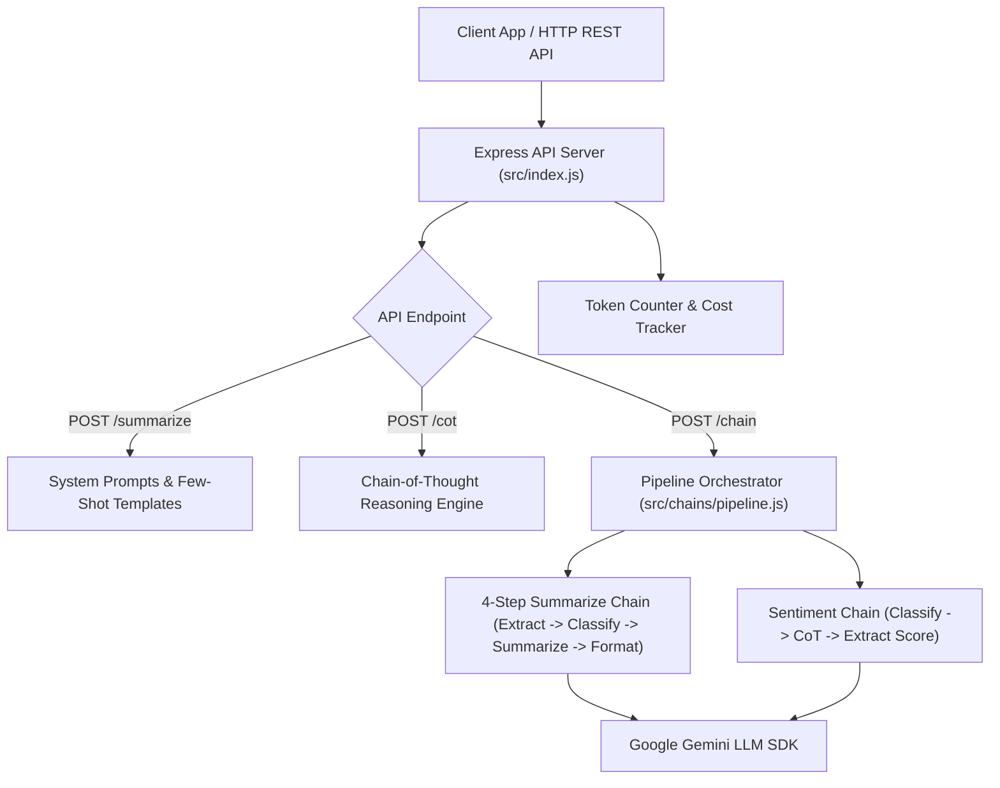

# File 00: Article Summarizer System Overview & Architecture

## Overview
The **Article Summarizer System** is a production-grade LLM text analysis microservice. It implements core prompt engineering patterns—**System Prompts**, **Few-Shot Learning**, **Chain-of-Thought (CoT) Reasoning**, **Sequential Prompt Chaining**, and **Parallel Pipeline Orchestration**—to transform raw articles into structured, high-precision summaries and sentiment reports.

---

## 1. Article Summarizer System Architecture

---

## 2. System Capabilities & Endpoints

| Endpoint | Method | Mode | Technique | Description |
| :--- | :--- | :--- | :--- | :--- |
| `/summarize` | `POST` | `basic` | System Prompt | Quick 3-bullet point executive summary |
| `/summarize` | `POST` | `few-shot` | Few-Shot Prompting | Domain-guided summary with input/output examples |
| `/cot` | `POST` | N/A | Chain-of-Thought | Step-by-step reasoning for complex text |
| `/chain` | `POST` | `sequential` | Prompt Chaining | 4-step pipeline passing output to next step |
| `/chain` | `POST` | `parallel` | Fan-Out / Fan-In | Runs Summarization & Sentiment chains concurrently |

---

## Key Takeaways
1. Combines **Express.js API routing** with **Gemini LLM SDK** integration.
2. Demonstrates **Prompt Chaining**: breaking monolithic summarization into discrete, reliable steps.
3. Supports **Parallel Execution** via `Promise.all()` to analyze sentiment and summaries concurrently.
